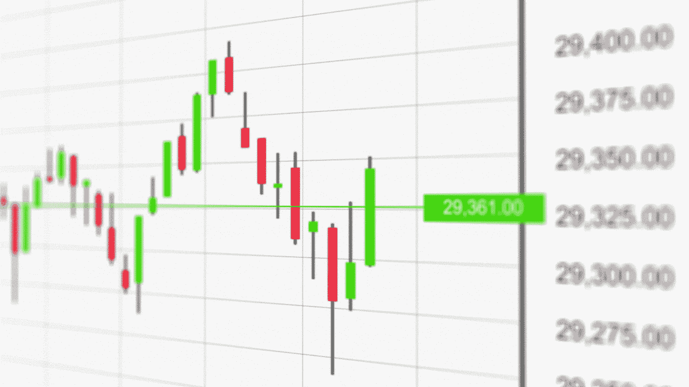

# 动量交易—交易 1 和 2 — (ONGC 和西普拉)—2022 年 3 月 7 日

> 原文：<https://medium.com/coinmonks/momentum-trading-trades-1-2-9cfbcc2342b9?source=collection_archive---------48----------------------->

这是我的股票交易/设置说明和图表

***ONGC:石油&天然气公司***

能源、石油和天然气行业看涨，因此，如果交易者发现这种结构，任何能源/石油和天然气都将是一个容易的猎物。

*我今天怎么交易 ONGC，为什么交易？*

1.  MACD 和随机统计成立于…