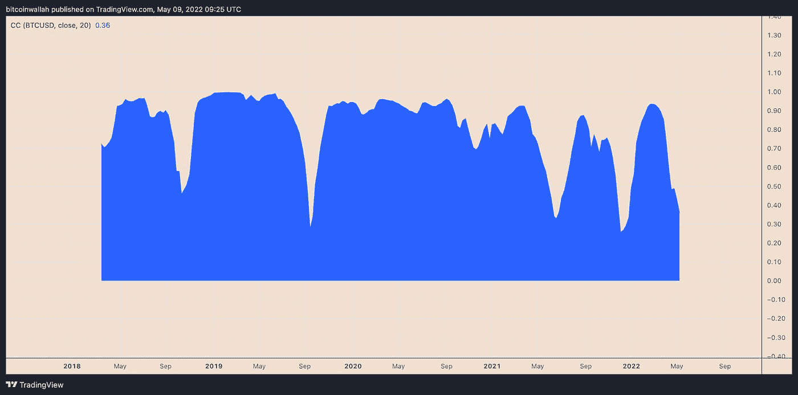

# 虽然 Monero 避免了加密市场的崩溃，但 XMR 的价格仍有可能在 6 月份下降 20%

> 原文：<https://medium.com/coinmonks/monero-avoids-a-crypto-market-meltdown-but-the-xmr-price-still-faces-a-20-decrease-by-june-a09c722f57a2?source=collection_archive---------50----------------------->

**For full blog visit:-**[**https://bitcoinsupports.com/monero-avoids-a-crypto-market-meltdown-but-the-xmr-price-still-faces-a-20-decrease-by-june/**](https://bitcoinsupports.com/monero-avoids-a-crypto-market-meltdown-but-the-xmr-price-still-faces-a-20-decrease-by-june/)

Monero 正准备在本月发布其硬分叉的 testnet 版本，因此 XMR 的看跌情景是及时的。面对美联储的鹰派政策，Monero 表现出了惊人的忍耐力，这些政策导致其大多数加密竞争对手的价格在上周下跌，包括市场领导者比特币(BTC)。

根据币安的数据，XMR 的价格比前一周上涨 2.37%，至 217 美元。相比之下，通常推动更大加密市场的 BTC 本周下跌了 11.55%。第二大加密货币 ETH 同期下跌 11%。

**For full blog visit:-**[**https://bitcoinsupports.com/monero-avoids-a-crypto-market-meltdown-but-the-xmr-price-still-faces-a-20-decrease-by-june/**](https://bitcoinsupports.com/monero-avoids-a-crypto-market-meltdown-but-the-xmr-price-still-faces-a-20-decrease-by-june/)

虽然加密市场上周损失了 1632.5 亿美元，约占其价值的 9%，但 Monero 的市值增长了 8770 万美元，这表明许多交易者在这个注重隐私的硬币中寻求庇护。

## **XMR 接近关键支持**

Monero 本周开局不利，5 月 9 日 XMR 下跌约 4%，至 208 美元左右。下跌使该指数接近其关键支撑位 214 美元，这是由 50 周指数移动平均线(50 日均线；下图中的红色波浪)。这一波也与另一个价格底部相交:从 38 美元的摆动低点到 491 美元的摆动低点形成的 0.618 斐波纳契回撤图。

**For full blog visit:-**[**https://bitcoinsupports.com/monero-avoids-a-crypto-market-meltdown-but-the-xmr-price-still-faces-a-20-decrease-by-june/**](https://bitcoinsupports.com/monero-avoids-a-crypto-market-meltdown-but-the-xmr-price-still-faces-a-20-decrease-by-june/)

XMR 的价格下跌是 4 月 21 日开始于 290 美元左右的更大撤退的一部分。下行反转发生在下跌楔形突破的背景下，上行目标为 490 美元。

这可能导致两种结果之一:XMR 跌破 214 美元附近的支撑汇合点，测试楔形的上趋势线作为支撑(这也与 161.50 美元附近的 200 周均线重合)；或者，标志从支撑线反弹，继续向楔形的技术上涨目标 490 美元附近移动。

在更高的利率环境下，整个加密市场的趋势似乎倾向于看跌。这一点，加上 Monero 与比特币不一致但持续的积极联系，可能会导致 Q2 股市跌至 160 美元左右，比今天的价格下跌约 20%。

**For full blog visit:-**[**https://bitcoinsupports.com/monero-avoids-a-crypto-market-meltdown-but-the-xmr-price-still-faces-a-20-decrease-by-june/**](https://bitcoinsupports.com/monero-avoids-a-crypto-market-meltdown-but-the-xmr-price-still-faces-a-20-decrease-by-june/)

## **XMR 拥有强大的基础**

随着 Monero 在 7 月 16 日接近其潜在的硬分叉，XMR 的看跌设置可能会导致一段时间的价格飙升。根据 Monero 的 GitHub 文章，相同技术改进的 testnet 版本将于 5 月 16 日发布。该项目的管理层表示，hard fork 将提高 Monero 的网络安全性，同时降低成本。

[https://twitter.com/johnfoss69/status/1515492242173046784](https://twitter.com/johnfoss69/status/1515492242173046784)

与此同时，由于其承诺匿名，预计 2022 年对 Monero 的需求将会增加。例如，勒索软件攻击者已经转向 XMR，一项 CipherTrade 分析预测，到 2021 年，该令牌的使用量将增长 500%。

**完整博客访问:-**[**https://bitcoinsupports . com/monero-avoids-a-crypto-market-meltdown-but-the-xmr-price-still-faces-a-20-decrease-by-June/**](https://bitcoinsupports.com/monero-avoids-a-crypto-market-meltdown-but-the-xmr-price-still-faces-a-20-decrease-by-june/)

**免责声明:以上为作者观点，不应视为投资建议。读者应该自己做研究。**

> 加入 Coinmonks [电报频道](https://t.me/coincodecap)和 [Youtube 频道](https://www.youtube.com/c/coinmonks/videos)了解加密交易和投资

# 另外，阅读

*   [Bookmap 评论](https://coincodecap.com/bookmap-review-2021-best-trading-software) | [美国 5 大最佳加密交易所](https://coincodecap.com/crypto-exchange-usa)
*   最佳加密[硬件钱包](/coinmonks/hardware-wallets-dfa1211730c6) | [Bitbns 评论](/coinmonks/bitbns-review-38256a07e161)
*   [新加坡十大最佳加密交易所](https://coincodecap.com/crypto-exchange-in-singapore) | [购买 AXS](https://coincodecap.com/buy-axs-token)
*   [红狗赌场评论](https://coincodecap.com/red-dog-casino-review) | [Swyftx 评论](https://coincodecap.com/swyftx-review) | [CoinGate 评论](https://coincodecap.com/coingate-review)
*   [投资印度的最佳密码](https://coincodecap.com/best-crypto-to-invest-in-india-in-2021)|[WazirX P2P](https://coincodecap.com/wazirx-p2p)|[Hi Dollar Review](https://coincodecap.com/hi-dollar-review)