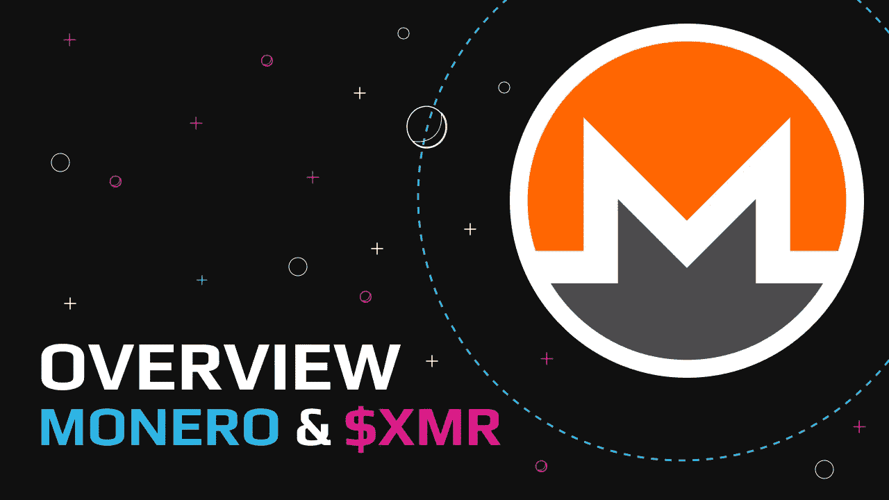
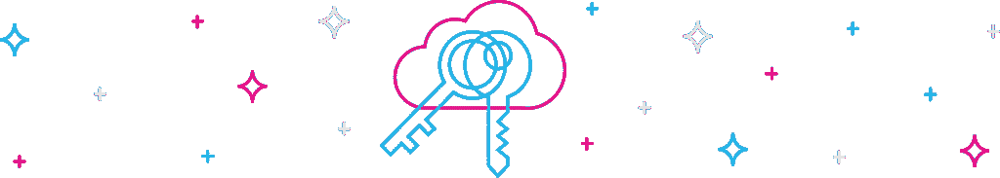
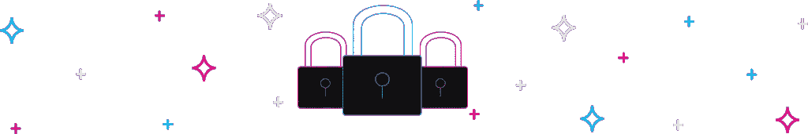
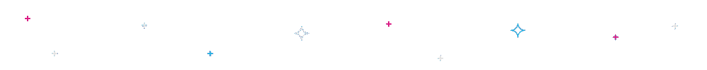

# Monero 进入极度关注区？我们已经做了一个完整的 XMR 概述

> 原文：<https://medium.com/coinmonks/monero-entering-the-area-of-extreme-attention-weve-made-a-full-xmr-overview-1c1be8d148b5?source=collection_archive---------14----------------------->

[Monero ($XMR)](https://swapzone.io/currencies/monero) 是一种数字资产，为用户及其与加密相关的交易提供高度的隐私和匿名性。与领先的加密货币[比特币](https://swapzone.io/currencies/bitcoin)一样，Monero 也是去中心化的，是一种安全的点对点加密货币，但比 BTC 更注重隐私。

它拥有数字资产中第三大开发者社区，仅次于以太坊和比特币。Monero 的协议是开源的，基于 CryptoNote，Nicolas van Saberhagen 在 2013 年的白皮书中对此进行了描述。

基于隐私的项目依靠零知识证明、环签名、IP 隐藏方法和秘密地址来隐藏交易细节。Monero 的这些特性已经融入了它的协议中，尽管在第三方审计的情况下，它的用户可以选择共享视图密钥。

Monero 通过运行 RandomX 的 miner 网络来验证交易，这是工作证明。截至发稿时，XMR 在加密领域排名第 26 位，市值为 3.25 亿美元，每枚硬币的价格为 181.31 美元。

# 了解 Monero (XMR)加密货币

Monero 是一种分散的、不可追踪的、秘密的、安全的数字资产。它使用一种独特的加密技术来确保所有的交易都无法追踪和链接。该项目在加密领域的崛起归因于几个因素，其中之一是它的匿名化功能。

普通令牌的用户，如 BTC，获得一个公钥或唯一的钱包地址，用于交易。无论出于何种原因，当发送方收到公共地址时，他们都可以看到该地址包含多少令牌，甚至可以找出最近通过该地址进行的交易。

大多数区块链网络，包括比特币、以太坊和创存储或记录这些交易。然而，使用 Monero，发送方无法访问接收方的密码，即使他们知道接收方的公共地址。所有交易都是不可追踪的，给接收者的硬币通过一次性随机生成的地址进行交易。

Monero 的分类账也不存储收件人和发件人的实际秘密地址，它记录的一次性生成的地址也无法追踪到任何一方的实际地址。这使得检查或识别该项目的不透明的区块链账本成为一项徒劳的活动。

# Monero 的创始人是谁？

当 Monero 在工作时，加密货币行业没有现在这么受欢迎，所以从事该项目的开发人员出于好奇而这样做。虽然有传言说中本聪发明了 XMR，但从未得到证实。

第一个 Monero 团队有五名开发人员——三名是匿名的，另外两名是公开的。多年来，数百名开发人员为开发 XMR 做出了贡献。以下是核心开发团队的成员:

*   里卡多·斯帕尼(毛绒绒的小马)
*   弗朗西斯科·卡巴尼亚斯(艺术)
*   嘟嘟狗
*   光滑的
*   二元命运
*   其他
*   路易吉 1111

# 是什么让 Monero 独一无二？

Monero 是全球领先的隐私硬币之一，其独特之处有很多，包括:

*   Monero 是第一个为用户提供完全匿名的数字资产。这项功能的一个例子是，你钱包里的总金额是不公开的。这是一个很酷的功能，特别是作为反黑客的好处，因为黑客看不到一个地址或钱包有多少，也不知道他们应该偷多少。
*   **CryptoNight 算法**是它与众不同，不同于其他项目的另一个原因。Monero 不涉及 ASICs 在采矿。它只允许 GPU 和 CPU，使其成为一种公平和可访问的资产，真正实现了去中心化，并阻止足智多谋的矿工获得对资产的更大控制权。
*   **完全可以替代**。可替换性意味着 XMR 的两个单元可以毫无区别地相互替换。每一个单位都是一样的，没有显著的特征可以使它们“被污染”或面临歧视，因为没有办法追踪硬币曾经在哪里。

这与具有可追踪的唯一序列号的美元纸币或揭示交易历史的比特币不同，比特币可以显示该硬币是否被用于非法交易。

*   任何合同中被转移的金额也是模糊不清的，所以外人无法知道汇款人向收款人转移了多少。

## **了解更多:** [**隐私币:探索加密匿名**](/@swapzone/privacy-coins-explore-crypto-anonymity-13fb8201361f)

# 是什么赋予了 Monero 价值？

大多数用户认为匿名和隐私是 Monero 价值的两个因素。它让数百万用户有机会随时进行交易，而不用担心他们的钱包地址被黑客、政府或第三方追踪。

公司不能因为可疑的犯罪链接而将 XMR 列入黑名单，因为实际上没有办法追踪它们——它们是可替代的。此外，它对那些相信并希望匿名和隐私需求将会增加并使隐私硬币市场看涨、推高市值和价格的投资者也有价值。

# Monero 和比特币有什么不同？

比特币使用随机生成的字母数字伪名称地址来保护参与者的身份，但隐私有限。比特币的交易细节在区块链注册，因此对公众开放。

Monero 为每笔交易使用随机生成的一次性地址，并且交易具有不可追踪的历史。比特币依靠 SHA-256 算法进行挖掘，而 Monero 使用 Cryptonight/GPU 挖掘。

## 进一步阅读:[隐私巨头:Zcash vs Monero](https://swapzone.io/blog/zcash-vs-monero)

# Monero 如何提高隐私？

Monero 消除了隐私问题，并通过使用一些重要的概念来改善它们，这些概念在最近的一些基于隐私的项目中发挥了作用。

*   **环签名**:他们允许发送者对群组中的其他参与者隐藏他们的身份。不可能知道哪个成员的密钥被用来创建签名。
*   **隐形地址**:它们增加了额外的隐私，因为它们是每笔交易一次性使用的随机生成的地址。它有助于隐藏交易的实际目的地地址，并掩盖接收者的身份。
*   **Ring Confidential Transactions(RingCT)**:它们可以对 Monero 网络上的交易金额进行模糊处理。

# Monero 的挑战

毫无疑问，Monero 的快速采用归功于其隐私功能，但这也带来了一些挑战。

*   隐私和不可追溯性的特性允许人们在不同的活动中和可疑的地方使用 Monero，如 darknet/dark web。
*   [2018 年美国消费者新闻与商业频道的一份报告](https://www.cnbc.com/2018/01/10/what-is-monero-north-korea-new-favorite-cryptocurrency.html)显示，朝鲜黑客创建了感染人们电脑的恶意软件，并开采了 Monero，然后将其发送回朝鲜。
*   用户可以利用 Monero 从事违法和非法活动，因为它不受资本控制，没有任何可追溯性。这使得一些政府考虑限制或禁止加密货币。

# 如何使用 Monero

你可以利用 Monero 进行日常交易，或者简单地买入并持有。它可以像法定货币一样使用，允许持有者进行存款，转移资金，或者以不连续和匿名的方式将[换成其他密码或法定货币。](https://swapzone.io/)

# 如何开采 Monero

Monero 运行在所有顶级操作系统平台上，如 macOS、Linux、Windows、FreeBSD，甚至 Android。采矿流程允许个人通过加入采矿池或单独采矿(单独采矿)获得活动奖励。

你可以在一台标准计算机上进行挖掘，而不需要使用像昂贵的专用集成电路(ASICS)这样的特定硬件。你电脑的 CPU 或者 GPU 可以帮你用 Monero 的工作证明挖掘算法挖掘 XMR。

# 常见问题

# Monero 违法吗？

不，Monero 不是非法的加密货币，它只是以隐私为导向，提供完全匿名。虽然这个特性很棒，但它也使它成为暗网上毒品销售和赌博等活动的流行选择。

# Monero 是一个好的投资吗？

如果你想进入加密货币投资领域，Monero 可能是一个合适的投资选择。Monero 的价格在 2020 年 8 月至 2021 年 8 月期间上涨了 231%以上，突显出它的利润有多高。截至发稿时，上涨 2.14%。也别忘了 DYOR！

# 开采一枚 Monero 需要多长时间？

这取决于你用来开采硬币的设备。尽管如此，平均每两分钟就有一个 Monero 区块被开采。

# XMR 可以追踪吗？

与其他非隐私加密货币不同，XMR 是不可追踪的。你不能跟踪 Monero 的交易历史，这一功能为用户提供了一个更安全的网络，而没有他们投资组合中的单位被列入黑名单或被拒绝的风险。

# 哪里可以买到 Monero？

你可以通过密码交易所购买 Monero。像 [Swapzone](https://swapzone.io/) 这样的平台聚集了顶级加密货币交易所的最佳价格，允许你以很低的价格购买硬币，而无需注册或 KYC。

按照以下简单步骤购买 buy XMR:

1.  选择 [BTC 进行 XMR 交换页面](https://swapzone.io/exchange/btc/xmr)。
2.  输入您要兑换的 BTC 总额。
3.  选择最好的 [BTC 到 XMR](https://swapzone.io/exchange/btc/xmr) 互换报价。
4.  点击交换按钮。
5.  请输入您的钱包地址，以便将钱存入您的钱包。
6.  将您的 BTC 存款发送到生成的地址。
7.  等待您的 BTC-XMR 交换完成。
8.  最后，在你的钱包里收到你的 XMR！

# 底线

对于数百万用户来说，加密是越来越受欢迎的投资选择。除了匿名和隐私，人们更喜欢 Monero，而不是像 BTC 这样的顶级加密，因为它的价格和受欢迎程度。

虽然仍有许多虚拟货币可以轻松购买和交易，但 Monero 丰富的隐私功能使其成为公认的首选。您可以在流行的加密交换提供商处交易令牌，或者前往 [Swapzone.io](https://swapzone.io/currencies/monero) 交换令牌。

> 加入 Coinmonks [电报频道](https://t.me/coincodecap)和 [Youtube 频道](https://www.youtube.com/c/coinmonks/videos)了解加密交易和投资

# 另外，阅读

*   [TraderWagon 回顾](https://coincodecap.com/traderwagon-review) | [北海巨妖 vs 双子星 vs BitYard](https://coincodecap.com/kraken-vs-gemini-vs-bityard)
*   [如何在 FTX 交易所交易期货](https://coincodecap.com/ftx-futures-trading) | [OKEx vs 币安](https://coincodecap.com/okex-vs-binance)
*   [OKEx vs KuCoin](https://coincodecap.com/okex-kucoin) | [摄氏替代品](https://coincodecap.com/celsius-alternatives) | [如何购买 VeChain](https://coincodecap.com/buy-vechain)
*   [ProfitFarmers 点评](https://coincodecap.com/profitfarmers-review) | [如何使用 Cornix Trading Bot](https://coincodecap.com/cornix-trading-bot)
*   [如何匿名购买比特币](https://coincodecap.com/buy-bitcoin-anonymously) | [比特币现金钱包](https://coincodecap.com/bitcoin-cash-wallets)
*   [瓦济里克斯 NFT 评论](https://coincodecap.com/wazirx-nft-review)|[Bitsgap vs Pionex](https://coincodecap.com/bitsgap-vs-pionex)|[坦吉姆评论](https://coincodecap.com/tangem-wallet-review)