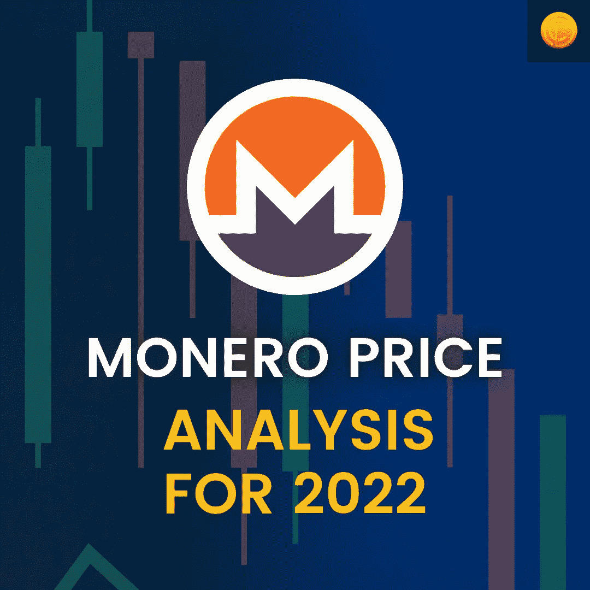
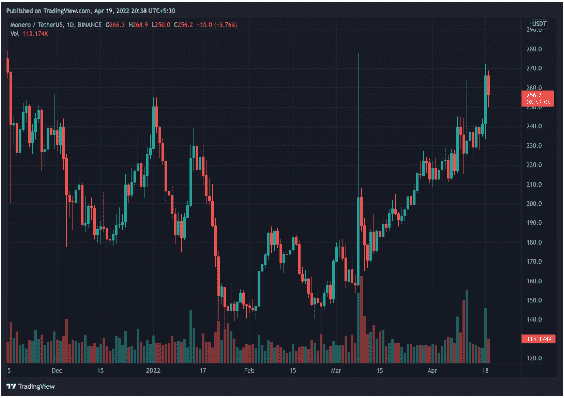

# monero 2022 年价格分析| CoinDhan

> 原文：<https://medium.com/coinmonks/monero-price-analysis-for-2022-coindhan-b888447c5210?source=collection_archive---------59----------------------->

欢迎来到本周另一个 Coindhan 的密码分析。今天我们来看看过去几个月里 Monera 的价格变动。这枚硬币在 2021 年经历了前所未有的反弹，甚至在 2021 年 5 月突破了 520 美元的水平，这距离撰写之日已经过去了近 12 个月。然而，从那以后，代币已经贬值了将近 75%,在撰写本文的时候，代币的交易价格在 255 美元左右。

# 什么是 [Monero](https://www.getmonero.org/) ？

Monero 是一种电子现金，解决了比特币存在的非匿名问题。区块链。通过使用 monero，任何人都可以在世界任何地方发送加密货币，完全匿名。

**莫内罗**[价格分析](https://blog.coindhan.com/2022/03/22/btc-2022-analysis-coindhan-analysis/)**2022 年**

我们还没有看到 2022 年 XMR 附近的显著势头，因为它在今年开始时是一个熊市。从 1 月初开始，XMR 的交易价格从 254 美元涨到了 140 美元。尽管有所复苏，但对 Monero 的看法仍然是悲观的。当你看着它的 TA 时，

相对强弱指标停留在 39.5 左右，相当中性。然而，12 天和 26 天的 MACD 显示价值变化到-2.3 到-3.3，这表明在 Monero 周围形成了越来越大的卖出压力。

目前，我们可以看到 XMR 已经在支撑位形成了双底形态。虽然有所改善，但上方阻力仍未被突破。

然而，在 140 美元水平形成双底后，我们确实看到势头正在逐步建立。

> 加入 Coinmonks [电报频道](https://t.me/coincodecap)和 [Youtube 频道](https://www.youtube.com/c/coinmonks/videos)了解加密交易和投资

# 另外，阅读

*   [美国最佳加密交易机器人](https://coincodecap.com/crypto-trading-bots-in-the-us) | [经常性回顾](https://coincodecap.com/changelly-review)
*   [在印度利用加密套利赚取被动收入](https://coincodecap.com/crypto-arbitrage-in-india)
*   [Godex.io 评审](/coinmonks/godex-io-review-7366086519fb) | [邀请评审](/coinmonks/invity-review-70f3030c0502) | [BitForex 评审](https://coincodecap.com/bitforex-review)
*   [最佳比特币保证金交易](/coinmonks/bitcoin-margin-trading-exchange-bcbfcbf7b8e3) | [萝莉点评](/coinmonks/lolli-review-e6ddc7895ad8) | [比特币保证金交易](https://coincodecap.com/bityard-margin-trading)
*   创造并出售你的第一个 NFT | [密码交易机器人](https://coincodecap.com/best-crypto-trading-bots)
*   [如何在 CoinDCX 上购买柴犬(SHIB)币？](https://coincodecap.com/buy-shiba-coindcx)