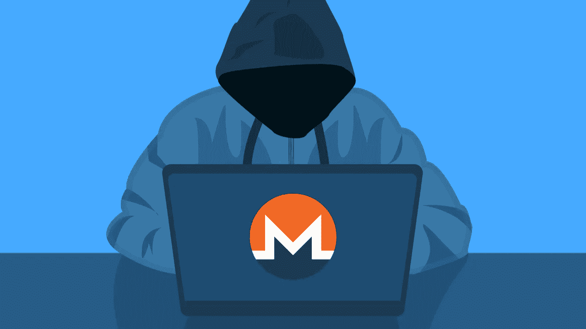

# monero(XMR)60 秒解说

> 原文：<https://medium.com/coinmonks/monero-xmr-explained-in-60-seconds-5c03921b8dc5?source=collection_archive---------41----------------------->

隐私之王 Monero 将让你重新考虑你的投资！

到底谁不想要一个完全私有的数字货币呢？

Monero 是一种数字货币，其目标是提供私人、安全和不可追踪的交易。它是一种数字货币，可以防止任何人跟踪你的财务历史或交易数据。Monero 利用环签名、秘密地址和其他高级加密技术为其用户提供一个安全的匿名平台。它取得了成功，因为专家们认为它是最安全、最私密的加密货币选择之一。

Monero (XMR)的特别之处在哪里？

Monero 使用所谓的加密协议，这使得隐私政策薄弱的暴虐国家或公司更难跟踪或逆转交易。很明显，如今没有人能够侵入性地进入公民的个人生活而不引起公众的合理抗议。Monero 将有助于激发公民抵抗和隐私倡导者；这将使这些活动家今天比昨天更有能力成为活动家领袖。

> 加入 Coinmonks [电报频道](https://t.me/coincodecap)和 [Youtube 频道](https://www.youtube.com/c/coinmonks/videos)了解加密交易和投资

# 另外，阅读

*   [3 商业评论](/coinmonks/3commas-review-an-excellent-crypto-trading-bot-2020-1313a58bec92) | [Pionex 评论](https://coincodecap.com/pionex-review-exchange-with-crypto-trading-bot) | [Coinrule 评论](/coinmonks/coinrule-review-2021-a-beginner-friendly-crypto-trading-bot-daf0504848ba)
*   [莱杰 vs n rave](/coinmonks/ledger-vs-ngrave-zero-7e40f0c1d694)|[莱杰 nano s vs x](/coinmonks/ledger-nano-s-vs-x-battery-hardware-price-storage-59a6663fe3b0) | [币安评论](/coinmonks/binance-review-ee10d3bf3b6e)
*   [Bybit Exchange 审查](/coinmonks/bybit-exchange-review-dbd570019b71) | [Bityard 审查](https://coincodecap.com/bityard-reivew) | [Jet-Bot 审查](https://coincodecap.com/jet-bot-review)
*   [3 commas vs crypto hopper](/coinmonks/3commas-vs-pionex-vs-cryptohopper-best-crypto-bot-6a98d2baa203)|[赚取加密利息](/coinmonks/earn-crypto-interest-b10b810fdda3)
*   最好的比特币[硬件钱包](/coinmonks/hardware-wallets-dfa1211730c6) | [BitBox02 回顾](/coinmonks/bitbox02-review-your-swiss-bitcoin-hardware-wallet-c36c88fff29)