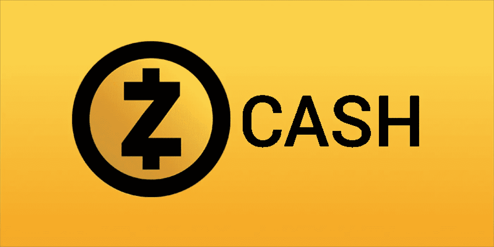

# Monero，Zcash 和隐私硬币的未来

> 原文：<https://medium.com/coinmonks/monero-zcash-and-the-future-of-privacy-coins-7927a6998de8?source=collection_archive---------20----------------------->

# **简介:**

在比特币网络上，每笔支付都可以通过公共账本追溯，这使得交易和地址不完全是“匿名的”，每枚比特币也不完全是“可替代的”。

例如，当 Bob 向 Alice 提供他的比特币账户的公共地址时，Alice 可以很容易地查看 Bob 账户的余额、过去的交易以及其他信息。此外，一旦第三方确定了 Alice 和她的地址，他就可以通过查看 Alice 和 Bob 的帐户之间的交易历史来推断 Bob 的身份，从而使 Bob 的匿名性面临风险。

这是私人硬币进来的时候。他们使用不同的加密技术来达到保护用户匿名的目的。随着 Dash 转向关注数字支付，以下两种私人硬币开始主导市场，Monero，截至 2022 年 2 月 27 日，Marketcap 和 z cash(13 亿美元)的市值约为 27 亿美元。

本文旨在比较和对比 Monero 和 Zcash，揭示隐私币的总体前景。

# **莫内罗:**

Monero 是一种加密货币，于 2014 年 4 月作为 Bytecoin 的一个分支开始，没有 pre-mine 或 insta-mine，在隐私和可替代性方面取得了重大进展。它使用 ASIC 抗功耗算法，以确保每个人都有可能挖掘。

具体来说，通过使用 ***隐形地址*** 、 ***环签名*** 和 ***环 CT 来保证机密性。***

**隐藏地址(一次性公钥)**

允许发送方代表接收方为每笔交易创建一个随机的一次性地址。收款人可以将她的每一笔付款转到不同的地址，在那里它们不能相互关联。

每个 Monero 地址由一个公共查看密钥和一个公共发送密钥组成。Alice 将使用 Bob 的公共查看密钥、公共花费密钥和一些随机数据来生成一次性公共密钥。Bob 可以使用他的私有查看密钥来扫描网络中的所有交易，并识别 Alice 进行的交易。然后，Bob 可以计算与一次性公钥相对应的一次性私钥，从而允许 Bob 将资金用于将来的交易。

**戒指签名**

为了保持发送者(爱丽丝)的匿名性，使用了**环签名**。一个**环签名**是通过融合来自实际签名者(Alice)的签名和几个诱骗签名者(从区块链中提取的过去的交易输出)而生成的。确定哪个组成员是实际的签名者是不可行的。

为了防止重复花费，在一对一的基础上从每个输出生成一个**关键图像**。Monero 挖掘者可以通过检查密钥图像来验证被转移的 Monero 确实是未用完的，而无需识别实际的签名者。

**环形 CT(环形保密交易)**

**戒指 CT** 于 2017 年 1 月启用，现已强制执行，用于保护交易金额的匿名性。在实现环 CT 之前，事务必须被分解成指定的块，如(0.5 XMR，1 XMR，5 XMR)，以便容易地找到环签名伙伴。不利的一面是，每个人都可以看到被转移的确切账户。有了 Ring CT，交易不再需要被拆分，矿工可以轻松验证交易的合法性，而无需查看实际交易金额。

# Zcash:

Zcash 于 2016 年出现，是一种 PoW 私人硬币，由一群希望提高比特币安全性和匿名性的科学家建立。它主要使用零知识加密技术 zk-SNARK 来确保相关方可以验证交易，而不会向对方或网络透露任何信息。

**zk-SNARK**

zk-SNARK 代表“零知识简洁的非交互式知识论证”。“零知识”证明是这样的证明，其中一方可以向另一方证明某些东西，而不透露任何超出陈述本身有效性的信息。(例如给散列一个随机数)。“简洁”意味着证明可以在几毫秒内被验证，而“非交互式”意味着证明只需要从证明者向验证者发送一条消息。

通过 **zk-SNARK，** Zcash 还可以屏蔽发送者、接收者以及网络上任何交易的交易金额。然而，Zcash 让用户能够通过两种类型的地址打开和关闭隐私功能:私有(以 Z 开头)和透明(以 T 开头)。

**比较和结论**

在我看来，Monero 似乎是一个更好的隐私硬币。

虽然 Zcash 提供隐私功能，但几乎没有人使用它(约 2%)，而且它的大量硬币都与一家美国公司有关。Monero 专注于为其所有用户提供隐私保护，没有预埋地雷，也没有确定的集中各方。就 24 小时交易量而言，Monero 是 Zcash 的 5 倍以上。如果只考虑 Zcash 上的私人交易量，这种差异就更加惊人了。

From Coindesk

总之，我认为隐私是相对于比特币或以太坊等蓝筹密码的一个重要而独特的优势。像 Monero 和 Zcash 这样的硬币为政府日益增加的监管审查提供了重要的保护。我很高兴看到隐私币的发展(更多的竞争对手，更多的采用，潜在的注重隐私和菲亚特挂钩的稳定币？)并相信他们将在加密市场赢得稳固的地位。

> *加入 Coinmonks* [*电报频道*](https://t.me/coincodecap) *和* [*Youtube 频道*](https://www.youtube.com/c/coinmonks/videos) *了解加密交易和投资*

# 另外，阅读

*   [Bookmap 评论](https://coincodecap.com/bookmap-review-2021-best-trading-software) | [美国 5 大最佳加密交易所](https://coincodecap.com/crypto-exchange-usa)
*   最佳加密[硬件钱包](/coinmonks/hardware-wallets-dfa1211730c6) | [Bitbns 评论](/coinmonks/bitbns-review-38256a07e161)
*   [新加坡十大最佳加密交易所](https://coincodecap.com/crypto-exchange-in-singapore) | [购买 AXS](https://coincodecap.com/buy-axs-token)
*   [红狗赌场评论](https://coincodecap.com/red-dog-casino-review) | [Swyftx 评论](https://coincodecap.com/swyftx-review) | [CoinGate 评论](https://coincodecap.com/coingate-review)
*   [投资印度的最佳密码](https://coincodecap.com/best-crypto-to-invest-in-india-in-2021)|[WazirX P2P](https://coincodecap.com/wazirx-p2p)|[Hi Dollar Review](https://coincodecap.com/hi-dollar-review)
*   [加拿大最佳加密交易机器人](https://coincodecap.com/5-best-crypto-trading-bots-in-canada) | [库币评论](https://coincodecap.com/kucoin-review)
*   [火币的加密交易信号](https://coincodecap.com/huobi-crypto-trading-signals) | [HitBTC 审核](/coinmonks/hitbtc-review-c5143c5d53c2)