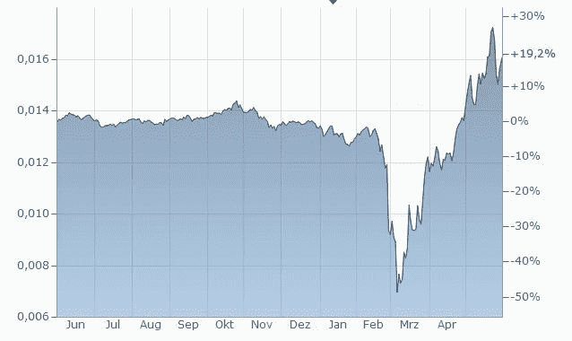
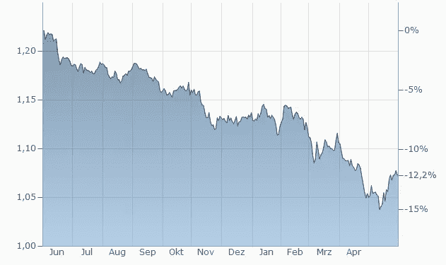

# 货币战

> 原文：<https://medium.com/coinmonks/monetary-warfare-924b703043d1?source=collection_archive---------41----------------------->

“钱是我最重要的弹药，”在入侵和占领伊拉克中发挥主导作用的美国将军大卫·彼得雷乌斯说。在军事战略手册中，金钱被正式归类为军需品。它可以通过投资和贿赂获得当地居民的合作，向敌方战斗人员提供资金退出选择，并切断敌方的资金流动。相反，**货币战直接攻击一个国家的货币**，更有甚者，攻击构成货币的“东西”。让我们在沙滩上画一条线。

Source: [abeldanger.blogspot.com](https://abeldanger.blogspot.com/)

# 金钱作为武器

2022 年 2 月俄罗斯入侵乌克兰后，有人呼吁将俄罗斯银行排除在 SWIFT 国际支付系统之外。这些电话被法国财政部长 Bruno Le Maire 称为“核选择”的**金融等价物**，因为它使国际支付交易变得非常困难。此外，还有一种象征性的不满，即在可以被称为世界政治**心理**的领域:到目前为止，只有伊朗等在大国协调中不被视为令人满意的参与者的国家被切断(首先是在 2012 年，然后是 2018/2019 年)。

购买俄罗斯能源仍不受针对选定俄罗斯银行的制裁。这一豁免至关重要，因为后苏联时代的俄罗斯经济主要靠出口天然气、原油和矿产等原材料赚钱。除了被排除在国际支付之外，还考虑了另一个更重要的货币武器:冻结俄罗斯的外汇储备。如果第一招是核武器，那么**冻结俄罗斯外汇储备就是死星的激光**(你看过《星球大战》吧？).

首先，这些制裁对俄罗斯卢布汇率产生了巨大影响，导致其贬值。但俄罗斯央行能够扭转局势，中国等国家购买了俄罗斯货币，或将其用于石油业务。现在，4 个月过去了，卢布相对于美元和欧元比以前更加坚挺。西方的制裁政策首先是一个乌龙。

Exchange rate development of Dollar — Ruble from June 2021 till May 2022

尽管最初有些胆怯，但很明显，央行储备的军事化(尤其是将其用作地缘政治角力中的权力工具)释放出的破坏性潜力，很可能超出在非法侵略战争中削弱侵略者的意图。我们正在应对一种潜在的破坏性影响，这种影响不仅在经济方面令人担忧，最重要的是在货币方面。

# 金钱、权利、信任

将货币视为财富的日子已经一去不复返了，这种财富与存放在央行金库里的一堆价值联系在一起。然而，事实上，在外汇储备的情况下，我们正在谈论的**合同只有在交易对手愿意偿还**金额并履行签订的合同时才有效。外汇储备也是金融机构和政府的负债(债务)。因此，其大部分资产由俄罗斯中央银行持有，就像我们持有货币一样，就像我们声称的那样(作为一个中央银行持有外国债券)。

如果银行拒绝付款或转账，它会将相应账户中的钱减少到仅仅是一串数字的状态。这正是货币战争中发生的事情。俄罗斯的外汇储备主要是对外国银行体系的债权，例如欧洲银行体系。现在“冻结”他们，这是一个比喻，基本上是传达这样一个信息:从现在起**我们不再愿意和准备承认俄罗斯对我们的权利主张。这一法案将俄罗斯的国际货币储备变成了纸上谈兵。**

听起来微不足道，但如果考虑到我们所有的钱最终只不过是写在纸上的数字，这些数字建立了其他人接受的主张，这将是巨大的。因为它是一个**声明基础设施**，它的**稳定性需要信任作为优先级**。为了让你不要误解我，我们不是在谈论对一种货币的信任。我们谈论的是对整个全球货币体系的信任。在这里，我们来了解一些实质性的问题。

# 金钱的实质

由于这些原因，尊重这样的要求并不是正常的和习惯性的协商过程中的一部分。因为我们的支付手段只有在保证其他人尊重我们共同要求的期望得到可靠满足时才是有用和有益的。否则，侵权意味着主权国家的货币债权可以在讨债案件中质押。这将对构成全球货币难题的实质提出质疑。

央行资产负债表的军事化需要思考可能的长期后果。问题是，在这场战争结束后，我们是否还能以同样的方式使用全球资本主义的货币基础设施，这种基础设施是建立在尊重权利的基础上的。这难道不是从根本上削弱对国际索赔的信心吗？如果这种观念得到巩固，即欧洲央行或美联储的存款不再被视为无条件尊重的债权，甚至对强国来说也是如此，而是新道德经济中的**可随意处置的协议，在出现政治不当行为的情况下，可以通过制裁决议予以拒绝**，那么将这些存款作为资产持有的吸引力可能会下降。因此，对外国支付手段的依赖成为一个严重的**安全风险**。

# 货币基础设施的政治化

从本质上讲，货币战是基于货币的彻底政治化。央行的任务是技术性的，应该尽可能远离日常民主生活中的党派政治冲突，也就是说，它应该是独立的。但是，对俄罗斯的制裁让广大公众清楚地看到，金钱，这种高度复杂的层级结构，也一直是一个政治问题，一个充满争议的“物质”,激励着外交和国内政策。

据目前所知，外国势力的外汇储备并不是中性的衡量已售商品的库存，而是针对整个国家的权利主张，一旦有人攻击我们邻国的主权国家实体并谋杀其平民，这些权利主张就会遭到拒绝。时间会证明，西方是否会削弱本国货币，或者在最糟糕的情况下，削弱整个全球货币体系，而不是制裁某个国家。欧元汇率的发展并不是一个好兆头。

Exchange rate development of Dollar — Euro from June 2021 till May 2022

请记住，这些汇率衡量一种贬值货币与另一种贬值货币。从历史上看，通货膨胀总是与急剧贬值的汇率相关联。上述所有方面使人得出结论，全球支付系统正面临信任危机和动荡。这就是为什么我会用比特币做对冲。

干杯，亚历克斯

~在推特上关注我

# 来源

本文仅是对:
*Aaron Sahr 2022:Monet re kriegsführung 的总结和翻译。发表于:geld Politik-Aus Politik und zeitgeschte。德国中央政治学院时代周刊。72.Jahrgang，2022 年 18 日至 19 日，2。麦 2022，p40–45。*

*Ingo Sauer 2019:反对数量理论的案例:作为央行破产、(错误)主导教科书和掏空欧元的隐晦元凶的恶性通货膨胀。就职论文，约翰·沃尔夫冈·歌德大学，法兰克福。*

> 加入 Coinmonks [电报频道](https://t.me/coincodecap)和 [Youtube 频道](https://www.youtube.com/c/coinmonks/videos)了解加密交易和投资

# 另外，阅读

*   [3 商业评论](/coinmonks/3commas-review-an-excellent-crypto-trading-bot-2020-1313a58bec92) | [Pionex 评论](https://coincodecap.com/pionex-review-exchange-with-crypto-trading-bot) | [Coinrule 评论](/coinmonks/coinrule-review-2021-a-beginner-friendly-crypto-trading-bot-daf0504848ba)
*   [莱杰 vs n rave](/coinmonks/ledger-vs-ngrave-zero-7e40f0c1d694)|[莱杰 nano s vs x](/coinmonks/ledger-nano-s-vs-x-battery-hardware-price-storage-59a6663fe3b0) | [币安评论](/coinmonks/binance-review-ee10d3bf3b6e)
*   [Bybit Exchange 审查](/coinmonks/bybit-exchange-review-dbd570019b71) | [Bityard 审查](https://coincodecap.com/bityard-reivew) | [Jet-Bot 审查](https://coincodecap.com/jet-bot-review)
*   [3 commas vs crypto hopper](/coinmonks/3commas-vs-pionex-vs-cryptohopper-best-crypto-bot-6a98d2baa203)|[赚取秘密利息](/coinmonks/earn-crypto-interest-b10b810fdda3)
*   最好的比特币[硬件钱包](/coinmonks/hardware-wallets-dfa1211730c6) | [BitBox02 回顾](/coinmonks/bitbox02-review-your-swiss-bitcoin-hardware-wallet-c36c88fff29)
*   [block fi vs Celsius](/coinmonks/blockfi-vs-celsius-vs-hodlnaut-8a1cc8c26630)|[Hodlnaut 审核](/coinmonks/hodlnaut-review-best-way-to-hodl-is-to-earn-interest-on-your-bitcoin-6658a8c19edf) | [KuCoin 审核](https://coincodecap.com/kucoin-review)