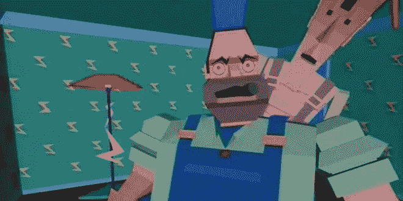

# 白花钱，区块链，比特币和元宇宙

> 原文：<https://medium.com/coinmonks/money-for-nothing-blockchain-bitcoin-and-the-metaverse-6f3f8bd35d1c?source=collection_archive---------55----------------------->

## 回顾过去才能展望未来。虽然这听起来简单而荒谬，但有时这是理解当下的关键。隐藏在一首伟大的歌曲和一个更伟大的视频剪辑中的是对人类重复时代的一种可能的解释，就像波浪一样来来去去，永无止境

[direstraitsblog.com](https://direstraitsblog.com/blog/36-years-ago-dire-straits-released-money-for-nothing-song/)

如果你想知道今天的元宇宙是什么样子，你需要做的就是时光旅行…但是是倒退！历史是人类最伟大的外部老师之一，还有来自内心的羞耻和经验。要理解今天已经成为现实的事情，你必须先看一下英国乐队“可怕的海峡”在 1985 年录制的视频片段的前 35 秒。

进入未来就是一头跳进屏幕！当今最具颠覆性的当代虚拟技术发展看起来就是这样。请为这个夸张的短语鼓掌…鼓掌…鼓掌…鼓掌。如果有人在 1985 年说，若干年后人们会消费(投资？)动画游戏和电影上的数十亿美元，他们也会称之为夸张。

鼓起勇气，我将继续坚持我的幻想，加倍下注。YouTube 如今就像上世纪 80 年代的 MTV:视频之王。你知道未来 Web2 和它的统治会发生什么吗？最终会像 MTV 一样。它将只是过去的记忆。

37 年前，不同声音的单调要求是:*我要我的……我要我的 MTV* ，今天的要求是:*我要我的……我要我的钱*(不要钱)。问题是，今天的本质，几年后就只是表面的附属品，或者已经变异成某种东西，不更好也不更坏，只是不同而已。由于 YouTube 压制了 MTV，区块链将清算 Web2。同样的事情会发生在法定货币和密码上吗？有可能。

三年前，一周大部分时间朝九晚五的个人工作是必不可少且无可争议的。这一基本逻辑在短短一年内就崩溃了。没有什么和任何人是必不可少的。这既悲伤又真实。

*钱无所值*将创新、前卫设计和对 80 年代中期电脑动画的迷恋引入了视频剪辑文化。我们小时候记得那些几何的、三维的、粗糙的和缓慢的图像给我们留下了非常好的印象。

比特币给金融文化带来了应用于货币的创新、前沿和对区块链的迷恋。今天的区块链与 1985 年的电脑动画是一样的(抱歉，适度或反过来夸张)。我相信区块链甚至还没有达到商业互联网的原始阶段(90 年代)，更不用说互联网泡沫了(2000 年代)。

然而，尽管时间总是一成不变，事件却发展得更快。

> 加入 Coinmonks [电报频道](https://t.me/coincodecap)和 [Youtube 频道](https://www.youtube.com/c/coinmonks/videos)了解加密交易和投资

# 另外，阅读

*   [TraderWagon 回顾](https://coincodecap.com/traderwagon-review) | [北海巨妖 vs 双子星 vs BitYard](https://coincodecap.com/kraken-vs-gemini-vs-bityard)
*   [Exness 评测](https://coincodecap.com/exness-review)|[moon xbt Vs bit get Vs Bingbon](https://coincodecap.com/bingbon-vs-bitget-vs-moonxbt)
*   [如何开始通过加密贷款赚取被动收入](https://coincodecap.com/passive-income-crypto-lending)
*   [加密货币储蓄账户](/coinmonks/cryptocurrency-savings-accounts-be3bc0feffbf) | [加密交易机器人](https://coincodecap.com/best-crypto-trading-bots)
*   [BigONE 交易所评论](/coinmonks/bigone-exchange-review-64705d85a1d4) | [CEX。IO 审查](https://coincodecap.com/cex-io-review) | [Swapzone 审查](/coinmonks/swapzone-review-crypto-exchange-data-aggregator-e0ad78e55ed7)
*   [最佳比特币保证金交易](/coinmonks/bitcoin-margin-trading-exchange-bcbfcbf7b8e3) | [比特币保证金交易](https://coincodecap.com/bityard-margin-trading)
*   [加密保证金交易交易所](/coinmonks/crypto-margin-trading-exchanges-428b1f7ad108) | [赚取比特币](/coinmonks/earn-bitcoin-6e8bd3c592d9)