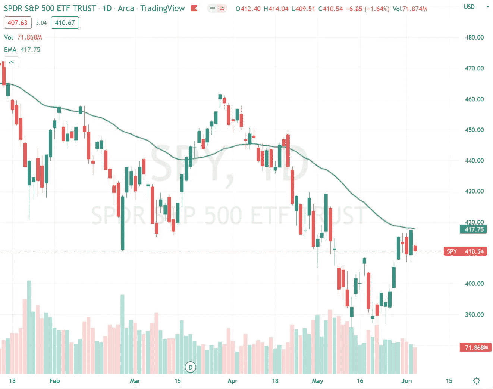

# 货币维京人每周市场报告

> 原文：<https://medium.com/coinmonks/money-vikings-weekly-market-report-6c57cb907b16?source=collection_archive---------24----------------------->

为下周做准备— 6 月 6 日至 6 月 10 日

**每周市场报告—** 阵亡将士纪念日之前的涨势没有继续。标准普尔&指数本周下跌了 1.20%。能源和工业继续跑赢其他行业。医疗保健&房地产是受打击最严重的板块，分别下跌了-3.13%和-2.19%。