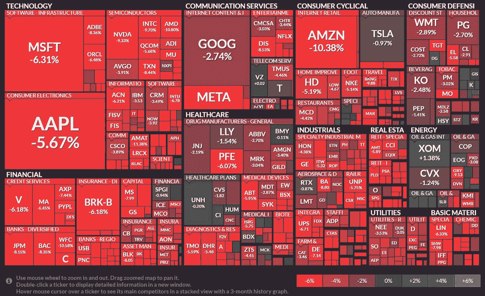
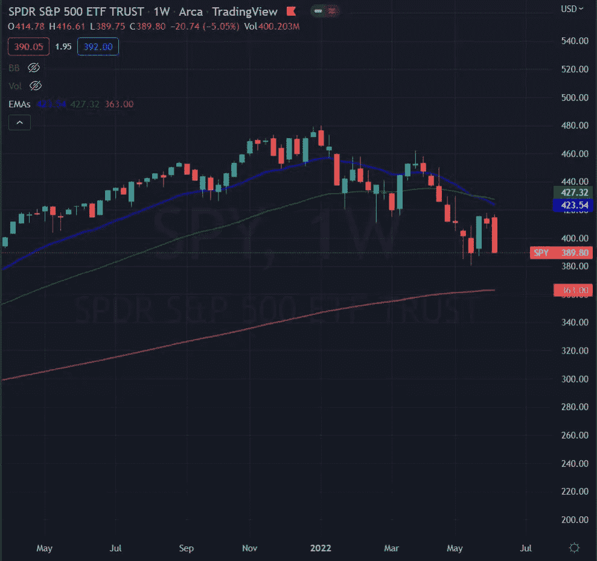

# 货币维京人每周市场报告

> 原文：<https://medium.com/coinmonks/money-vikings-weekly-market-report-fcda160e0732?source=collection_archive---------47----------------------->

为下周做准备—2012 年 6 月至 2018 年 6 月

每周市场报告— 这周我已经转到了周线。SPY (-5.25%)的下一个逻辑支撑是 5 月低点 380.54 附近，然后是 200 均线(红线)，在 363。没有一个部门是绿色的…