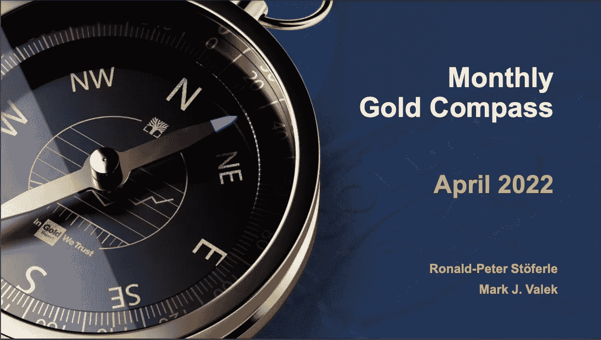
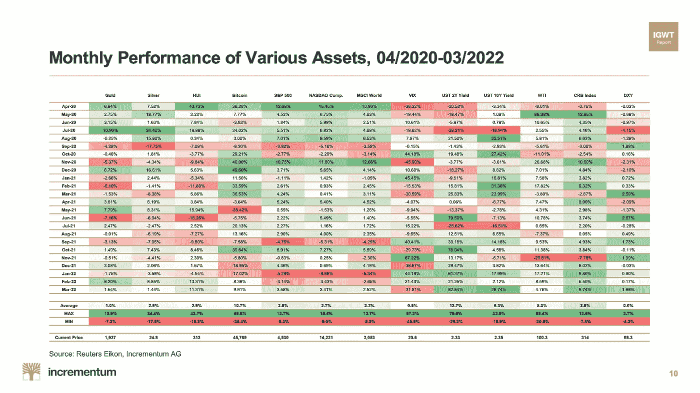
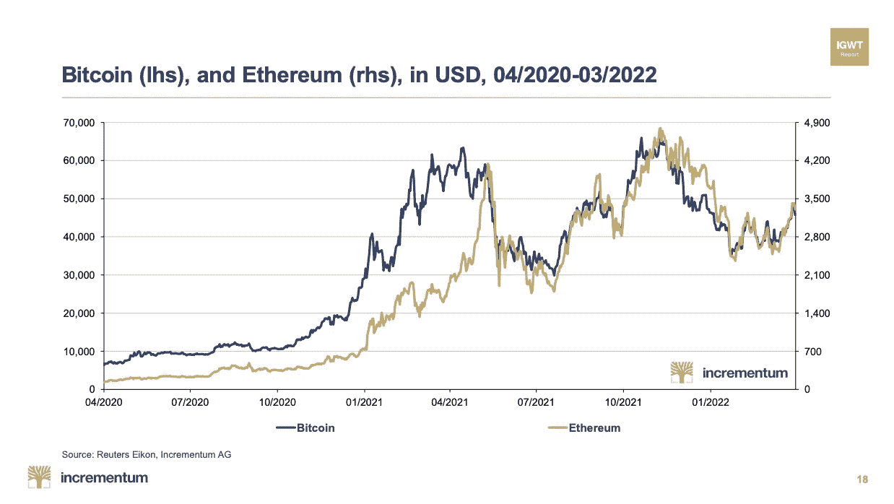
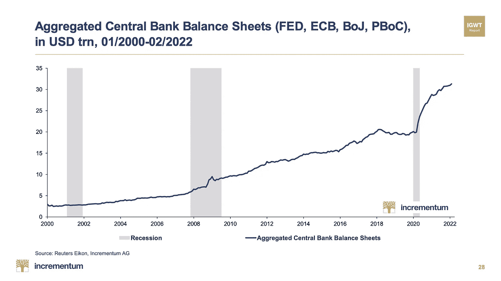
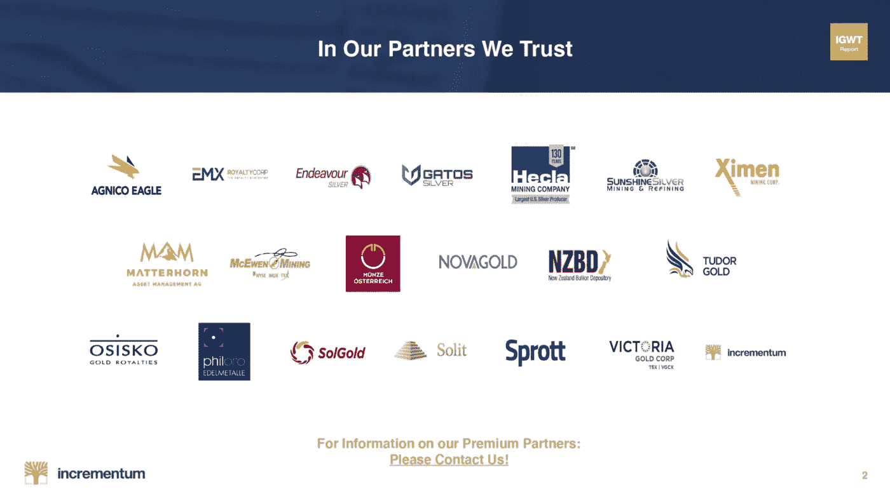

# 每月黄金罗盘图-2022 年 4 月

> 原文：<https://medium.com/coinmonks/monthly-gold-compass-chartbook-april-2022-ca9f29cef23e?source=collection_archive---------37----------------------->

本月由我们信任的 黄金 [*呈现的图表簿充满了有趣的图表。*](https://ingoldwetrust.report/igwt/?lang=en)

点击查看完整的账簿[。](https://ingoldwetrust.report/gold-compass/monthly-gold-compass-april-2022/?lang=en)

今年,《In Gold We Trust》报告计划于 2022 年 5 月 24 日发布。欲了解更多信息，请点击订阅我们的简讯[。](https://www.incrementum.li/en/newsletter/)

本月的图表包括 44 张图表，其中包括各种资产的月度表现图表…

比特币 vs 美元以太坊…

和汇总的央行资产负债表。

一如既往，我们感谢我们的优质合作伙伴:

点击查看 2021 年我们信任的黄金报告[。](https://ingoldwetrust.report/igwt/?lang=en)

我们相信黄金[网站](https://ingoldwetrust.report/?lang=en)每天都会更新新的新闻文章、视频、图表和分析。记得访问网站，了解最新信息。

> 加入 Coinmonks [电报频道](https://t.me/coincodecap)和 [Youtube 频道](https://www.youtube.com/c/coinmonks/videos)了解加密交易和投资

# 另外，阅读

*   [瓦济里克斯 NFT 评论](https://coincodecap.com/wazirx-nft-review) | [比茨盖普 vs 皮奥克斯](https://coincodecap.com/bitsgap-vs-pionex) | [坦吉姆评论](https://coincodecap.com/tangem-wallet-review)
*   [如何使用 Solidity 在以太坊上创建 DApp？](https://coincodecap.com/create-a-dapp-on-ethereum-using-solidity)
*   [币安 vs FTX](https://coincodecap.com/binance-vs-ftx) | [最佳(SOL)索拉纳钱包](https://coincodecap.com/solana-wallets)
*   [如何在 Uniswap 上交换加密？](https://coincodecap.com/swap-crypto-on-uniswap) | [A-Ads 评论](https://coincodecap.com/a-ads-review)
*   [加密货币储蓄账户](/coinmonks/cryptocurrency-savings-accounts-be3bc0feffbf) | [YoBit 审核](/coinmonks/yobit-review-175464162c62)