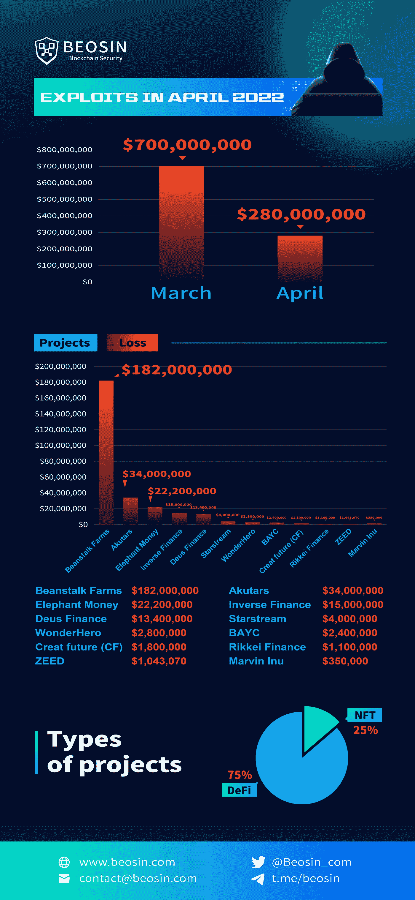

# 每月回顾:2022 年 4 月发生了超过 21 起典型的安全事件

> 原文：<https://medium.com/coinmonks/monthly-recap-more-than-21-typical-security-incidents-occurred-in-april-2022-7f853aed53c7?source=collection_archive---------33----------------------->

是时候进行另一次月度安全盘点了！根据 Beosin EagleEye 的数据，2022 年 4 月，各种安全事件的数量比 3 月有所下降。4 月份发生的典型安全事件超过 21 起。攻击性安全事件造成的损失为 2.8 亿美元。

# 挑战

9 **典型安全事件**

1.4 月 2 日，借贷平台 Inverse Finance 遭遇价格操纵攻击，损失约 1500 万美元。

2.4 月 8 日，以太网第 2 层网络 Metis 上的收入聚合器 Starstream 因合同漏洞被盗 400 万美元。

3.Creat future (CF)代币合约存在根本缺陷，允许任何人消费另一个人的 CF 余额，导致该合约损失约 180 万美元。

4.马文·伊努(Marvin Inu)的跨链桥(cross-chain bridge)因私钥泄露而被黑，造成约 35 万美元的损失。

5.4 月 13 日，stablecoin 平台 Elephant Money 遭遇闪贷攻击，损失 2200 万美元。

6.元宇宙 DeFi 协议 Rikkei Finance 于 4 月 15 日遭到黑客攻击，攻击者利用一个合约漏洞发动了一次甲骨文攻击，获利约 110 万美元。

7.4 月 17 日，稳定的 coin 协议 Beanstalk Farms 遭受了 flashloan 攻击，该协议损失了约 1.82 亿美元，黑客实际获利约 8000 万美元。

8.4 月 21 日，DeFi 协议 ZEED 被黑。攻击者总共获利超过 100 万美元，但在没有取出的情况下将合同设置为自动销毁，导致获利资金被永远锁定在合同中。

9.4 月 28 日，多链衍生品协议德乌斯金融受到 flashloan 攻击，黑客获利约 1340 万美元。该项目还在 3 月 15 日遭到攻击，损失约 300 万美元。

# 欺诈/加密骗局

6 **典型安全事件**

1.P2E 游戏密码 Klash 已经逃跑，该项目现在已经删除了其社交账户。800 个 bnb 被 Crypto Klash 骗子转到 Tornado Cash。

2.Rug Pull 发生在 BNB 链上的自动质押协议 MaxAPY Finance 上，现在其官方 Twitter 账户和 Telegram group 已被删除。

3.BNB 链上的项目 ANA 遭受了地毯拉和象征性的价格下降了 91%。

4.Avalanche 上的一个超宇宙房地产项目 Universe 遭受了一场灾难，合同开发商创造并销售了大约 16 万亿 universe。

5.BNB 链上的 MetalSwap 出现了下跌，token Metal 在短时间内下跌了 99%

6.Rug Pull 发生在 BNB 连锁项目 BuccaneerFi，该项目的社交媒体账户和社区已被删除，约 841 BNBs 已被转移到 Tornado Cash。

# 非同质化通证

4 **典型安全事件**

1.4 月 7 日，NFT 游戏 WonderHero 受到私钥泄露的攻击，导致约 280 万美元的损失。

2.4 月 23 日，由于合同中的两个漏洞，NFT 项目 Akutar 被永久锁定，导致该项目损失 3400 万美元。

3.4 月 25 日，BAYC 的官方 Instagram 账户被黑，黑客发布了一个钓鱼链接，导致 91 个 NFT 被盗。黑客获利约 240 万美元。

4.由于一个“假验证”骗局，一名用户损失了价值 57 万美元的 BAYC NFTs。

# 其他人

2 **典型安全事件**

1.美国司法部成功没收了暗网上一名卖家价值约 3400 万美元的加密货币，称其为美国历史上最大的加密货币民事没收文件之一。

2.区块链安全公司发现了一个可能导致 150 亿美元损失的漏洞。该漏洞现已修复。

# 摘要

总体而言，2022 年 4 月全球区块链安全事件比 3 月有所下降。攻击性安全事件造成的损失总额约为 2 . 8 亿美元。

# 更大的

1.  [***VaaS —自动检测工具，让您的智能合约在 Web3.0***](/@Beosin_com/vaas-automatic-detection-tool-make-your-smart-contract-secure-in-web3-0-c3431f5c6ff) 中安全
2.  [***【重述】AMA 关于如何在使用 Beosin VaaS***](/@Beosin_com/recap-ama-about-how-to-keep-your-smart-contract-secure-during-development-with-beosin-vaas-f7ecd2dc27a) 进行开发的过程中保护您的智能合约的安全
3.  [***如何在 Web 3.0 热潮下保证 NFT 的安全？***](/@Beosin_com/how-to-ensure-the-security-of-nft-under-the-web-3-0-boom-beosin-vaas-has-provided-with-a-solution-50697ccd4f56)
4.  [***德乌斯金融遭遇今年第二次闪贷攻击:贝奥森详细分析***](/@Beosin_com/deus-finance-suffered-its-second-flashloan-attack-this-year-beosins-detailed-analysis-5032be0ec4f2)
5.  [***Beosin 已经完成了加密乐高算法***](/@Beosin_com/beosin-has-completed-security-audit-service-of-crypto-lego-alg-no-critical-high-or-medium-risk-b656849e9334) 的安全审计服务
6.  [***Beosin 完成了 PancakeSwap***](/@Beosin_com/beosin-has-completed-security-audit-service-of-masterchefv2-and-cake-pool-contracts-in-pancakeswap-4dafa0aa6068)master chef v2 和蛋糕池合同的安全审计服务

# 接触

如果您需要任何区块链安全服务，请联系我们:

[**网站**](https://beosin.com/) [**邮箱**](http://contact@beosin.com/) [**官方推特**](https://twitter.com/Beosin_com) [**预警**](https://twitter.com/BeosinAlert) [**电报**](https://t.me/beosin)**[**LinkedIn**](https://www.linkedin.com/company/beosin)**

# **另外，阅读**

*   **[3 商业评论](/coinmonks/3commas-review-an-excellent-crypto-trading-bot-2020-1313a58bec92) | [Pionex 评论](https://coincodecap.com/pionex-review-exchange-with-crypto-trading-bot) | [Coinrule 评论](/coinmonks/coinrule-review-2021-a-beginner-friendly-crypto-trading-bot-daf0504848ba)**
*   **[莱杰 vs n rave](/coinmonks/ledger-vs-ngrave-zero-7e40f0c1d694)|[莱杰 nano s vs x](/coinmonks/ledger-nano-s-vs-x-battery-hardware-price-storage-59a6663fe3b0) | [币安评论](/coinmonks/binance-review-ee10d3bf3b6e)**
*   **[Bybit Exchange 审查](/coinmonks/bybit-exchange-review-dbd570019b71) | [Bityard 审查](https://coincodecap.com/bityard-reivew) | [Jet-Bot 审查](https://coincodecap.com/jet-bot-review)**
*   **[3 commas vs crypto hopper](/coinmonks/3commas-vs-pionex-vs-cryptohopper-best-crypto-bot-6a98d2baa203)|[赚取加密利息](/coinmonks/earn-crypto-interest-b10b810fdda3)**
*   **最好的比特币[硬件钱包](/coinmonks/hardware-wallets-dfa1211730c6) | [BitBox02 回顾](/coinmonks/bitbox02-review-your-swiss-bitcoin-hardware-wallet-c36c88fff29)**