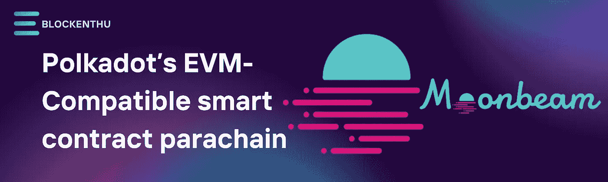
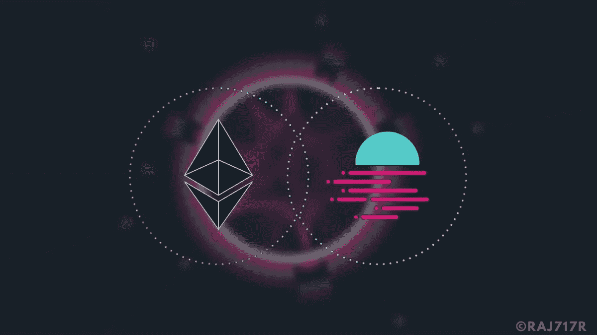
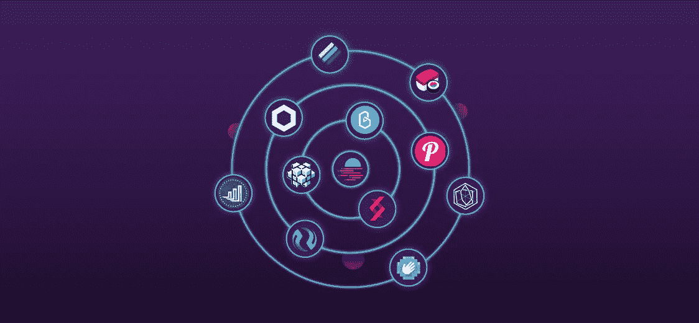

# 月亮光束

> 原文：<https://medium.com/coinmonks/moon-beam-glmr-f6fe02252b3f?source=collection_archive---------35----------------------->

***Polkadot 的兼容 EVM 的智能合约 parachain***

Moonbeam 是一个智能合约平台，与以太坊合作。它带有一个 EVM 引擎和一个 Web3 API。有了这种以太坊互操作性，开发者可以轻松地将现有的 **Solidity 智能合约**和 **DApp** 前端移植到 **Moonbeam** 。Moonbeam 受益于波尔卡多特中继链的共享安全性，以及作为波尔卡多特网络上的副链与其他波尔卡多特连接链的集成。

**历史**

衬底区块链技术被用于创建智能合同平台 Moonbeam。PureStake 是该协议的支持者，它是一个开发组织，也为 Algorand 开发开发工具，并管理 Polkadot 验证器。**2020 年初 PureStake 启动了 moon beam**。月光基金会也为该网络做出了贡献。

Moonbeam 家族现在由三个网络组成。 **Moonbeam 渴望成为波尔卡多特生态系统的 EVM 兼容副链，而它的姐妹网络 Moonriver 在 2021 年 6 月开始成为草间弥生副链**。Moonbeam 和 Moonriver 的基本技术本质上是相同的。Moonriver 可能是第一个在 Moonbeam 之前获得新功能的。**月岩**是两者共同使用的**测试网**。

几个项目宣布了他们在 2020 年 9 月测试网首次亮相后的六个月内建立 Moonbeam 的计划。与 Linear Finance、Sushi、Injective Protocol 和 Bet Protocol 合作的项目包括在内。

# 月光:这是什么？

Moonbeam 是一个基于 Polkadot 的以太坊兼容智能合同副链。Moonbeam 使得使用普通以太坊开发工具在基于底层的环境中构建或重新部署 Solidity 应用变得简单。

Moonbeam 是一个高度专业化的副链，模仿以太坊的 Web3 RPC、账户、密钥、订阅、日志等等。Moonbeam 平台向以太坊基础功能集添加了链上治理、堆栈和跨链集成等功能。

开发人员可以使用网络部署 Solidity 智能合约、兼容 Web3 的 API、Oracle 数据馈送和以太坊网桥等。

# **月亮光束的成分**

Moonbeam 由以下主要部件组成，这些部件共同发挥作用:

Polkadot:Polkadot 将各种区块链连接成一个统一的网络，以促进跨链通信和互操作性。月光是波尔卡多特生态系统的草间弥生的月亮河(MOVR)。

**副链**是独立的区块链(碎片)，可以与波尔卡多特通信。

众筹贷款是项目为 Polkadot 网络上的副链空间筹集资金的一种方式。**用户锁定他们的 DOT，以获得项目团队的奖励，**，这通常是项目的本地令牌的形式。

**投币拍卖:**希望成为波尔卡多特上的副链的项目必须首先赢得副链拍卖中的一个投币。Moonbeam 使用众筹贷款赢得了第二次拍卖，赢得了从 2021 年 12 月 17 日开始的 96 周的 Polkdaot parachain。

# **moon beam 创始人是谁？**

PureStake 的首席执行官 Derek Yoo 开发了 Moonbeam 网络，该公司为区块链的应用开发者、项目和组织提供安全可靠的区块链公共基础设施。

Moonbeam 和 PureStake 都聘请 Stefan Mehlhorn 担任首席运营官，他是公司早期管理和运营方面的专家。Stefan 之前曾在 Samsung Pay、Candibell Inc .、LoopPay、Permessa 和 Thinking Phone Network 等公司工作。

PureStake 的 Katie Butler 和 Nate Hamilton 分别领导 Moonbeam Network 的营销和业务开发团队。

# 是什么让 Moonbeam 与众不同？

在底层之上，Moonbeam 提供了一个类似以太坊的环境(而不是基于 Geth 的解决方案)。这使得开发人员可以使用与以前相同的工具和集成快速重新部署现有的智能合约，同时还可以利用支持所有 Polkadot parachains 的新基板技术。

利用基于 **Solidity 或 Vyper 的智能合同**的开发者可以使用 Moonbeam 网络“走向多链”,并将其影响扩展到 Polkadot 生态系统。在一个新的层面上，Polkadot 的区块链提供了无缝的任务共享。

开发人员可以使用 Moonbeam 将当前的以太坊 dapp 转移到 Polkadot，或者使用熟悉的以太坊开发工具构建新的无权限分散应用程序(dapp)。当前端 dApps 在链之间迁移时，Moonbeam 的工具确保只有最小的修改。

以太坊开发者(公共区块链开发者的最大市场)将能够通过采用 Moonbeam 来避免以太坊网络的费用和限制所导致的可扩展性问题。

# GLMR Token

Moonbeam 的工具和治理令牌 GLMR 用于以下目的:

**交易费用:** GLMR 允许用户支付燃气费，执行智能合约。

**赌注:**用户可以将 GLMR 作为赌注成为验证者或代表，并以参与网络共识为交换来接收 GLMR。

**治理:**允许 GLMR 令牌持有者提名理事会成员并在网络上投票。

**流动性挖掘:**通过为基于 Moonbeam 的分散式交易所(DEXes)提供流动性，赚取一部分交易所费用。

# **令牌组学**

> 月光的原生令牌 Glimmer 是在一个名为 Take Flight 的私人社区活动中发布的。**在月光社区活动期间，分发了 100，000，000** GLMR(总供应量的 10%)。

截至 2022 年 5 月 9 日，GLMR 目前是排名第 104 位的加密货币，目前交易价格为**1.99 美元** (153 印度卢比)。市场规模超过 5 亿美元。Glimmer 拥有 251 万枚流通代币。

总共将有 1，000，000，000 个 GLMR 代币，年通货膨胀率为 5%，导致无界代币供给。

# **合闸思想**

Moonbeam 是在 Polkadot 生态系统上推出的第一批 parachains 之一，因此，它在希望从跨链互操作性中受益的开发人员中发展了一批追随者。Moonbeam 的路线图强调了网络的互操作性，特别是在其跨共识消息(XCM)格式方面，以及部署额外的“集成和协作”

曲线金融是最著名的 DeFi 协议之一，已经首次亮相。Moonbeam 已经为在不久的将来部署贷款和借款应用程序、NFT、defi 项目、游戏项目和 bounty 项目制定了目标。

# 加入我们，轻松进入 WEB 3.0

> *我们的社区*

# WHATSAPP

 [## BLOCKENTHU

### WhatsApp 群邀请

chat.whatsapp.com](https://chat.whatsapp.com/FTKme4XzkOU73ZDv99Oatj) 

# INSTAGRAM

[https://www.instagram.com/blockenthu/](https://www.instagram.com/blockenthu/)

# 电报

 [## ⚡·布洛克登胡·⚡

### 可以马上查看并加入@blockenthu。

t.me](https://t.me/blockenthu) 

# 商务化人际关系网

 [## Blockenthu | LinkedIn

### LinkedIn 上有 469 名粉丝。“面向大众的 Web 3.0 福利”加密和区块链| BlockEnthu 是社区…

www.linkedin.com](https://www.linkedin.com/company/blockenthu/?viewAsMember=true) 

使用印度最安全的外汇货币

 [## CoinDCX -加密交易所|购买、出售和交易比特币和顶级替代币

### CoinDCX 是印度最大、最安全的加密货币交易所，在这里你可以买卖比特币和其他…

coindcx.com](https://coindcx.com/) 

# blockenthu # ETH # BTC # coincxpathbreaker # polkadot #比特币#以太坊#月光#露娜

> 加入 Coinmonks [电报频道](https://t.me/coincodecap)和 [Youtube 频道](https://www.youtube.com/c/coinmonks/videos)了解加密交易和投资

# 另外，阅读

*   [3 商业评论](/coinmonks/3commas-review-an-excellent-crypto-trading-bot-2020-1313a58bec92) | [Pionex 评论](https://coincodecap.com/pionex-review-exchange-with-crypto-trading-bot) | [Coinrule 评论](/coinmonks/coinrule-review-2021-a-beginner-friendly-crypto-trading-bot-daf0504848ba)
*   [莱杰 vs n rave](/coinmonks/ledger-vs-ngrave-zero-7e40f0c1d694)|[莱杰 nano s vs x](/coinmonks/ledger-nano-s-vs-x-battery-hardware-price-storage-59a6663fe3b0) | [币安评论](/coinmonks/binance-review-ee10d3bf3b6e)
*   [Bybit Exchange 审查](/coinmonks/bybit-exchange-review-dbd570019b71) | [Bityard 审查](https://coincodecap.com/bityard-reivew) | [Jet-Bot 审查](https://coincodecap.com/jet-bot-review)
*   [3 commas vs crypto hopper](/coinmonks/3commas-vs-pionex-vs-cryptohopper-best-crypto-bot-6a98d2baa203)|[赚取加密利息](/coinmonks/earn-crypto-interest-b10b810fdda3)
*   最好的比特币[硬件钱包](/coinmonks/hardware-wallets-dfa1211730c6) | [BitBox02 回顾](/coinmonks/bitbox02-review-your-swiss-bitcoin-hardware-wallet-c36c88fff29)
*   [BlockFi vs 摄氏度](/coinmonks/blockfi-vs-celsius-vs-hodlnaut-8a1cc8c26630) | [Hodlnaut 审核](/coinmonks/hodlnaut-review-best-way-to-hodl-is-to-earn-interest-on-your-bitcoin-6658a8c19edf) | [KuCoin 审核](https://coincodecap.com/kucoin-review)