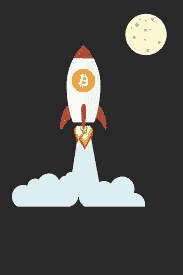
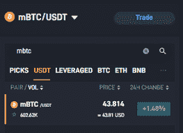
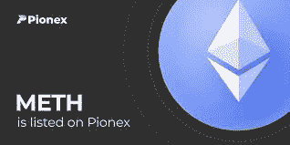

# 月球机器人——让我们给火箭飞船加满油！

> 原文：<https://medium.com/coinmonks/moon-bots-lets-gas-up-the-rocket-ship-80d6a4c87dc?source=collection_archive---------35----------------------->

**交易机器人**

当看如何交易加密时，你可能是一个没有时间真正绘制硬币图表的人，但你仍然想参与不同硬币的上下运动。这可能是你想参与交易机器人的时候。交易机器人有能力为你做交易。用户需要输入一些参数，但是从那时起，交易机器人将继续运行，直到机器人被“停止”或达到某个参数。举个例子，我可以说以 3 万 k 买入比特币，以 4 万 k 卖出。它将继续运行，直到这些命令得到满足。如果这是你感兴趣的东西，那么你可能会喜欢交换 [**Pionex**](https://www.pionex.com/en-US/sign/ref/zVt0KmHU) **。它有许多不同的交易机器人，但我今天要关注的是一个月亮机器人。**

**什么是月球机器人？**

目前有两种不同的月球机器人。这些机器人旨在为超长持有和非常大的价格波动。目前提供的机器人用于 BTC/USDT 和 ETH/USDT。这些机器人的价格从低点的 1 万或 1.5 万英镑，一直到高点的 10 万或 15 万英镑左右。价格每天都不一样，但是波动非常大。ETH 的价格没有那么高，但仍然一样宽。低点 1000 一直到高点 10000。机器人的移动就像一个标准的网格机器人，但是他们也有一个非常大的 500 个网格。

**它有什么作用？**

月亮机器人背后的想法是进入一个位置，让机器人购买一个极端的下跌，以及在极端的价格运动中出售电网。这个想法是，你不需要“绘制”硬币，你只需要有足够的钱进入机器人。当你这样做的时候，你可以让机器人运行，并继续通过价格在正常给定的一天里的日常小幅波动来获得利润。即使有好消息和坏消息，这个机器人应该捕捉你正在寻找的收益。

**mBTC 或冰毒**

如果你坐在那里，心里想着我没有那么多钱，但我确实喜欢拥有一个月球机器人并让它为我工作的想法。这部分是给你的！如果你加入了 [**Pionex**](https://www.pionex.com/en-US/sign/ref/zVt0KmHU) 并且没有足够支付官方 3500 USDT 的比特币或 Eth，那么 [**Pionex**](https://www.pionex.com/en-US/sign/ref/zVt0KmHU) 会自动帮你解决。 [**Pionex**](https://www.pionex.com/en-US/sign/ref/zVt0KmHU) 会自动将你的投资切换到 mBTC 或冰毒。你可以用更少的量来运行。例如，对于冰毒月亮机器人，它将从 1.00 一直运行到 10.00，冰毒的价格目前约为 2.00

**打造你自己！**

如果你还坐在那里思考人类，我喜欢月球机器人的想法，但不是这些选择， [**Pionex**](https://www.pionex.com/en-US/sign/ref/zVt0KmHU) 也有一个工作。这对你来说需要一些时间，但它确实有效。有了 [**Pionex**](https://www.pionex.com/en-US/sign/ref/zVt0KmHU) ，你就有能力在一对上做 30 个格子交易机器人。所以，如果你想投资一个有 Cardano 和 ADA 的月球机器人，那么你可以。但是你需要为不同的群体制造不同的机器人。例如，您可以制作一个从 0.90 移动到 1.00 的机器人，另一个从 1.00 移动到 1.10 的机器人，等等。我确实为这种风格制作了一个视频 [**这里**](https://youtu.be/QR6LdiGUW7Q) 如果你有兴趣看看它到底是如何运作的。

**今天就加入！**

如果你对这些东西感兴趣，请随意加入下面的链接。如果你已经加入了，并想了解更多关于特定加密领域的知识，请随时关注我的文章！

YouTube 上的 grid bot Guru:[点击这里！](https://www.youtube.com/c/gridbotguru)

美国公民 pionex:[点击这里！](https://pionex.us/en-US/sign/ref/RnIZeirs)

全球公民 pionex:[点击这里！](https://www.pionex.com/en-US/sign/ref/zVt0KmHU)

报名参加比特币基地:[点击这里！](https://www.coinbase.com/join/wyatt_h)

> 加入 Coinmonks [电报频道](https://t.me/coincodecap)和 [Youtube 频道](https://www.youtube.com/c/coinmonks/videos)了解加密交易和投资

# 另外，阅读

*   [5 款最佳加密交易终端](https://coincodecap.com/crypto-trading-terminals) | [最佳 DeFi 应用](https://coincodecap.com/best-defi-apps)
*   [最佳网上赌场](https://coincodecap.com/best-online-casinos) | [币安评论](/coinmonks/binance-review-ee10d3bf3b6e) | [BitMEX 评论](https://coincodecap.com/bitmex-review)
*   [麻雀交换评论](https://coincodecap.com/sparrow-exchange-review) | [纳什交换评论](https://coincodecap.com/nash-exchange-review)
*   [美国最佳加密交易机器人](https://coincodecap.com/crypto-trading-bots-in-the-us) | [经常性评论](https://coincodecap.com/changelly-review)
*   [在印度利用加密套利赚取被动收入](https://coincodecap.com/crypto-arbitrage-in-india)
*   [Godex.io 审核](/coinmonks/godex-io-review-7366086519fb) | [邀请审核](/coinmonks/invity-review-70f3030c0502) | [BitForex 审核](https://coincodecap.com/bitforex-review)