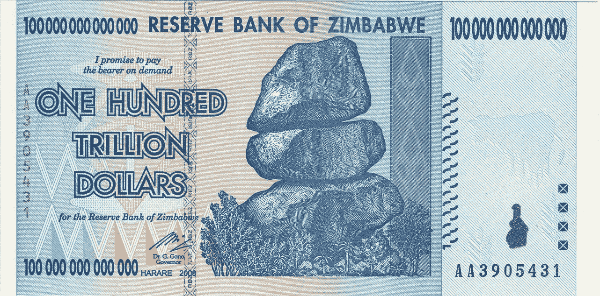
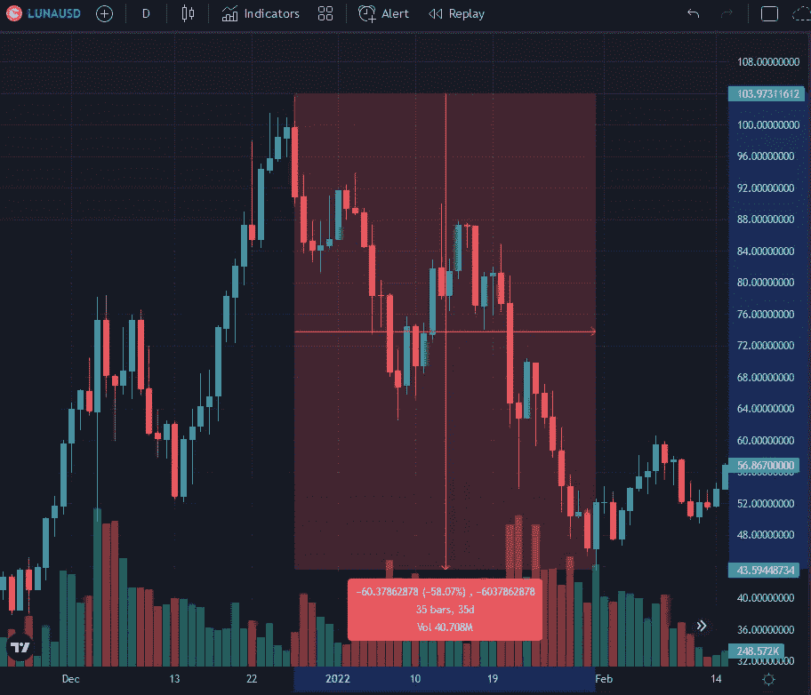
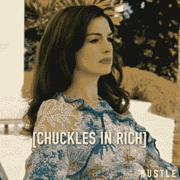
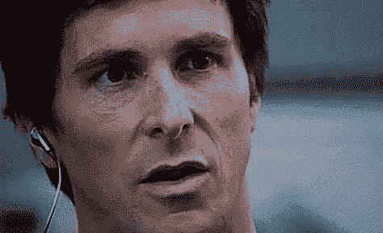
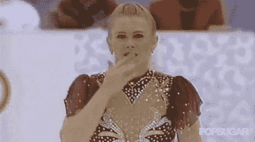
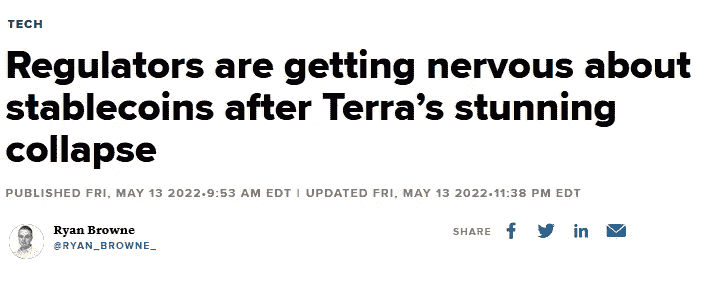
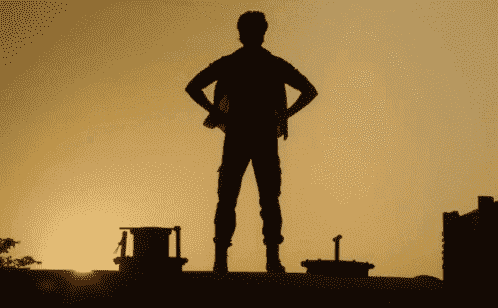

# 登月🌑

> 原文：<https://medium.com/coinmonks/moonfall-721d5406b57?source=collection_archive---------28----------------------->

***显然，WNAGMI***

“Famous last words” 😂

我从没说过我什么都知道。事实上，我经常说完全相反的话。这就是原因。

我花了一大笔钱买了 LUNA dips，当它在 40 美元左右的时候我离开了。我当时抓着一枚硬币，以防露娜基金会的警卫来救援。

现在一个代币以美元计价是如此便宜，以至于在我写这篇文章的时候，称它为大约 10 SHIB 更有意义。

Or, like, six of these. Wait, twenty. Nope, four hundred . . . aww, crap.

LUNA 失宠的影响是巨大的，在过去一周半左右的时间里，它导致了 40%的总加密市值暴跌。

[许多投资者彻底破产](https://www.youtube.com/watch?v=Npvldfda_4Q)，[有些甚至彻底破产并自杀](https://www.reddit.com/r/terraluna/comments/un40h4/my_excolleague_attempted_suicide/)。还有很多人很愤怒，最大的替罪羊似乎是。。。Terraform Labs 联合创始人 Do Kwon？

什么？

幸灾乐祸(就像许多其他令人敬畏的德语单词一样)是普遍的，但这并不意味着卢娜是庞氏骗局。

庞齐夫妇被自己的谎言压垮了。

卢娜摔倒了，没错——但它是被推下去的。

It happened at just the right (wrong) time. What are the odds?

就像电影*所有总统的手下*说的:跟着钱走。由于这发生在链上，我们可以这样做:

You do have to admire the balls.

你没看错:有人在做空价值约 40 亿美元的比特币。补充一句，他们同时购买了泰拉的稳定货币 UST 的 10 亿美元，这似乎是微不足道的。

与其他由抵押品支持的稳定货币不同，UST 被设计成*算法*，这意味着保持其与 1 美元挂钩的均衡是由其自身提供的。LUNA 是(技术上仍然是)浮动机制。每当有人铸造 UST，他们烧伤露娜，反之亦然。

攻击者一直等到正确的时间，当数百万 UST 人通过弯道协议时。然后[抛售他们的 UST，充斥市场，导致其贬值](https://twitter.com/OnChainWizard/status/1524123960257961985)，或从 1 美元“脱钩”。UST 以前经历过严重的依赖，最近一次是在一月份仙境内爆时的[。在这种情况下，套利者会在 UST 低于 1 美元的时候冲进去买入，烧掉 1 美元的卢娜，然后卖掉卢娜，实现即时盈利。因此，当 UST 因其新的需求而回升至 1 美元时，新的 LUNA 正在被铸造和出售。随着仙境的消亡，大量的供应导致露娜在接下来的一个月里崩溃了一大半:](https://subscriptions.finimize.com/content/Q29udGVudFBpZWNlOjQwNjM=)

“I can’t wait to ride this back up” — me (I did)

卢娜崩溃，本质上，正是它应该做的。但是这次威胁更大也更复杂，它利用了一个重要的新因素:之前的脱钩事件所带来的恐惧。

UST/卢娜机制只有在对 UST 有需求的情况下才起作用。虽然你可以在一些零售店使用它，特别是在韩国，但对 UST 需求最大的是锚协议，这是一款支付近 20%年息的去中心化金融应用。

但是在一月份脱钩之后，Anchor 决定引入一种动态利率，作为 UST 国内重大波动的减震器。这本身就很有意义。但是[新来的第一层 algostables](https://cryptoslate.com/after-usts-success-a-new-race-for-l1-stablecoins-is-here/) 跳进了竞技场，抢了 UST 的风头。有一个晚上[承诺 30%的回报](https://www.newsbtc.com/news/tron/tron-joins-stablecoin-wars-will-launch-usdd-with-30-apy-here-is-when/)。

随着对生息美元的新竞争，5 月份的袭击引发了一连串清算，UST 持有者纷纷逃离。

“I can’t wait to ride this back up” — me (I did not)

众所周知，权道买入了超过 10 亿美元的比特币，以支持 UST 盯住美元，卢娜基金会的守卫开始抛售比特币，孤注一掷地试图守住底线。但这一切也迫使 BTC 坦克化。

“I can’t wait to ride this back up” — me (maybe)

也许我疯了，但我认为这才是真正的目标。做空 LUNA 赚钱是一回事，但最终只有当投资变为零时，你的投资才会翻倍(除非你使用杠杆，但这次攻击已经需要 50 亿美元)。

真正的 ***真正的*** 赢了？做空价值 40 亿美元的 BTC，用它来推高 use 卢纳，由此产生的多米诺骨牌效应让 BTC 崩溃，然后买回这些股票来填补做空，然后在数字显示的世代底部建立多头头寸。如果迈克尔·塞勒[被清算](https://fortune.com/2022/05/04/michael-saylor-microstrategy-margin-call-bitcoin/)，那就更好了。

而你所要做的就是摧毁一个 600 亿美元的资产，强行让成千上万的人破产来做到这一点。

#YOLO. (MGM)

在这些道德剧中，英雄和反派之间的区别往往主要取决于一个人个人喜欢和不喜欢谁。乔治·索罗斯没有做任何迈克尔·伯里也没有做的事情，但主要是出于政治原因，索罗斯是“打破英镑的人”，而伯里是一个古怪的特立独行者，由克里斯蒂安·贝尔在《大空头》中扮演。

I mean, I guess that’s a compliment. (Paramount)

我们不知道是谁破坏了 Terra 的生态系统，但我们知道跆拳道，普遍的共识似乎是。。。

Sorry about the language, but this is actually among the nicer reactions I could use.

我的意思是，是的，道权[对评论家说垃圾话](https://twitter.com/AlgodTrading/status/1501551655837384707)，[表现出一种狂妄自大](https://twitter.com/stablekwon/status/1522465428320120832)，[被定制来降低](https://twitter.com/stablekwon/status/1464897977793728514)，[树敌太多](https://twitter.com/stablekwon/status/1506494471873081352)以至于很难挑出任何一个嫌疑人。但是被人低声下气地对待和你的车刹车失灵是有区别的。所以 Do 表现得像个自大的蠢驴，拿着他的包就跑了。。。在**推特上**？嗯，我*从来没有*！*胆大妄为*！Twitter 密码空间中肯定没有其他人会表现得如此傲慢。

对 Do 的另一个抱怨是，他用[一个已经多次失败](https://www.coindesk.com/layer2/2022/05/11/do-kwon-is-the-elizabeth-holmes-of-crypto/)的系统建立了一个算法稳定币——事实上，[他甚至联合创造了一个](https://twitter.com/CoinDesk/status/1524408439287463936)。为了让 Terra party 继续下去，他不断膨胀锚协议泡沫，让人们锁定 UST 的脂肪产量，这样稳定的硬币就会如此“[强大](https://twitter.com/stablekwon/status/1502226320989700097)”以至于可以承受依赖。虽然情况显然比他透露的要危险得多——毕竟，安全的幻觉是 UST/卢娜/主播的吸引力的一部分——但如果他能让 UST 进入曲线，他可能会成功的。他可能离终点线还有两步，有人击中了他的致命弱点。

Never mind, I do have a suspect! (if you’re under 40, ask your parents)

加密领域的一些非常聪明的人认为算法稳定是必要的，因为否则总会有一个集中点。(况且人家又不是没有[针对其他马厩的尖锐问题](https://www.ft.com/content/5887ef43-d43a-4608-a1ac-aacc99f076b9)。)人们可能会认为，创造一种只能靠吹自己的帆来推动的资产是荒谬的，但这正是许多替代硬币的意义所在。有许多项目使用并继续使用不可持续的承诺来维持这一策略，包括[美元](https://www.usdebtclock.org/)。

Kwon 最终会飞得离太阳太近吗？可能吧。但我们永远不会知道。相反，成千上万的人破产了。虽然人们可以说他们应该更加多样化，他们应该更加多样化，但是没有什么比一些经济上破产的公民给官僚们提供更多的机会去干涉他们不属于的和几乎不理解的事情。

“Nervous” isn’t the word I’d use, Ryan. Closer to “hot for,” actually.

所以，当你可以问权如何看待建立一个废墟帝国时，你也应该问问那些故意把 Terra 推向悬崖的杀手，他们如何看待允许政府为了我们的利益而实施 CBDCs。

但那都是未来。在当下，我们只能努力学习。我郑重声明，虽然我从来都不是一个带卡的疯子，但我应该更加怀疑。虽然我同意批评者的观点，即死亡螺旋风险是真实存在的，但我没有理会他们，主要是因为[我希望 Do 获胜，并带着比特币一起上涨](/coinmonks/bitcoins-going-to-the-moon-2ab759ce4c5f)。在过去的[两个](/coinmonks/top-10-cryptos-to-buy-on-coinbase-in-april-2022-8ab5e96b1e56)月[月](/coinmonks/top-10-cryptos-to-buy-on-coinbase-in-may-2022-e99e3b033e2f)里，我在我的前 10 枚硬币里放入了一个露娜克隆体。如果你听我的，你会损失 22 美元。我会退款，但老实说，在过去的两个月里，你可能在你没看过的流媒体服务上花了那么多钱。另外，IANAFA。

下面是[一些](https://twitter.com/thedefiedge/status/1524782511783415813) [更](https://twitter.com/0xHamz/status/1525117474441764865) [的教训](https://twitter.com/Route2FI/status/1525898586306797568)，都是比我聪明很多的人给的。

与此同时，请记住，生活中有比金钱更多的东西，更多的钱来自哪里。活着，无论是比喻还是字面意思。如果你觉得别无选择，不要单干。在美国，生命线是**(800)273–8255**。

月亮可能已经落下，但太阳将会升起。

你会成功的。

While wearing a cape, apparently.

> 加入 Coinmonks [电报频道](https://t.me/coincodecap)和 [Youtube 频道](https://www.youtube.com/c/coinmonks/videos)了解加密交易和投资

# 另外，阅读

*   [币安期货交易](https://coincodecap.com/binance-futures-trading)|[3 comas vs Mudrex vs eToro](https://coincodecap.com/mudrex-3commas-etoro)
*   [如何购买 Monero](https://coincodecap.com/buy-monero) | [IDEX 评论](https://coincodecap.com/idex-review) | [BitKan 交易机器人](https://coincodecap.com/bitkan-trading-bot)
*   [CoinDCX 评论](/coinmonks/coindcx-review-8444db3621a2) | [加密保证金交易交易所](https://coincodecap.com/crypto-margin-trading-exchanges)
*   [红狗赌场评论](https://coincodecap.com/red-dog-casino-review) | [Swyftx 评论](https://coincodecap.com/swyftx-review) | [造币厂评论](https://coincodecap.com/coingate-review)
*   [Bookmap 评论](https://coincodecap.com/bookmap-review-2021-best-trading-software) | [美国 5 大最佳加密交易所](https://coincodecap.com/crypto-exchange-usa)