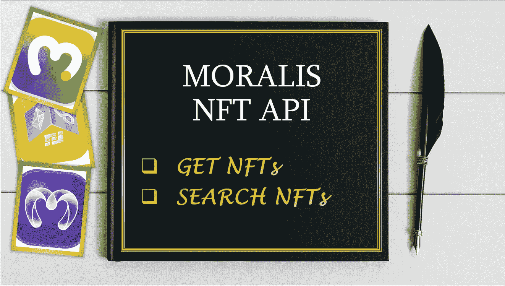

# 道德 NFT API —带分页的 getNFTs 和 searchNFTs

> 原文：<https://medium.com/coinmonks/moralis-nft-api-getnfts-and-searchnfts-with-pagination-5dd77b990bba?source=collection_archive---------6----------------------->

## NFT 系列

## 使用游标分页的 Moralis getNFTs 和 searchNFTs APIs 的一个预览

在本文中，我们试图使用游标在分页端点上使用 Moralis APIs 的 getNFTs 和 searchNFTs。API 响应有一个光标，我们可以用它来迭代多个页面。



## getNFTs

它用于获取指定用户地址的所有 NFT。根据请求，我们将访问页码、链和用户地址。

```
function getNFTs(req, res, next) {
 try {
    const { pageNumber, chain, address } = req.body;
    let cursor = null, count = 1, nfts = [];
    do {
          const options = {
            chain,
            address,
            limit: 10,
            cursor
          };
          nfts = await Moralis.Web3API.account.getNFTs(options);
          cursor = nfts.cursor;
          count++;
       } while (count <= pageNumber);
    return nfts;
   } catch (err) {
     console.log(err);
   }
 }
```

## 搜索功能

它用于基于元数据搜索 NFTs。这里我们将查看整个元数据集，因此过滤值设置为`global.`

```
function searchNFTs(req, res, next) {
 try {
    const { pageNumber, chain, searchKey } = req.body;
    let cursor = null, count = 1, nfts = [];
    do {
          const options = {
            q: searchKey,
            chain,
            filter: "global",
            limit: 10,
            cursor
          };
          nfts = await Moralis.Web3API.token.searchNFTs(options);
          cursor = nfts.cursor;
          count++;
       } while (count <= pageNumber);
    return nfts;
   } catch (err) {
     console.log(err);
   }
 }
```

## 谢谢:)

> 加入 Coinmonks [电报频道](https://t.me/coincodecap)和 [Youtube 频道](https://www.youtube.com/c/coinmonks/videos)了解加密交易和投资

# 另外，阅读

*   [3 商业评论](/coinmonks/3commas-review-an-excellent-crypto-trading-bot-2020-1313a58bec92) | [Pionex 评论](https://coincodecap.com/pionex-review-exchange-with-crypto-trading-bot) | [Coinrule 评论](/coinmonks/coinrule-review-2021-a-beginner-friendly-crypto-trading-bot-daf0504848ba)
*   [莱杰 vs n rave](/coinmonks/ledger-vs-ngrave-zero-7e40f0c1d694)|[莱杰 nano s vs x](/coinmonks/ledger-nano-s-vs-x-battery-hardware-price-storage-59a6663fe3b0) | [币安评论](/coinmonks/binance-review-ee10d3bf3b6e)
*   [Bybit Exchange 评论](/coinmonks/bybit-exchange-review-dbd570019b71) | [Bityard 评论](https://coincodecap.com/bityard-reivew) | [Jet-Bot 评论](https://coincodecap.com/jet-bot-review)
*   [3 commas vs crypto hopper](/coinmonks/3commas-vs-pionex-vs-cryptohopper-best-crypto-bot-6a98d2baa203)|[赚取秘密利息](/coinmonks/earn-crypto-interest-b10b810fdda3)
*   最好的比特币[硬件钱包](/coinmonks/hardware-wallets-dfa1211730c6) | [BitBox02 回顾](/coinmonks/bitbox02-review-your-swiss-bitcoin-hardware-wallet-c36c88fff29)