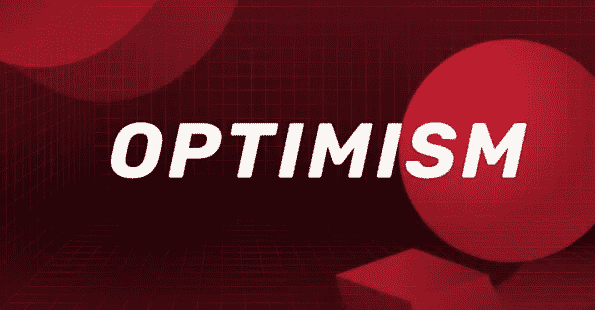
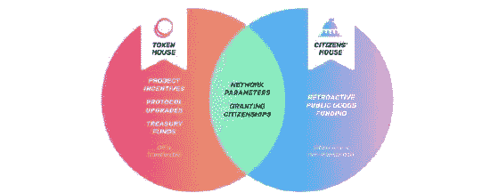
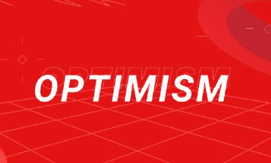

# 还会有更多空投吗？乐观基金会和操作手册 v0.1 发布

> 原文：<https://medium.com/coinmonks/more-airdrop-to-come-optimism-foundation-operating-manual-v0-1-launched-66c53fecb038?source=collection_archive---------36----------------------->

为了实现真正可持续的分权治理体系，乐观集团出版了乐观集团 v0.1 版运营手册，该手册大量引用了现有的治理模式。乐观主义还宣布了一个独特的实体——乐观主义基金会。乐观基金会的主要职责是:

>在建造市民之家的过程中，管理追溯性公共产品融资和基于身份的非功能性交易的实验。

>维护运营手册，通过改进集体的两院来确保健康和灵活的治理。

>在集体早期的指导下制定连锁交易。

## 什么是“乐观主义集体”？

乐观主义认为，乐观主义集体是分权治理的大规模实验。其治理的核心是两个同等重要的议院:象征议院和公民议院。

上个月，Token House 与它自己的 token airdrop 一起推出([点击这里](/coinlucky/biggest-crypto-airdrop-in-2022-optimism-is-launching-governance-token-op-3de823974ec3)了解更多关于空投的信息)。操作手册 v0.1 授权 Token House 进行升级和资金分配等工作。它的存在是为了明确财阀模式，但不足以为新的互联网提供长期平衡。

这就是为什么公民之家被引入，

> “公民之家的主要责任将是资助那些对乐观主义和以太坊生态系统产生最积极影响的公共产品。"

市民之家将由拥有 NFT 公民身份的人管理。既然乐观基金会和象征之家已经建成，第一公民之家和相应的 NFT 公民将成为这个集体的下一个里程碑。市民之家计划在操作手册 v0.2 版中推出。这些房子的任务是平衡短期激励并实现乐观的长期前景。

然而，乐观主义者认为，这种治理体系将不止一次地自我毁灭——没有任何实验在第一次就奏效，更不用说前所未有的分权治理体系了。这意味着当前的治理模式可能会在未来被推翻，以适应一个设计更好的模式。

乐观主义是在以太坊上建立即时交易和可扩展智能合约的第二层网络，并在乐观主义中创建了 OVM，旨在与以太坊第一层协同工作，不仅保留了以太坊主网络的安全性，还大大减少了 gas。费用。乐观 mainnet 于 2021 年推出，为用户节省了超过 11 亿美元的天然气费用，部署了超过 6，800 份合同，促成了超过 174 亿美元的交易量，产生了超过 2，450 万美元的收入，并向公共产品基金捐赠了超过 100 万美元。

乐观公司发行本地代币使其官员能够进一步降低汽油费，并可以迅速扩大网络节点的规模，这使其在面对 Arbitrum、Metis 和其他 rollups 时更具竞争力。值得注意的是，所有 OP 的 19%将以空投的形式提供给其用户，其中，5%已在空投#1 中发货。这意味着现在加入乐观主义并在未来空投中赢得 OP token 还不算太晚！

如果你想赚取更多的免费密码，你可以在这里参加 LuckyHash 投资大赛，在社交媒体上分享活动可以赚取 5 Dogecoins。

还有，🌈[这里有一个神奇的链接，注册可以获得 5 个金币](https://www.luckyhash.com/createAcc?invitationCode=031DA6)

# 来源

[https://gov .乐观主义. io/t/operating-manual-of-the-乐观主义-collective-v 0-1/592](https://gov.optimism.io/t/operating-manual-of-the-optimism-collective-v0-1/592)
[https://乐观主义. mirror . XYZ/r 888 E4 b5 iinqi-3 _ mo 26 ixgv-plq 099 xwgqeov 9 iwka](https://optimism.mirror.xyz/r888e4B5iiNQi-3_mO26ixgv-plQ099XWgqEOv9iWKA)

— — — — — — — — — — — — — — — — — — — — — — — — — — — —

# 关于 LuckyHash

LuckyHash 是全球领先的一站式加密资产管理平台。它提供免抵押采矿 hashrate 租赁和担保加密货币的利息产生计划。

[网站](https://m.luckyhash.com/?utm_source=english&utm_medium=official) | [推特](https://twitter.com/LuckyHash_) | [脸书](https://www.facebook.com/luckyhashofficial) | [电报](https://t.me/luckyhashgroup)|[LinkedIn](https://www.linkedin.com/company/76618197/)|[YouTube](https://www.youtube.com/channel/UCWSfe0OwBuD4D79sSjUoYBA)

# 机会

1.  [参与我们的抽奖活动，有机会赢得 300 TRX](http://t.ly/VKMe)
2.  [参与我们的抽奖活动，有机会赢得 500 TRX](http://t.ly/V0D3)

> 加入 Coinmonks [电报频道](https://t.me/coincodecap)和 [Youtube 频道](https://www.youtube.com/c/coinmonks/videos)了解加密交易和投资

# 另外，阅读

*   [Bookmap 点评](https://coincodecap.com/bookmap-review-2021-best-trading-software) | [美国 5 大最佳加密交易所](https://coincodecap.com/crypto-exchange-usa)
*   [如何在 FTX 交易所交易期货](https://coincodecap.com/ftx-futures-trading) | [OKEx vs 币安](https://coincodecap.com/okex-vs-binance)
*   [CoinLoan 评论](https://coincodecap.com/coinloan-review) | [YouHodler 评论](/coinmonks/youhodler-4-easy-ways-to-make-money-98969b9689f2) | [BlockFi 评论](https://coincodecap.com/blockfi-review)
*   [XT.COM 评论](https://coincodecap.com/profittradingapp-for-binance)币安评论 |
*   [SmithBot 评论](https://coincodecap.com/smithbot-review) | [4 款最佳免费开源交易机器人](https://coincodecap.com/free-open-source-trading-bots)
*   [比特币基地僵尸程序](/coinmonks/coinbase-bots-ac6359e897f3) | [AscendEX 审查](/coinmonks/ascendex-review-53e829cf75fa) | [OKEx 交易僵尸程序](/coinmonks/okex-trading-bots-234920f61e60)
*   [如何在印度购买比特币？](/coinmonks/buy-bitcoin-in-india-feb50ddfef94) | [瓦济克斯评论](/coinmonks/wazirx-review-5c811b074f5b)