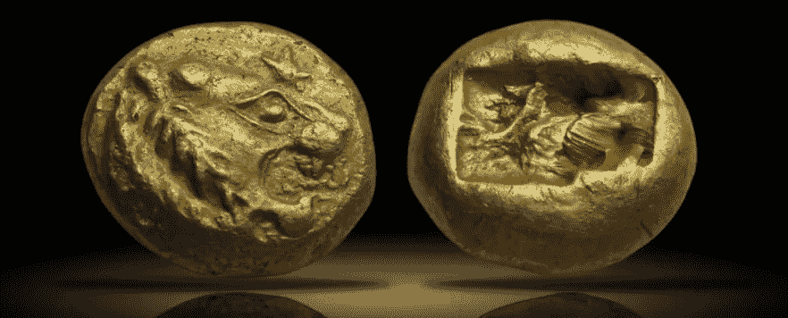
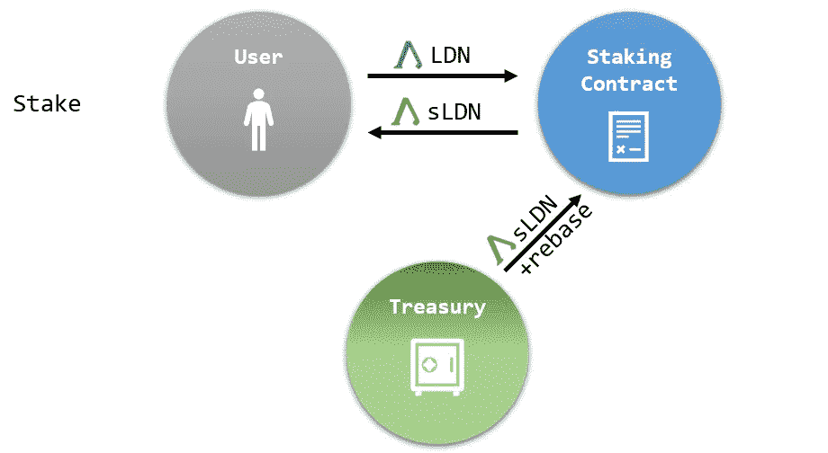
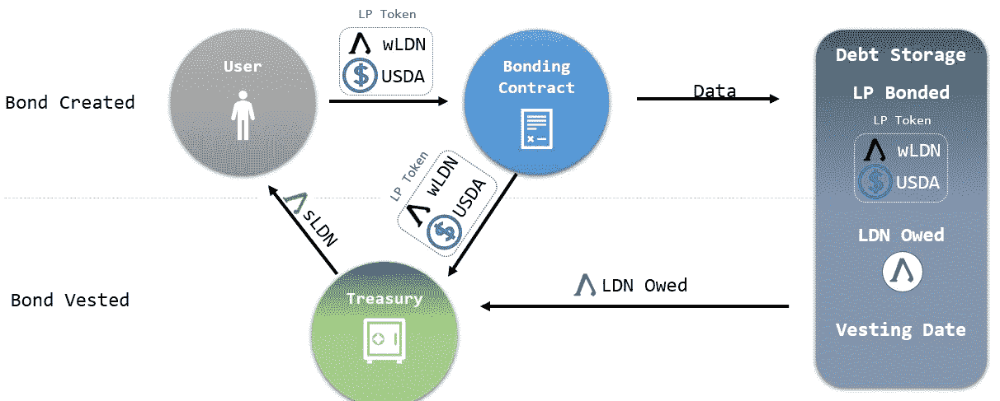
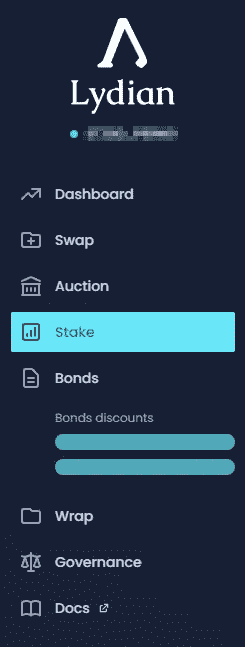
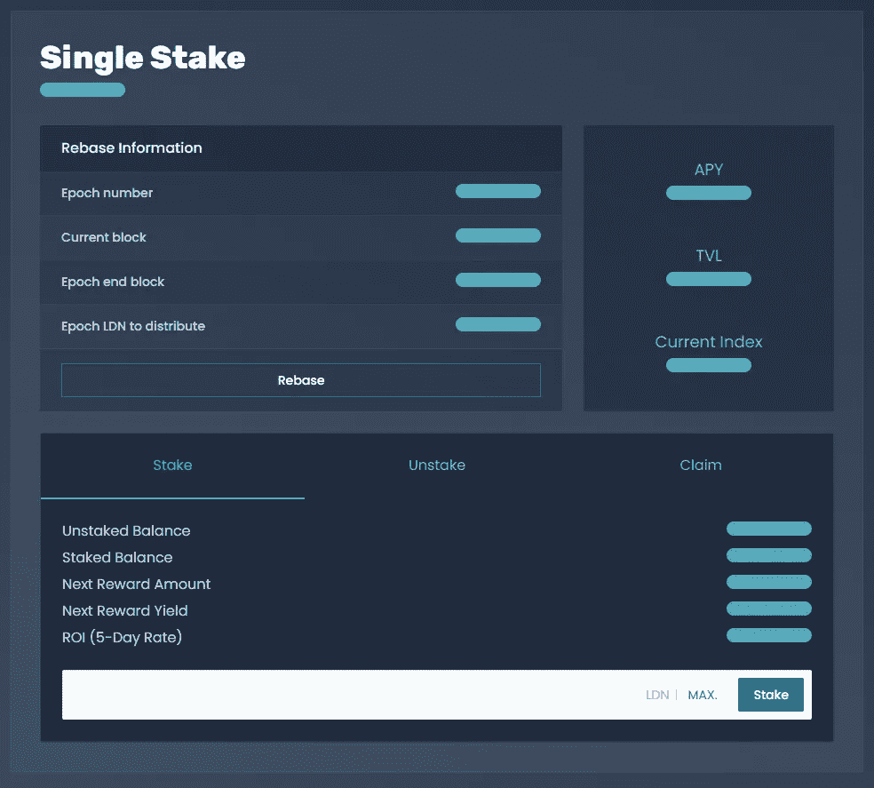
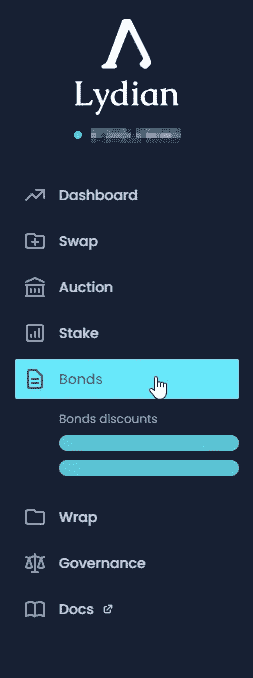
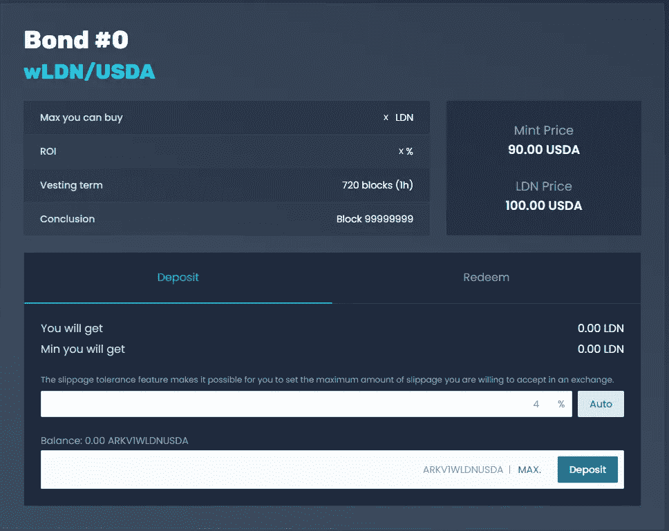

# 更多关于吕底亚代币和如何使用它们。

> 原文：<https://medium.com/coinmonks/more-on-lydians-tokens-and-how-to-use-them-fe7b15ff7367?source=collection_archive---------8----------------------->

2022 年 3 月 14 日

# 1.介绍

因为我们正在接近 Lydian 的国库启动事件，所以是时候深入研究在使用协议时您将会遇到的不同令牌了。

# **2。LDN**

LDN 是吕底亚协议的基础治理令牌。它代表总金库的一部分，是你的公会会员卡。

你在治理投票中的权重还取决于你钱包里的吕底亚代币数量，无论是 LDN 代币、s LDN 代币还是 wLDN 代币。

# **3。sLDN** (木桩 LDN)

赌注允许你通过自动复利被动赚取更多的 LDN。

通过把你的 LDN 和吕底亚押在一起，你会以 1:1 的比例得到 sLDN(押在 LDN 身上的)。在您收到您的 sLDN 后，您可以申领您的 sLDN 奖励，这些奖励根据各自的 APY 不断增长。

# **4。wLDN** (包裹 LDN)

LDN 的包装使得 sLDN 令牌能够在其他协议上使用，将来甚至可能脱离链。

在 Arkadiko 上用你的 wLDN 和 USDA 换 wLDN-USDA LP 代币，在 Lydian 上买债券。

购买债券时，绑定机制会创建额外的 LDN 令牌，使协议能够拥有 wLDN-USDA LP 令牌。

未来，将决定哪些其他代币应该被接受为债券，从而成为吕底亚国库的一部分。

**债券让你有机会以折扣价从协议中购买 LDN。**

1.  **你用流动资金支付 LDN。**这有助于协议积累流动性份额。不是用 USDA 来绑定，而是用 wLDN-USDA LP(或者以后其他接受的资产)。但事实上它和任何常规贸易是一样的；你给协议一个资产(LP)，作为回报，你得到另一个资产(LDN)。
2.  对债券的需求决定了你得到的折扣。市场仍然是相关的，因为你支付的 LP 股票或多或少会变得有价值，但这并不是你实际获得的东西。相反，债券折价在债券多的时候上升，在债券少的时候下降。
3.  **一旦您绑定，您的承诺 LP 将被锁定。**这一点需要注意。当你做交易时，你已经做了交易。你可以把它想象成用 LP 代币购买 LDN。

# 5.如何下注

*   去吕底亚达普。

*   在导航菜单中选择“赌注”选项卡。

*   在输入字段中输入您希望下注的 LDN 金额。如果您想下注您的所有 LDN，请按“最大”按钮，输入字段将会填入您的全部可用 LDN 余额。
*   点击“赌注”并签署交易。
*   在您“确认”交易已被成功处理和签署后，您已下注您的 LDN！

# 6.如何结合

*   去吕底亚达普
*   在导航菜单中选择“债券”标签。

*   在输入字段中输入您想要购买的 LP 代币数量，并确定您的滑点。查看您将获得多少 LDN 代币作为回报。基于实际 LDN 价格的当前 ROI(折扣或溢价)。

# 7.最后

最后，由你来决定你的 LDN 的哪一部分是你想要的，哪一部分是你想要作为协议的流动性提供的。

我们建议关注你所知道的，关注你从交易中得到的回报，然后自己决定什么是最好的前进方式。

一如既往，Lydian Discord 是一个与其他公会成员公开讨论的好地方，他们面临着同样的难题来获得最好的奖励。

> *加入 Coinmonks* [*电报频道*](https://t.me/coincodecap) *和* [*Youtube 频道*](https://www.youtube.com/c/coinmonks/videos) *了解加密交易和投资*

# 另外，阅读

*   [3 商业评论](/coinmonks/3commas-review-an-excellent-crypto-trading-bot-2020-1313a58bec92) | [Pionex 评论](https://coincodecap.com/pionex-review-exchange-with-crypto-trading-bot) | [Coinrule 评论](/coinmonks/coinrule-review-2021-a-beginner-friendly-crypto-trading-bot-daf0504848ba)
*   [莱杰 vs n rave](/coinmonks/ledger-vs-ngrave-zero-7e40f0c1d694)|[莱杰 nano s vs x](/coinmonks/ledger-nano-s-vs-x-battery-hardware-price-storage-59a6663fe3b0) | [币安评论](/coinmonks/binance-review-ee10d3bf3b6e)
*   [Bybit Exchange 审查](/coinmonks/bybit-exchange-review-dbd570019b71) | [Bityard 审查](https://coincodecap.com/bityard-reivew) | [Jet-Bot 审查](https://coincodecap.com/jet-bot-review)
*   [3 commas vs crypto hopper](/coinmonks/3commas-vs-pionex-vs-cryptohopper-best-crypto-bot-6a98d2baa203)|[赚取加密利息](/coinmonks/earn-crypto-interest-b10b810fdda3)
*   最好的比特币[硬件钱包](/coinmonks/hardware-wallets-dfa1211730c6) | [BitBox02 回顾](/coinmonks/bitbox02-review-your-swiss-bitcoin-hardware-wallet-c36c88fff29)