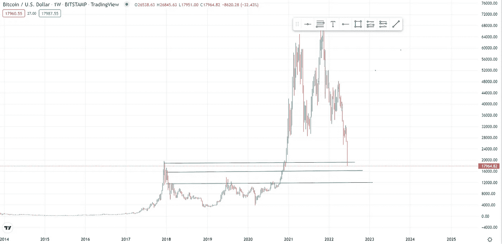

# 还有更多的痛苦..密码有危险吗？

> 原文：<https://medium.com/coinmonks/more-pain-to-go-are-cryptos-in-danger-99fc6c225822?source=collection_archive---------28----------------------->

在 crypto 中会有更多的痛苦吗？

好吧，让我们看看事实，看看到底发生了什么。如果你不想看完这篇文章，答案是肯定的，可能会有更多的痛苦，直到我们到达底部，并开始巩固，或形成一个新的交易区，价格将来回反弹。不幸的是，加密领域的投资者习惯于在一定时期的抛售后快速恢复，然而这可能会有所不同，因为我们很大程度上依赖于爸爸鲍威尔和他正在听取的其他数百名经济学家。

**比特币**

比特币刚刚突破 19800 美元支撑位，这是前一个周期 2017 年高点，200 天周均线，巨大的心理支撑位。还有一天的时间来确认周线图收于该水平以下，这不是空头陷阱，然而事情看起来并不乐观。

Bitcoin/USD chart, broke below the $20000 support line

在 15000-16000 美元附近几乎没有支撑，另一个主要支撑在 12000-13000 美元附近，我认为这也是我们前进的方向。

各地的坏消息可能开始表明我们已经接近底部。

*   主流媒体每天都在谈论比特币崩盘(还记得 2021 年 11 月，到处都是比特币涨到 10 万的新闻吗..？)也许只是巧合
*   [Crypto lender Celsius 因“极端市场条件”暂停所有提款和转账](https://www.cnbc.com/2022/06/13/crypto-lender-celsius-pauses-withdrawals-bitcoin-slides.html)。如果你从未听说过 Celsius，它是加密贷款领域最大的参与者之一，管理着近 120 亿美元的资产。由于他们向客户提供的高收益率，他们不得不承担不必要的风险来支付这些，但这在牛市中很有效，而不是在流动性危机和美联储收紧时期。这一行业的可疑之处在于，他们不披露这些交易，从而将投资者的资金置于风险之中。Celsius 会是下一家宣布破产的公司吗？我想是的。
*   [更多的破产风险，三箭资本(3AC)，加密领域最大的风险投资公司之一，拥有约 100 亿美元的 AUM 面临破产的危险](https://www.coindesk.com/business/2022/06/17/three-arrows-capital-confirms-heavy-losses-from-lunas-collapse-exploring-potential-options-report/)引用卢纳-UST 的严重损失，以及 4 亿美元的清算。摄氏、3AC、卢纳-UST 崩溃的传染效应可能会将价格推得更低。
*   加密公司开始大规模裁员以降低成本，并在低交易量和加密价格下生存下来。比特币基地以惊人的 18%裁员。

这些都是坏消息，通常当一切都很糟糕时，这是底部的信号，但现在我们试图对抗通货膨胀，流动性危机，战争，等等…因此更多的痛苦可能会到来。

**红旗**

[抵押贷款支持证券市场无人问津，这应该是流动性最强的市场之一。](https://www.cherrycreekmortgage.com/lous-credit-news)为了便于理解，这种情况在历史上发生过 4 次，当流动性最强的市场之一没有投标时，这可能是流动性危机的信号..美联储刚刚开始量化紧缩，这意味着从市场中取出流动性。那么，未来 6 至 12 个月，流动性危机会深化到什么程度？这是我最大的担忧，在这种环境下，加密货币市场不可能复苏。

一定有什么事情促使美联储改变政策，让风险资产重新开始反弹。将不得不看触发器是什么。

考虑到外面的黑暗时期，通货膨胀，危险信号，量化紧缩，我认为在这些时候你可以采取的最佳策略是把你计划投资的钱分成 6-12 个月。在这段时间里，每个月投资相等的金额，然后你会计算出你的平均进场点。把你的时间范围扩大到 5-10 年，你可以赚到几倍。根据你的风险承受能力进行投资，风险资本投资于加密玩家中相对安全的资产。

祝大家晚上愉快！

免责声明:我必须警告你，有些观点可能是我个人的偏见，但是，我会尽我所能为你提供关于特定主题的客观观点。我不是理财顾问，所有文章只会有严格的教育目的。

> 加入 Coinmonks [电报频道](https://t.me/coincodecap)和 [Youtube 频道](https://www.youtube.com/c/coinmonks/videos)了解加密交易和投资

# 另外，阅读

*   [本地比特币审核](/coinmonks/localbitcoins-review-6cc001c6ed56) | [加密货币储蓄账户](https://coincodecap.com/cryptocurrency-savings-accounts)
*   [什么是融资融券交易](https://coincodecap.com/margin-trading) | [美元成本平均法](https://coincodecap.com/dca)
*   [拥护卡审核](https://coincodecap.com/uphold-card-review) | [信任钱包 vs MetaMask](https://coincodecap.com/trust-wallet-vs-metamask)
*   [Exness 评测](https://coincodecap.com/exness-review)|[moon xbt Vs bit get Vs Bingbon](https://coincodecap.com/bingbon-vs-bitget-vs-moonxbt)
*   [如何开始通过加密贷款赚取被动收入](https://coincodecap.com/passive-income-crypto-lending)
*   [BigONE 交易所评论](/coinmonks/bigone-exchange-review-64705d85a1d4) | [电网交易机器人](https://coincodecap.com/grid-trading)