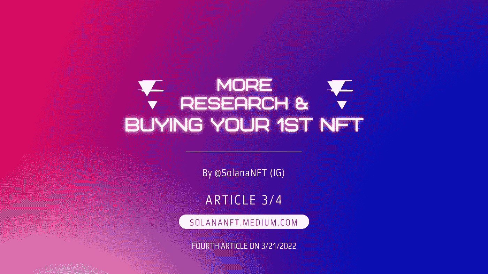
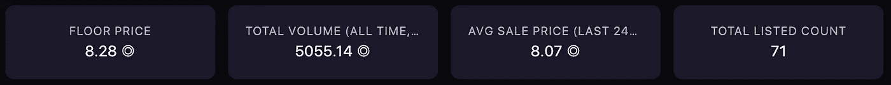
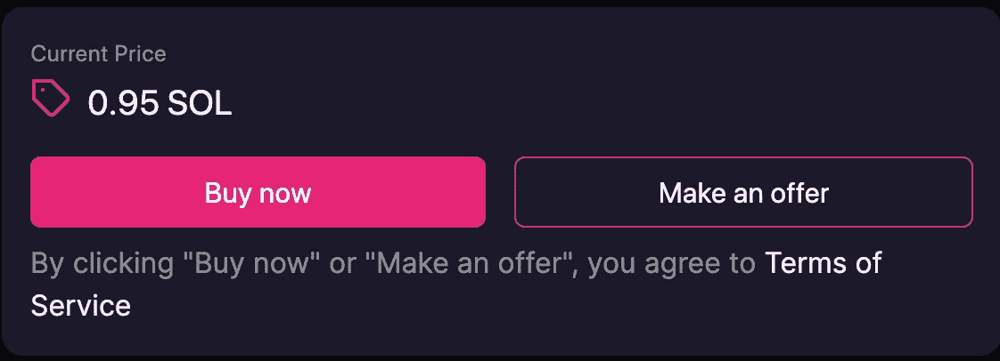

# 更多研究&购买你的第一辆 NFT

> 原文：<https://medium.com/coinmonks/more-research-buying-your-first-nft-a002b91d5574?source=collection_archive---------35----------------------->

你就要得到你的第一个索拉纳·NFT 了！我们希望你已经做好了尽职调查，并准备进入一些高可信度的游戏。在这里，您可以使用市场数据进行最后一级研究，但首先，让我们向您介绍一下索拉纳市场。

**NFT 索拉纳市场:**

*   [魔法伊甸园](https://magiceden.io/)
*   [数字眼](https://digitaleyes.market/)
*   [索拉纳](https://solanart.io/)
*   [阿尔法艺术](https://alpha.art/)
*   [Exchange.art](https://exchange.art/)
*   [索尔西](https://solsea.io/)

**最后一轮调查**

楼面价动的快吗？过去 24 小时的平均销售价格是多少？是高于还是低于底价？团队在工作吗？这是扣动扳机前你可以问自己的几个问题。做出你的假设，看看它们是否会实现。人们衡量指标的方式不同。有时指标也会误导人，例如洗盘交易(项目创始人/开发者在钱包之间交易，以使其看起来受欢迎)或当底价高时，上市数量低，但总交易量非常低(持有人决定在高底价上市，没有人降价，但在该价格下没有需求)

Floor Price, Total Volume, Avg Sale Price & Total Listed Count. Data on Magic Eden

**连接&出价/购买**

就是这个！是时候扣动扳机了。找到您想要的 NFT，连接您的钱包，然后出价或立即购买。大多数情况下，右上角有一个按钮，上面写着“连接钱包”。请记住，如果你出价，其他人可以跟随你并立即购买，从而取消你的出价。此外，如果你的出价被接受，SOL 将离开你的钱包，被 NFT 取代——没有提示或警告出价已被接受。

Screenshot from Magic Eden buy/bid

如果你正在寻找收集稀有的 NFT，有一些工具可以帮助你狙击——在某些市场上找到关于价格和稀有性的最佳交易。我们将在后面的文章中讨论这些内容

恭喜你！你现在拥有你的第一个索拉纳 NFT。在本系列的下一篇也是最后一篇文章中，我们将提示您在购买 NFT 后应该做些什么。如今，大多数收藏要么有元宇宙元素，要么是 P2E (play to earn)游戏的一部分，由一个强大的酷人社区支持，要么是可用于代币的赌注。

> 加入 Coinmonks [电报频道](https://t.me/coincodecap)和 [Youtube 频道](https://www.youtube.com/c/coinmonks/videos)了解加密交易和投资

# 另外，阅读

*   [印度最佳 P2P 加密交易所](https://coincodecap.com/p2p-crypto-exchanges-in-india) | [柴犬钱包](https://coincodecap.com/baby-shiba-inu-wallets)
*   [8 大加密附属计划](https://coincodecap.com/crypto-affiliate-programs) | [eToro vs 比特币基地](https://coincodecap.com/etoro-vs-coinbase)
*   [最佳以太坊钱包](https://coincodecap.com/best-ethereum-wallets) | [电报上的加密货币机器人](https://coincodecap.com/telegram-crypto-bots)
*   [交易杠杆代币的最佳交易所](https://coincodecap.com/leveraged-token-exchanges) | [购买 Floki](https://coincodecap.com/buy-floki-inu-token)
*   [3Commas 对 Pionex 对 Cryptohopper](https://coincodecap.com/3commas-vs-pionex-vs-cryptohopper) | [Bingbon 评论](https://coincodecap.com/bingbon-review)
*   [加密复制交易平台](/coinmonks/top-10-crypto-copy-trading-platforms-for-beginners-d0c37c7d698c) | [如何在 WazirX 上购买比特币](/coinmonks/buy-bitcoin-on-wazirx-2d12b7989af1)