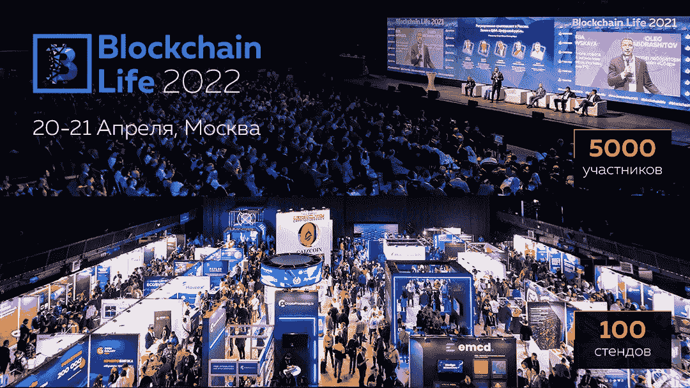
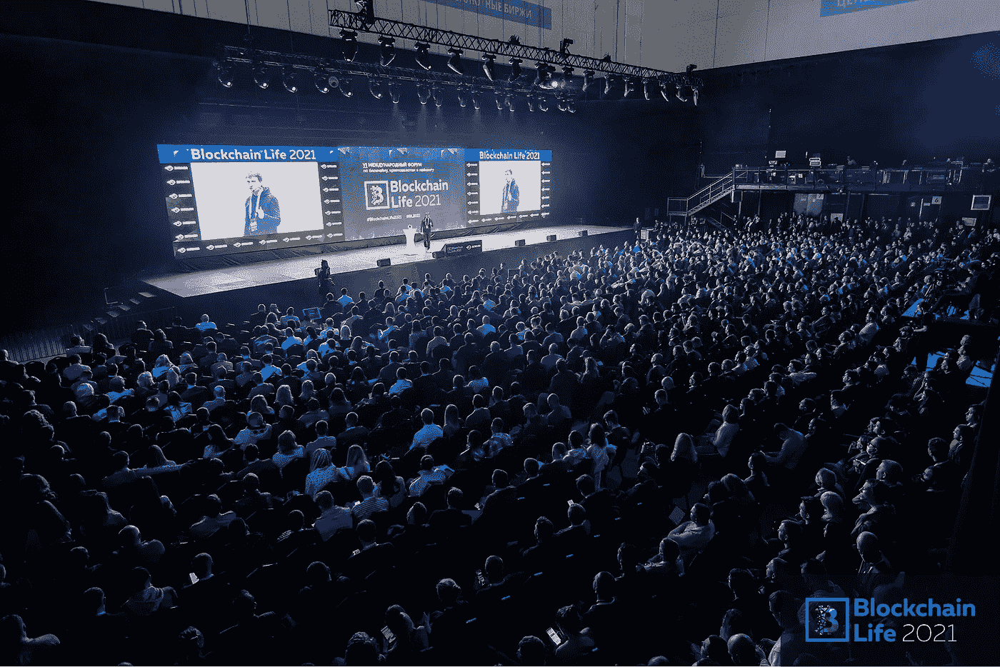

# 超过 5000 人将于 4 月 20 日至 21 日齐聚莫斯科，参加 2022 年区块链生活大会

> 原文：<https://medium.com/coinmonks/more-than-5-000-people-will-gather-in-moscow-on-april-20-21-at-blockchain-life-2022-132dcf9042cc?source=collection_archive---------77----------------------->

了解详情买票:[https://blockchain-life.com/europe/en/#tickets-row](https://blockchain-life.com/europe/en/#tickets-row)

[***youprstrategist***](https://bitmediabuzz.com/)*是区块链生活 2022 的媒体合作伙伴，很高兴向我们的社区提供特别的* ***10%折扣*** *。折扣代码:blockchainlife*

专业人士和那些刚刚开始加密行业之旅的人将聚集在莫斯科，了解加密货币行业的最新**趋势**，并在第八届加密货币和采矿国际论坛上寻找**商业伙伴**—**区块链生活 2022** 。

欧洲和独联体最重要的加密活动将聚集超过 5000 名参与者。他们中有交易员、矿工、加密和经典业务的企业家、投资者、区块链开发商，以及公共机构、风险基金和许多其他机构的代表。他们都已经在构建未来的金融体系并从中受益。

在两天之内，论坛上超过 60 位发言人将谈论投资密码产业的最新方式，承诺值得考虑的硬币和项目。

论坛的主要发言人包括:

——Sergey Khitrov，**上市公司创始人。帮**和**区块链生活**论坛。

——俄罗斯财政部**金融政策司**司长伊万·切别斯科夫。

——Vladislav Martynov，企业家，**以太坊俄罗斯**能力中心负责人，**区块极客**创始人。

——Anatoly Kaplan， **Forklog** 的创始人。

发言人的完整名单可在[网站](https://blockchain-life.com/europe/en/)上找到。

今年有一些**最热门的话题**在日程**，**上，例如:如何在 2022-2023 年在加密货币上赚钱 **DeFi 和元宇宙**发展，高效**采矿的特点**， **NFT** 前景**区块链在商业和政府中的实施**等等。

今年的中心话题是俄罗斯对加密货币的**监管，当局代表将讨论在不久的将来将通过哪些法律。**

传统上，该论坛将举办国际[区块链生活奖](https://blockchain-life.com/europe/en/awards2022/)，参与者可以投票选出该领域最重要的公司，以及为有前途的加密初创公司举办的[创业推介](https://blockchain-life.com/europe/en/startup_pitch/)比赛。

论坛的展览部分将展出最大的区块链和加密项目展览——100 多家公司，包括公认的行业领导者和有前途的初创公司，您可以亲自见到他们的团队。

在官方网站上购买门票:

[https://blockchain-life.com/europe/en/#tickets-row](https://blockchain-life.com/europe/en/#tickets-row)

本次论坛是由[挂牌举办的第八届论坛。求助](https://listing.help)，最大的上市机构。

> 加入 Coinmonks [电报频道](https://t.me/coincodecap)和 [Youtube 频道](https://www.youtube.com/c/coinmonks/videos)了解加密交易和投资

# 另外，阅读

*   [密码本交易平台](/coinmonks/top-10-crypto-copy-trading-platforms-for-beginners-d0c37c7d698c) | [Coinmama 审核](/coinmonks/coinmama-review-ace5641bde6e)
*   [印度的加密交易所](/coinmonks/bitcoin-exchange-in-india-7f1fe79715c9) | [比特币储蓄账户](/coinmonks/bitcoin-savings-account-e65b13f92451)
*   [OKEx vs KuCoin](https://coincodecap.com/okex-kucoin) | [摄氏替代品](https://coincodecap.com/celsius-alternatives) | [如何购买 VeChain](https://coincodecap.com/buy-vechain)
*   [币安期货交易](https://coincodecap.com/binance-futures-trading)|[3 commas vs Mudrex vs eToro](https://coincodecap.com/mudrex-3commas-etoro)
*   [如何购买 Monero](https://coincodecap.com/buy-monero) | [IDEX 评论](https://coincodecap.com/idex-review) | [BitKan 交易机器人](https://coincodecap.com/bitkan-trading-bot)
*   [CoinDCX 评论](/coinmonks/coindcx-review-8444db3621a2) | [加密保证金交易交易所](https://coincodecap.com/crypto-margin-trading-exchanges)