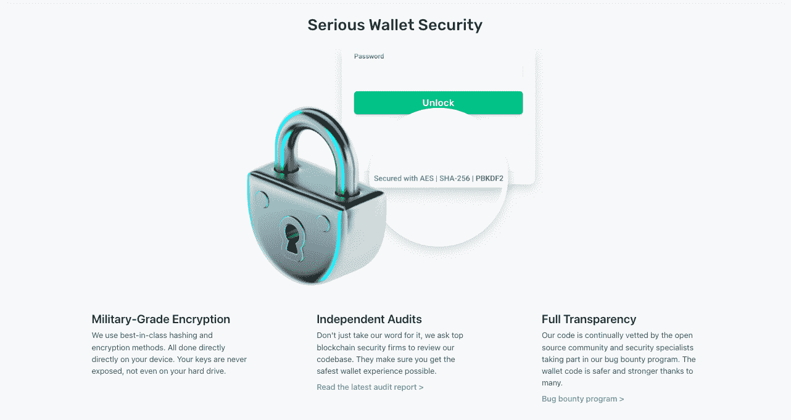

# 标题:Morpher 评论——安全吗？必读书目

> 原文：<https://medium.com/coinmonks/morpher-review-2022-free-100-mph-airdrop-6a16fbfa981e?source=collection_archive---------5----------------------->

# 什么是墨菲？

Morpher 是一个以太坊区块链交易平台，方便交易和投资。Morpher 允许用户免费交易无限数量的资产，并拥有无限的流动性(T2)。由于 Morpher 的[部分交易](https://support.morpher.com/en/article/fractional-trading-nnk8ke/)功能，金融市场更容易进入。在开市前、周末、节假日以及两者之间交易股票。

创始人:马丁·弗罗勒、丹尼斯·比科夫

联合投资者:Draper Associates、APEX Ventures、RTP Global、Spacecadet Ventures

行业:金融科技

该公司首席执行官 Martin Froehler 解释了 Morpher 协议如何为交易者带来利润，以及为什么 Morpher 上的交易体验在各个方面都优于传统交易所。

# 学习如何交易的理想平台。

Morpher 是新交易者的理想选择。在了解平台之前，没有必要承诺。在我对各种市场，如股票、商品、加密货币、指数、NFT 和其他独特的市场有了一个概述后，我就完成了 KYC，然后通过 PayPal 进行了存款。

这太棒了，因为我的时速提高了 10%,而且信用卡支付非常简单。甚至在 Trustpilot 上，Morpher 也获得了“优秀”的分数，有很多评论说这个平台非常适合学习如何交易。

由于 Morpher 使用分数交易，你已经可以用不到 1 美元投资所有资产，这很好，因为你可以使用测试金额来学习交易和如何使用该平台。

用户界面非常简单易懂，所以我很快就开始用更高的金额交易。

我是一个快乐的客户，期待着即将推出的所有新功能。最重要的是，我期待着他们宣布的所有独特的市场和即将到来的项目。例如，像豪华手表或收藏品这样的文化市场。你将不能在任何其他交易平台上交易这些市场。

# 零费用和无限流动性

优秀的交易平台，无手续费，流动性无限。没有交易对手，你可以在任何时间交易任何市场。我很少缺少市场，但是当我缺少时，我只是通过帮助中心请求它，大多数时候他们会在下一次更新时添加它。

此外，MPH/USDT 和 MPH/ETH 市场有时也有一些限制，但它们正在改善:)我用过各种交易平台，包括币安、Bittrex、Poloniex、北海巨妖、比特币基地和 Bitfinex。在我看来，Morpher 是其中最好的，也是最容易使用和理解的。

更重要的是，Morpher 与其他创新的合成资产协议有很好的比较。即使在最创新的交易平台上，Morpher 也大放异彩。

Morpher 的与众不同之处在于，它不需要任何抵押品来创建合成市场，这意味着他们可以提供传统金融中不存在的大量不同的市场——从交易劳力士手表价格到纽约房地产价格到大麻价格，再到蓝筹 NFT 收藏品，如 Cryptopunks 和 Bored Ape Yacht Club。

Morpher 真正令人敬畏的是，所有市场都可以用一种货币进行交易:MPH。这意味着用户不必担心债务状况，可以很容易地在 Polygon 网络上以非常低的费用将 MPH 换成 Matic，或者退出生态系统。

此外，Morpher 是超级用户友好的，只需点击几下就可以轻松利用和做空。这些关键的交易特征只是智能合约中的参数，这意味着复杂的金融工具已经成为过去。总而言之， [Morpher Protocol](https://coincodecap.com/go/morpher) 对于任何希望以简单有效的方式交易各种市场的人来说，是一个游戏规则的改变者。

# 强大的安全性和快速的客户支持

如果你正在寻找一个重视安全和可靠的客户支持的交易平台，Morpher 将助你一臂之力。Morpher 背后的团队将安全作为他们的首要任务。

在本平台使用[非保管钱包](https://www.morpher.com/blog/custodial-vs-non-custodial-wallets)时，您的资金归您所有，任何人都无法扣押。这是一个非常好的功能，它让您安心，并消除了传统平台的风险。

此外，Morpher 的客户支持是令人难以置信的帮助和响应。他们有一个全面的帮助中心，提供常见问题的答案，如果您需要进一步的帮助，您可以随时向他们的客户支持团队发送电子邮件。团队通常会在一两天内回复，所以你不会等太久。

Morpher Protocol 提供的强大安全性和快速客户支持表明，他们认真对待每一位客户和每一个问题。他们明白交易涉及真金白银，他们处理得非常专业。通过优先考虑安全和提供可靠的客户支持，Morpher 表明他们重视每一个客户和他们的资金。

难怪很多人给他们的平台好评。此外，该平台易于使用和用户友好。所以，如果你正在寻找一个既安全又可靠的交易平台，Morpher 绝对值得一试。

帮助中心:[https://support.morpher.com/en/](https://support.morpher.com/en/)

支持邮箱:【contact@help.morpher.com 

# 贸易的未来

但最精彩的部分呢？这是传统交易平台的绝佳替代品。最显著的优势是，即使在市场关闭时也可以开仓，例如，允许您根据周末新闻进行交易。

说到底层令牌 MPH，我相信随着使用和用户体验的增长，它将获得更大的价值。Morpher，在我看来是未来的交易平台，我可以强烈建议。(没有理财建议！)

# 既好玩又赚钱。

最初，我买了大约 500 英里/小时，我一时冲动，选择在深奥的加密上冒险。最重要的是，我喜欢在 Morpher 上交易的资产组合。分散我的投资组合并在许多不同的市场进行交易真的很容易。

我现在有一个令人尊敬的 3686 英里每小时，但最重要的是，我度过了一段美好的时光。 [Morpher 的](https://coincodecap.com/go/morpher)杠杆方法在我的经验中是不寻常的，绝对值得一试！

# Morpher 如何零手续费挣钱？

你可能想知道，Morpher 如何提供零费用交易？与传统交易平台不同，Morpher 作为其中央银行运营，并通过其令牌 MPH 获得收入。Morpher 在新铸造的令牌中接收总 MPH 令牌供应的一小部分，作为安全操作协议的奖励，这大约是每年 5.6%。

这种独特的商业模式使 Morpher 的利益与其用户的利益一致，因为 MPH 令牌价值的增加对公司和用户都有利。这是传统平台的一个令人耳目一新的变化，传统平台通常优先通过出售数据或收取高昂的费用来赚钱，让用户感觉被敲诈了。

简而言之，Morpher 的商业模式表明，他们重视用户的利益，并提供公平透明的交易体验，没有隐藏的费用或收费。通过代币赚取收入，Morpher 表明他们致力于创建一个长期可持续的平台。

另一个特点是，你实际上可以比 morpher 团队赚得更多，只需下注你的加密 MPH 代币，就可以获得每年 11%的 APY。

# 即将开展的项目

该公司的员工在数学、工程和计算机科学领域经验丰富。他们不断发布新功能和产品，您可以在他们的[“新功能”](https://www.morpher.com/whats-new)页面查看。

当你看到更新和新市场的速度时，你会真正感到惊讶。许多人不知道这一点，但 Morpher 还开发了一个非常安全的[非托管钱包](https://www.morpher.com/wallet)和一个最先进的[数据链](https://data-chain.morpher.com/)，以进一步改善他们用户的体验。

# Morpher 审查—结论

Morpher 是一个全新的交易平台，消除了大量的中间商成本。但是，因为你不拥有基础资产，所以有一些小缺点。

此外，你的整个投资都暴露在 Morpher Token 之下。不考虑这两个缺陷，这是一个奇妙的想法，它背后的人们付出了很多努力来创建这样一个奇妙的交易平台。这当然值得一试。

白皮书:[https://www.morpher.com/docs/morpher_whitepaper.pdf](https://www.morpher.com/docs/morpher_whitepaper.pdf)

> 加入 Coinmonks [电报频道](https://t.me/coincodecap)和 [Youtube 频道](https://www.youtube.com/c/coinmonks/videos)了解加密交易和投资

# 另外，阅读

*   [最佳比特币保证金交易](/coinmonks/bitcoin-margin-trading-exchange-bcbfcbf7b8e3) | [萝莉点评](/coinmonks/lolli-review-e6ddc7895ad8) | [比特币保证金交易](https://coincodecap.com/bityard-margin-trading)
*   创造并出售你的第一个 NFT | [密码交易机器人](https://coincodecap.com/best-crypto-trading-bots)
*   [如何在 CoinDCX 上购买柴犬(SHIB)币？](https://coincodecap.com/buy-shiba-coindcx)
*   [CBET 评论](https://coincodecap.com/cbet-casino-review) | [库科恩 vs 比特币基地](https://coincodecap.com/kucoin-vs-coinbase) | [拜比特 vs 比特币基地](https://coincodecap.com/bybit-vs-coinbase)
*   [折叠 App 回顾](https://coincodecap.com/fold-app-review) | [本地比特币回顾](/coinmonks/localbitcoins-review-6cc001c6ed56) | [Bybit vs 币安](https://coincodecap.com/bybit-binance-moonxbt)