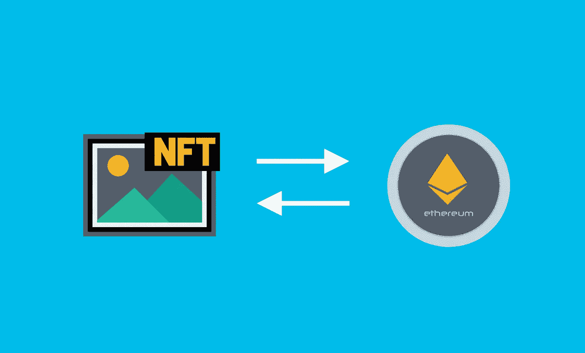

# 大多数 NFT 项目都是骗局:以下是如何避免它们

> 原文：<https://medium.com/coinmonks/most-nft-projects-are-scams-heres-how-to-avoid-them-bcb8920b158e?source=collection_archive---------52----------------------->

Image by shorturl.at/abxHT

# 介绍

在过去的几个月里，NFTs 的世界已经流行起来了。虽然参与这一市场趋势有好处，但投资者应该意识到有很多骗局存在。

NFTs 是密码技术的新趋势。它们本质上是数字资产，可以在分散的交易所买卖——有点像棒球运动员或曲棍球队的收藏卡，只是由区块链技术支持。

**NFTs 的好处显而易见:**可以帮助你围绕你的品牌建立一个社群；他们允许你推广你的品牌；他们将内容货币化(既作为一种广告形式，也通过销售)；他们鼓励用户经常回来，因为总是有新的东西被添加到平台或服务中。

> 交易新手？试试[密码交易机器人](/coinmonks/crypto-trading-bot-c2ffce8acb2a)或者[复制交易](/coinmonks/top-10-crypto-copy-trading-platforms-for-beginners-d0c37c7d698c)

## 如果你看到一个看起来不合法的项目，对其背景做一些研究。

你要看每个项目背后是一个什么样的团队；如果网上没有列出任何团队，那么也许这就不值得花时间进一步研究了！最后记住:仅仅因为有人声称他们的想法会改变世界并不意味着它会——你需要证据，然后再投入任何辛苦赚来的钱(甚至更糟)被骗！

非关税壁垒没有任何中央权威的支持。

非正规金融没有任何有形资产的支持。

非关税壁垒没有任何法定货币的支持。

非专利技术没有任何政府或机构的支持，所以它们的价值也没有保证！

# 当涉及到投资 NFTs 时，要聪明和有意识

*   要意识到风险。
*   做你的研究。
*   不要投资超过你能承受的损失。
*   不要让你的情绪战胜你。
*   不要相信你在网上看到的一切，尤其是投资 NFT 项目或在网上购买收藏品；如果听起来好得难以置信，那么很有可能是因为它很可能就是真的！许多人通过阅读关于项目和收藏品在未来会如何成功的虚假信息被骗走了他们的钱(有时甚至因为写文章声称如此而获得报酬)。

## 事实是，大多数 NFT 项目和数字资产都是专门设计来窃取投资者的骗局，他们对此一无所知，就像 ico 刚推出时一样——所以不要落入那些陷阱！

# 结论

正如我们所知，NFT 是加密领域的一个热门新趋势…但它们也是许多骗子的目标。然而，如果你用如何避免这些骗局的知识武装自己，你也许能在别人之前得到下一个大东西！