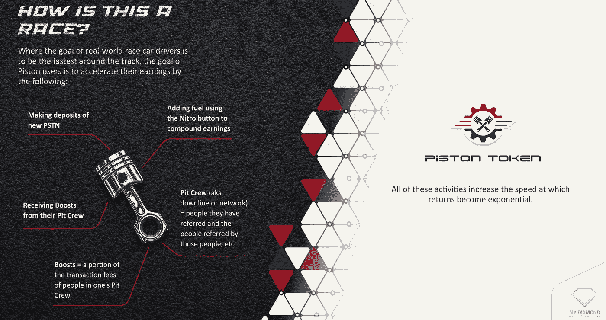
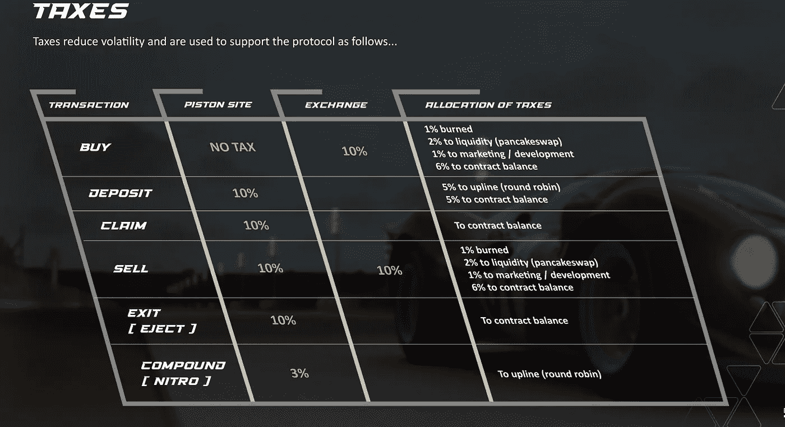
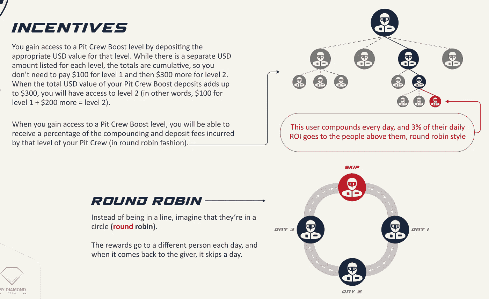

# 抛开滴漏——活塞令牌是具有更好令牌组学的被动收入缺乏机会

> 原文：<https://medium.com/coinmonks/move-aside-drip-piston-token-is-the-passive-income-defi-opportunity-with-better-tokenomics-b739b831c4a2?source=collection_archive---------3----------------------->

大胆的声明，哈？

你可能幻想过比你更早得到点滴。man——如果我在滴滴 40 美元的时候听那些 YouTubers 或者 Medium 的文章会怎么样？$20?如果我恰好在一年前进入滴滴呢？

这是真的——不管你现在对滴滴的价格感觉如何，滴滴确实比其他日常 ROI/miner/DeFi 项目有更长的寿命，这些项目在很大程度上没有经过时间的验证。

可持续性是我们所有人长期寻求的，以建立我们的被动收入投资组合。与点滴处于不变的状态”？？！！？！?"在过去的两个月里——储蓄罐开发、动物农场暂停、滴滴彩票/公用事业延迟——它给了其他项目了解这个空间的能力。

# **活塞令牌**

就像滴滴一样，Piston 每天收取 1%的回报，最高可达存款金额的 365%。你的本金最初被锁定，但有一个警告——你可以提前退出“比赛”。这对那些可能有买家后悔或需要获得流动性的人来说很好。请注意，这是一种惩罚，因为你将失去任何未决/无人认领的奖励/支付 10%的初始本金税。在我看来，这是一个巨大的胜利——也许你误解了这个项目，或者它不适合你，你可以减少你的损失。在滴滴，你的本金永远被锁在水龙头里。

# **“比赛”是如何进行的？**

比赛是主题——你的化合物(硝基)越多，你的维修站人员(推荐)越多，你赢得比赛的速度就越快。

和滴滴一样——投入你的第一笔存款，制定/申请一个最适合你的时间表，积极组建一个团队，这样你们所有人都可以分享循环赛奖励。

# **为什么我更喜欢活塞？**

让我们来看看这张税单:

1.  如果你在活塞网站[https://piston-token.com/race](https://piston-token.com/race)上购买，你不用支付“购买”税。
2.  你有能力在 7 天内退出项目，无论你有什么理由。
3.  复合(硝基)功能为 3%(滴为 5%)。这种税比滴滴有更好的象征经济学，因为滴滴将这种税发送到多个地方——主要是 BNB/滴滴的流动性池，这可能会有价格波动。
4.  流动性池与 BUSD 挂钩——更好的价格稳定性，而不是担心 BNB 的价格会如何。
5.  我有没有提到活塞的价格现在只有 11 美元和一些变化？！你能想象得到 11 美元的点滴吗？！

**激励措施**

白皮书摘录:

> 为了激励价值持续流入系统，新存款和来自下线的复合/间接奖励之间有所区别，如下所示:油箱中的总金额永远不能超过存入您油箱的存款金额的五倍。因此，例如，如果您存入 100 PSTN，然后您每天使用 Nitro 函数进行复合，直到您的油箱中的总量达到 500 PSTN……●您的油箱现在已满。●您每天 1%的最大支出是 1825 PSTN (500 * 3.65) ●将无法获得进一步的复利，并且不会从您的维修站工作人员的交易费中获得提升。要在此时重新启用复利并从您的下线处获得奖励，您需要进行新的 PSTN 存款。这可以通过两种方式之一实现:1 .首先声明，然后将 PSTN 重新部署到协议中(通过税收使系统受益)2。购买全新的 PSTN 并存放它
> 
> 为了鼓励通过推荐网络引入新用户，PSTN 可用于从您的下线(维修站工作人员)获取最多 15 个级别的奖励。在 Piston 站点中有两个地方可以存放 PSTN .您的油箱，使您能够每天获得总额 1%的投资回报率 2。维修队升压系统将 PSTN 接入维修队升压系统有什么好处？它允许你从 Nitro 获得 PSTN 的提升，并向你的下线用户(也就是你的维修人员)收取押金。维修站人员的助推会直接进入你的油箱。注意:您可以从您的下线的更多级别获得提升，这取决于存放在那里的 PSTN 的美元价值(在存放时)。●为什么以美元价值为基础？因为我们希望每个人都能够扩展他们的网络，即使 PSTN 的价值增加。●使用这种方法，价值 100 美元的 PSTN 将允许您从维修站工作人员的直接推荐中获得提升，无论一个 PSTN 的成本是 10 美元还是 500 美元。我们特别高兴的是，这个系统如何让每个人都能负担得起网络推荐的好处，即使代币价格上涨，这些维修站工作人员级别是如何工作的？●第一级由您的直接推荐人(使用您的推荐代码加入 Piston 项目的人)组成。●第二层由你直接推荐的人组成。●第三级由你的第二级推荐的人组成。●依此类推，最多可达 15 级

要了解更多激励措施，请点击这里查看白皮书。

我喜欢这个激励/推荐系统是因为它直接将更多的活塞放入系统中。你将不再需要购买另一个令牌，比如滴滴(BR34P)来获得推荐奖励(双关语)。在某一点上，BR34P 达到了大众无法承受的价格，只有滴滴的 OGs 能够利用这个推荐系统。在活塞，这将不再是一个问题。

# 加入我的团队，获得每周空投！

从 2012 年 5 月 8 日开始，我将根据我们累积的奖励金额每周向我的团队空投一次。不要错过这个以 11 美元的价格进入滴滴克隆的机会！

前往:
[活塞令牌网站](https://piston-token.com/race)

在你的账户里准备好$BUSD 来兑换。去网站顶部的“交换”,确定你想买多少活塞。

点击“比赛”选项卡，并存放您的活塞。

当要求加入一个团队时，输入:
0x cf 95 a 7 D2 b 19746 b 3782d 36 ef 5d 32433 b8e 3232 a 8

使用整数表示 PSTN 的数量，以避免存款时出现 gas 错误。

开始享受每周免费空投！！

你也可以在这里加入我的 Discord 服务器[。](https://discord.gg/BgGCYRz8)

前往#piston-token 频道聊天或直接向我寻求帮助！期待在那里见到你。

> 加入 Coinmonks [电报频道](https://t.me/coincodecap)和 [Youtube 频道](https://www.youtube.com/c/coinmonks/videos)了解加密交易和投资

# 另外，阅读

*   [OKEx 回顾](/coinmonks/okex-review-6b369304110f) | [Kucoin 交易机器人](/coinmonks/kucoin-trading-bot-automate-your-trades-8cf0ca2138e0) | [期货交易机器人](/coinmonks/futures-trading-bots-5a282ccee3f5)
*   [AscendEx Staking](https://coincodecap.com/ascendex-staking)|[Bot Ocean Review](https://coincodecap.com/bot-ocean-review)|[最佳比特币钱包](https://coincodecap.com/bitcoin-wallets-india)
*   [霍比评论](https://coincodecap.com/huobi-review) | [OKEx 保证金交易](https://coincodecap.com/okex-margin-trading) | [期货交易](https://coincodecap.com/futures-trading)
*   [比特币基地跑马圈地](https://coincodecap.com/coinbase-staking) | [Hotbit 点评](/coinmonks/hotbit-review-cd5bec41dafb) | [KuCoin 点评](https://coincodecap.com/kucoin-review)
*   购买 Dogecoin 的 7 种最佳方式
*   [iTop VPN 审查](https://coincodecap.com/itop-vpn-review) | [曼陀罗交易所审查](https://coincodecap.com/mandala-exchange-review)