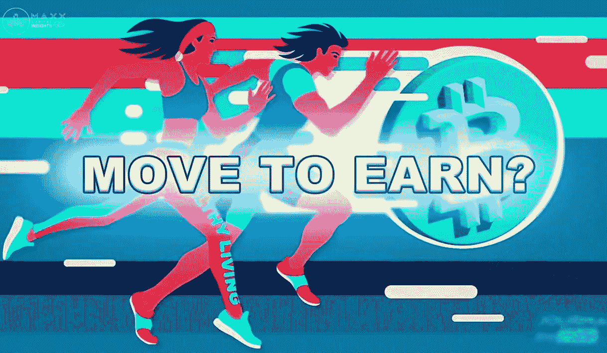
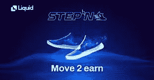
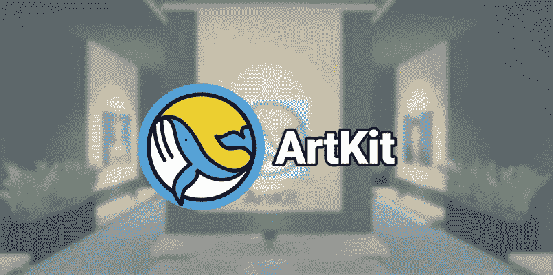
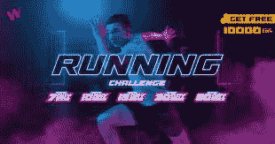
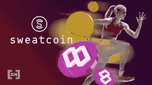
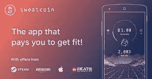
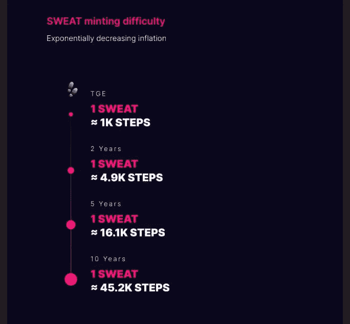
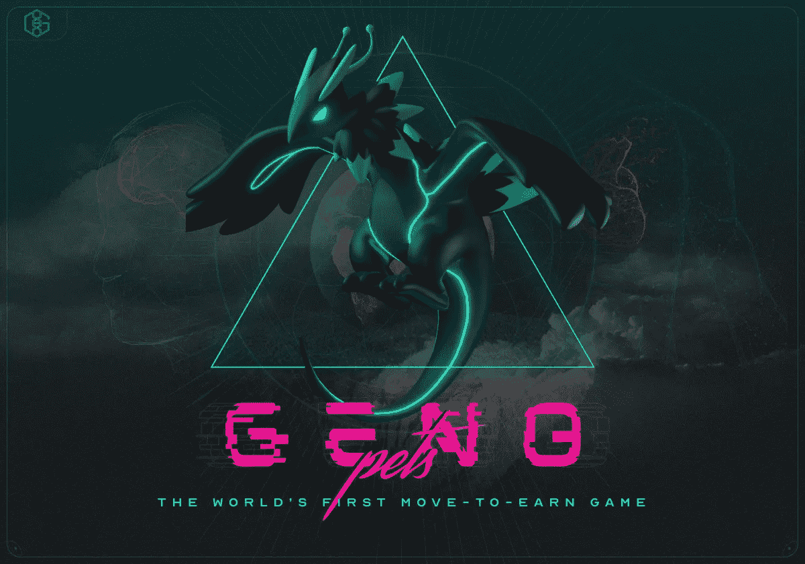
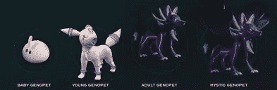

# 移动赚取，新的大事情在加密

> 原文：<https://medium.com/coinmonks/move-to-earn-the-new-big-thing-in-crypto-9f1118afa2ce?source=collection_archive---------13----------------------->

“移动赚取”是一种新现象，它包含了一系列奖励活跃客户的产品和服务。它们是奖励用户保持身材的在线平台，允许他们通过定期锻炼或参加特定的健身挑战来赚取额外的钱。它遵循了 P2E 用加密货币奖励玩游戏的用户的趋势。

> P2E 游戏奖励玩家在游戏中的行为，例如赢得战斗、通过关卡以及探索游戏中的宇宙。移动赚钱应用程序利用玩家移动设备的传感器来跟踪他们的运动，并自动奖励他们的身体活动。

这些平台通常旨在促进健身，因此减少肥胖和久坐行为，同时也为用户提供了赚钱改善健康的选择。事实上，研究人员最近发现，心肺健康状况的改善可以显著降低全因死亡率和特定疾病死亡率，最大摄氧量(VO2max)与预期寿命密切相关。

[移动 2 学习](https://medium.com/u/8c4ad0fb5c16?source=post_page-----9f1118afa2ce--------------------------------)

随着像 STEPN 和 Genopets 这样的项目，基于移动赚取(M2E)原则的区块链游戏在最近几个月已经出现。这些结合了游戏金融(GameFi)和健身应用的功能，以鼓励人们锻炼。

Web3 生活方式应用程序 STEPN 在 2021 年 9 月创造并推广了“移动赚钱”一词，此后它被许多其他应用程序采用，这些应用程序奖励用户的活动。这些应用程序奖励用户的方式因平台而异，但几乎所有应用程序都以原生效用代币的形式向完成健身相关任务(如散步)的用户付费。

该软件通过手机或健身追踪器跟踪任务的完成情况，然后将它们提交给 move-to-earn 应用程序，并分析它们以查看它们是否有资格获得奖励。然后，代币可以在应用程序中买卖，或者在内部或外部交易所交易为其他加密货币。

这个“FitnessFi”的概念是第三代互联网(web3)中迅速出现的一部分，它允许用户管理和货币化他们的个人数据

游戏化是将游戏功能融入非游戏活动的过程。成就、技能和竞争力是这种奖励用户行为的系统的例子。随着人们变得更加数字化，视频游戏变得更加流行，他们已经看到了这种趋势的发展。这一策略已经在各种业务中使用，包括银行、自助应用和营销活动，这并不令人惊讶，因为游戏化研究表明改善动机和更高水平的参与度之间存在直接关联。然而，当您将区块链技术加入等式时，客户采用/保留率可能会改变游戏规则，因为它允许将具有财务价值的数字资产直接转移给客户，而不是代金券或折扣。

GameFi 是一个综合了财务激励和游戏化方法的总称。由于正版游戏的成功，从玩到赚(P2E)的经济已经爆炸式增长。另一方面，同样的策略可能适用于通常不感兴趣的追求，比如锻炼。移动赚钱(M2E)是一个新的 GameFi 利基，补偿用户保持身体活动。像 Genopets、STEPN 和 WIRTUAL 这样的项目正在利用运动传感器技术来创造它

一些 M2E 游戏是免费的，类似于 P2E 游戏，但其他游戏需要用户在市场上购买一个 NFT 才能开始。因为随着游戏越来越受欢迎，NFTs 的价格往往会攀升，在用户开始赚钱之前，这可能是一项昂贵的初始投资。

例如，在 STEPN move-to-earn 应用程序上，NFT 的底价已经从 3 月份发布时的 SOL1(截至 4 月 4 日价值 133 美元)上涨到超过 SOL8(截至 4 月 4 日价值 1064 美元)(见 SOL/USD)。

这是一个增长最快的 Move 2 Earn 项目列表，这些项目可能会做得很好

**第 n 步**

大多数人的日常活动都是移动的，因此 [STEPN 官方](https://medium.com/u/343ca8528a45?source=post_page-----9f1118afa2ce--------------------------------)就是围绕着它开发的。

第一个成功实现工作移动和收入概念的项目。

[STEPN 官方](https://medium.com/u/ca51e560ea54?source=post_page-----9f1118afa2ce--------------------------------)

运动鞋是用户用来携带 NFT 的。用户可以通过散步、慢跑或在户外跑步来赚取游戏币，游戏币可以在游戏中使用或套现获利。

游戏模式大概有三种:单人、背景、马拉松模式。在单人模式下，玩家穿着 NFT 运动鞋四处走动以获得代币。绿色的 Satoshi 代币需要能量来赚取(GST)

用户因行走或跑步而获得奖励。GST/GMT 代币将根据以下因素进行分配:-运动鞋的类型-运动鞋的功效-运动鞋的舒适度-运动速度

想要参加马拉松模式的用户必须至少提前 24 小时在马拉松选项卡下注册。每周和每月的马拉松都将举行。

在后台模式下，即使 STEPN 应用程序没有被积极使用，用户也可以获得 GST。只要用户在 app 里有球鞋，就是这样。

step'n 的游戏财务系统包括能量、任务、成就、反作弊和税费系统。

能量、任务、成就、反作弊和税费系统都是 step'n 游戏财务系统的一部分。

接下来，step'n 的另一个微妙部分是社交金融(Social-Fi)组件，这需要创建一个持久的平台，以培育用户生成的 web 3.0 内容。

库存、通知和激活码系统是其他一些可用的系统。

**市场地点**

用户可以在市场上租赁或出售/购买 NFT 运动鞋、徽章和宝石。

市场分为三个部分:商业、租赁和信贷。

.

本质上，STEPN 希望通过激励数百万人采取更健康的生活方式来扰乱健身应用程序业务。这款应用解决了许多问题，包括“运动证明”(证明用户确实运动过)和一个正常工作的 GPS 系统。此外，STEPN 在经济上激励用户，并寻求包括社会奖励方面，从而成功实现碳中和。

**美术工具箱！**

[ArtKit](https://medium.com/u/9fb564d799e7?source=post_page-----9f1118afa2ce--------------------------------) 是一个社交媒体 NFT 平台，允许用户使用 NFT 创建、分享和参与故事，因此这是 NFT 和社交媒体领域的一个缺口，需要确保 NFT、元宇宙和社交媒体之间的交汇点。总的来说，我们认为所有的 NFT 背后都应该有一个故事。

除此之外， [ArtKit](https://medium.com/u/9fb564d799e7?source=post_page-----9f1118afa2ce--------------------------------) 观察到，现有的 NFT 市场不会向使用该市场的投资者或项目返还利润，因此他们决定将 Move to Earn 整合为一个系统，将市场产生的利润返还给他们的社区。

通过众多有趣的使用案例，ArtKit 还在探索其他方法来回馈 ArtKit 社区，并认为 M2E 是理想的技术，因为大多数人每天都在走路。这项技术也将促使人们避免久坐不动的生活方式。

这一特性也将使 Artkit 成为一个非常有趣的社会非功能性市场

**WIRTUAL！**

WIRTUAL 提供了一种挖掘加密货币的新方法，既便宜又易于使用。只需在你最喜欢的健身小工具(Strava、Fitbit、Garmin、Apple Health 或华为 Health)上跟踪你的跑步、步行、游泳、骑自行车、跳舞或健身活动，就可以获得这些硬币。

要参加挑战，请遵循以下步骤:

1.选择一个你想参加的挑战

2.点击“立即加入”

3.填写付款细节。

4.就是这样！你的挑战将会开始。

自 2017 年以来一直在运营的 *W JAMES VENTURES* 公司于 2019 年推出了 WIRTUAL initiative。他们是新一代的创新者，致力于通过创新的解决方案改善人们的生活。

WIRTUAL 是一个允许你“锻炼赚钱”的应用程序。就这么简单:锻炼身体，挣奖品。你通过锻炼赚取虚拟硬币，然后用它们交换实物产品和 NFT、赛事门票、虚拟体育赛事组织和持有者排名，以获得功能。

我们鼓励虚拟用户积极生活。它们提供跑步、步行、游泳、骑自行车、锻炼和跳舞方面的挑战，允许用户在速度、距离、团体比赛方面进行竞争，甚至创建他们的自定义挑战。

代表团

*第一阶段:锻炼赚取平台*

跑步，散步，游泳，健身，以后还会增加更多。他们会将所有专业运动应用程序的数据整合到一个地方，并奖励你跟踪他们的活动。

*第二阶段:面向积极生活方式用户的社交媒体*

作为资金来源，几乎所有的社交媒体网络都依赖于出售用户数据。WIRTUAL 拥有独特的商业模式。他们把数据控制权还给用户。他们完全可以决定是否向他们提供数据以换取报酬。

*第三阶段:多元宇宙头像*

用他们的软件连接现实世界和虚拟世界。只需一个配置文件，用户就可以存在于任何元宇宙。他们的应用程序还可以连接所有类型的智能设备。

他们在第一个版本开始时遇到了困难:Virtual Run 的设计者缺乏一个合适的平台来开展他们的活动。由于上传的活动数量巨大，该平台无法实时处理数据。有许多欺诈性的提交，应用程序很难使用，即使用户每天都来使用应用程序，他们仍然每次都必须通过网络浏览器登录。

因此，他们建立了一个网站来调查是否有可能与 Strava 应用程序连接的路线系统会使客户更容易参与虚拟跑步。结果证实他们走上了正确的道路。他们利用网站的反馈开发了虚拟跑步应用程序，该应用程序可以支持成千上万的用户，并连接到 Strava、Garmin、Suunto 和 Fitbit。

当他们在 2020 年 4 月推出时，他们引起了泰国许多活动组织者的注意，他们与我们签约，在 WIRTUAL 应用程序上创建活动。

这就是他们如何开始开发他们今天都知道的虚拟世界。

在他们最近的迭代中，他们已经发展成为一个超级应用。2.0 版本增加了头像，和解锁新功能捆绑在一起。挑战包括走路、游泳、跳舞、健身和骑马。他们已经拓展到电子商务和比特币，为专注于社交网络的 3.0 版本奠定了基础。

在对 1.0 版本进行了一年多的测试后，Wirtual 团队对其进展充满信心，并准备好以其新的和改进的 2.0 版本服务于全球市场。2.0 版本是一个独特的应用程序，他们相信它将使我们成为最受欢迎的健身平台。

**汗币**

Sweatcoin 是一款免费软件，它用新一代货币奖励你的日常散步，你可以用它来购买好东西，捐赠给慈善机构，或者兑换回汗水。

Sweatcoin 认为，照顾好自己的健康有益于社会。你更有效率。您帮助节省了数十亿美元的医疗费用。你的事业是有价值的，你应该成为其中的一部分。

[Sweatcoin](https://medium.com/u/56f52fe2d1e3?source=post_page-----9f1118afa2ce--------------------------------) 目前拥有超过 6400 万注册用户，预计在不久的将来会达到 1 亿用户。

你可以在他们的市场上选择数千种精彩的品牌商品和服务，如高科技鞋、iPhones、反重力瑜伽课程、苹果手表等等！

到目前为止， [Sweatcoin](https://medium.com/u/56f52fe2d1e3?source=post_page-----9f1118afa2ce--------------------------------) 应用程序充当了一个动作验证器，验证步骤。

随着时间的推移，该基金会将分散运动验证过程，允许其他应用程序和可穿戴设备验证新的运动类型，允许用户为游泳、骑自行车、徒步旅行和健身房工作等活动赚取汗水。

目前，只有步骤现在薄荷汗水，但其他行为将最终薄荷汗水随着时间的推移。汗水可能会被永久铸造，以维持全球激励，而其通胀率将继续下降。

汗水就像比特币一样，随着时间的推移将变得越来越难获得:你走得越早，汗水就越多。

汗水持有者将统治汗水经济。SWEAT 成员在实践中拥有所有权、激励、特权和投票权。

它建立在这样一种信念上，即流动的好处应该通过将权力和特权分配给拥有权力和特权的人以及流动的人来分享。

随着时间的推移，获得汗水的难度迅速增加，这也将增加价值

点击这里下载 [SweatCoin App](https://sweatco.in/hi/emmanuelonoja55649529549) 开始*行走赚取！*

**基因宠物**

Genopets 是一款基于索拉纳区块链的“玩赚”NFT 游戏，允许你培育和进化你独特的 geno pets，你的数字精神动物。

随时把你的基因宠物放在你的口袋里，当你起床、度过一天或跑完下一场马拉松时，你会得到奖励。漫长的一天过后，简单地坐下来，放松，收获你努力的成果。

在异步益智迷你游戏中，Genopets 将电子鸡的护理和进化与口袋妖怪的训练和战斗结合在一起。

与你的 Genopet 一起翱翔在霓虹闪烁的 Genoverse 中，探索隐藏的风景，发现神奇的领域，制作有趣的东西，并与来自世界各地的朋友战斗。它是这样工作的:

基因宠物使积极的生活方式变得愉快和有益。它使用来自你的智能手机或健身设备的数据，在游戏中推进你的基因宠物 NFT。

他们创造了“移动到游戏”这个短语，意思是 Genopets 将你现实生活中的移动转换成 XP 来帮助你在游戏中获胜。当你开始一天的工作时，用检查你的身体活动取代了传统的久坐不动的视频游戏和敲击屏幕的时间。你整天走来走去辛辛苦苦在游戏中取得的进步现在可以作为 NFT 按市场价值交易，这是第一次“移动赚钱”的 NFT 游戏体验。

[基因宠物](https://medium.com/u/ff69412e9fa1?source=post_page-----9f1118afa2ce--------------------------------)

总的来说，你培育、对抗和进化你的基因宠物 NFT，让它随着你在现实生活中的每一步而增值，然后在市场上出售，收获你努力的收益。这就是所谓的移动挣钱。

基因宠物是一个可生成的 NFT，随着你在游戏中的进展，它会不断进化、更新和个性化。你的吉诺佩特·NFT 是自由的，并且像新生儿一样孵化了。随着时间的推移，当你投入时间和精力来改进它的种类、战斗性能和外观时，它会变得更有价值。基因宠物随着经验值进化，它的进化受到精炼水晶的引导和加速。精炼水晶是不可替代的令牌，通过混合$GENE 和$KI 来控制基因宠物的进化。精制水晶有多种形状和大小，每一种都对你的宠物的成长有独特的影响。例如，在进化过程中，使用火基因水晶改变你的基因宠物的元素基因型为火，赋予它炽热的外表和火攻击招式。

Genopets 通过将您在现实生活中的日常活动与区块链的即玩即赚经济学相结合，使保持活跃变得愉快和有利可图，允许您在赚取 crypto 的同时将您的现实世界活动转化为大型游戏。

Genopets 还结合了电子鸡的培育和进化、口袋妖怪的训练和战斗，以及 Strava 的健身和社交激励，以加密货币奖励用户在日常生活中保持活跃。Genopets 称之为“移动挣钱”。

在基因宠物中，你可以看到所有这些术语

Genoverse 是他们的数字宠物(genopets)生活和参与活动的地方，类似于他们在这里拥有元宇宙的方式。

你的 NFT 精神动物是你的基因宠物，它储存了你的个性和健康数据。

两个代币，$Gene 和$kI 驱动 Genoverse。

一种叫做$基因的本地标记控制着基因宠物。

玩家的每一步都转化为能量(E)。

接下来，E 会转换成经验值(Xp)

$GENE 是反映 Genoverse 所有权的可替换治理和标记令牌。作为$GENE token 持有者，您可以对游戏的未来进行投票，并下注$ GENE token 以获得奖品。而$KI 令牌是通过购买栖息地获得的可替换的游戏内奖励令牌。$KI 可以用来进化你的基因宠物，炼金术水晶，创造新的栖息地，以及与其他玩家战斗。

经验值是基因宠物不可替代的表征信息中的一种状态，它通过你每天的努力而增长。一旦你积累了足够的经验，你就可以升级你的基因宠物。

这个 Xp 随后换成$KI(还没有)，产生被动收入。

您的$KI 可以用来提高您的基因宠物，也可以卖给其他玩家来帮助他们提高自己的基因宠物。

要开始使用 Genopets，你只需要一部智能手机。召唤你的基因宠物 NFT，并在移动中获得经验值。带着你的狗去散步，在你的房间里跳舞，每天跑 4 公里，或者只是起床，都可以得到奖励。当你准备好了，进入 Genoverse，通过你的数字精神动物的眼睛看世界。把你的经验花在定制、进化和准备你的基因宠物的战斗上。一旦你升级了你的基因宠物，你可以在市场上出售它，并将部分收益投入到你最初的栖息地，让你进化得更快，并在接下来的时间里用更好的基因宠物赚取更多。

注意，新创建的 genopet 只能用来享受游戏，不能用来赚取$KI。

玩这个游戏时，你必须获得一个基因宠物栖息地来赚钱。是一个为房子服务的 Nft，把你的 Xp 转换成$KI。

你也可以通过挑战一个朋友来赢得$KI。

还有一种被称为创世基因宠物的生物…

所以，你的免费基因宠物从 1 级开始，而创世基因宠物是付费的…

它也允许你自动从 22 级开始。

另一个获得被动收入的选择是将你的基因宠物栖息地出租给那些买不起的人……本质上，你扮演的是房东的角色。

有 5800 个创世纪栖息地可供创造。5200 创世纪栖息地现在可用。

吉恩的市值是 5000 万美元。

**行走 2 赚 APP**

步行 2 学习。该应用基于大多数人的典型日常活动——散步。他们是第一个成功执行工作步行赚钱概念的人，支持人们赚取被动收入，同时引领健康的生活方式。

用户配备有鞋形式的 NFT。用户可以随时随地步行赚取游戏币，然后他们可以在游戏中使用或套现获利。

Walk2Earn.app 旨在推动数百万人走向更健康的生活方式，应对气候变化，并通过 Fitness-Fi 将公众与 Web 3.0 联系起来，同时依靠其 Social-Fi 功能建立一个支持用户生成的 Web 3.0 内容的持久平台。

[Walk2Earn.app](https://medium.com/u/dc9ae0730e18?source=post_page-----9f1118afa2ce--------------------------------) 刚刚发布，还在进行 Beta 测试。下载 Walk2Earn 应用程序所需的一切

1.  【https://walk2earn.app/】下载 Walk2Earn app 从[下载](https://walk2earn.app/)
2.  **注册 Walk2Earn** 在您各自的设备上访问该应用程序后，您将能够使用您的电子邮件地址注册 Walk2Earn。您将收到一个验证码，需要输入该验证码才能进入应用程序
3.  **创建新钱包**点击屏幕右上角的钱包图标。该应用程序将生成一个 12 个词的秘密短语。如果你卸载了该应用或忘记了密码，这将用于恢复你的钱包。**重要的**——记下这句话，把它安全地保存起来(把它写下来，存放在只有你能接触到的地方。)
4.  **将 BNB 转入你的应用内钱包**将 BNB 转入你的应用内钱包以购买鞋盒，并始终在你的钱包账户中保留一些 BNB 作为汽油。
5.  **买一个鞋盒，开始走路**

步行者可以通过购买更多或更高质量的鞋子来提高他们的步数。步数上限由弹性值和舒适度值共同决定。此外，系统将在每天 24:00 UTC 重置步骤上限。\

**来源**

[coin gecko |](http://coingecko.com)[art kit](https://artkit.art/)|[geno pets](http://genopets.me)|[sweat coin](http://sweatco.in)

通过 BIT 在[上交易速度快、费用低的密码](https://partner.bybit.com/b/NewsCrypto)

> 加入 Coinmonks [电报频道](https://t.me/coincodecap)和 [Youtube 频道](https://www.youtube.com/c/coinmonks/videos)了解加密交易和投资

# 另外，阅读

*   [3 商业评论](/coinmonks/3commas-review-an-excellent-crypto-trading-bot-2020-1313a58bec92) | [Pionex 评论](https://coincodecap.com/pionex-review-exchange-with-crypto-trading-bot) | [Coinrule 评论](/coinmonks/coinrule-review-2021-a-beginner-friendly-crypto-trading-bot-daf0504848ba)
*   [莱杰 vs n rave](/coinmonks/ledger-vs-ngrave-zero-7e40f0c1d694)|[莱杰 nano s vs x](/coinmonks/ledger-nano-s-vs-x-battery-hardware-price-storage-59a6663fe3b0) | [币安评论](/coinmonks/binance-review-ee10d3bf3b6e)
*   [Bybit Exchange 审查](/coinmonks/bybit-exchange-review-dbd570019b71) | [Bityard 审查](https://coincodecap.com/bityard-reivew) | [Jet-Bot 审查](https://coincodecap.com/jet-bot-review)
*   [3 commas vs Cryptohopper](/coinmonks/3commas-vs-pionex-vs-cryptohopper-best-crypto-bot-6a98d2baa203)|[赚取加密利息](/coinmonks/earn-crypto-interest-b10b810fdda3)
*   最好的比特币[硬件钱包](/coinmonks/hardware-wallets-dfa1211730c6) | [BitBox02 回顾](/coinmonks/bitbox02-review-your-swiss-bitcoin-hardware-wallet-c36c88fff29)
*   [block fi vs Celsius](/coinmonks/blockfi-vs-celsius-vs-hodlnaut-8a1cc8c26630)|[Hodlnaut 审核](/coinmonks/hodlnaut-review-best-way-to-hodl-is-to-earn-interest-on-your-bitcoin-6658a8c19edf) | [KuCoin 审核](https://coincodecap.com/kucoin-review)
*   [Bitsgap 审查](/coinmonks/bitsgap-review-a-crypto-trading-bot-that-makes-easy-money-a5d88a336df2) | [Quadency 审查](/coinmonks/quadency-review-a-crypto-trading-automation-platform-3068eaa374e1) | [Bitbns 审查](/coinmonks/bitbns-review-38256a07e161)