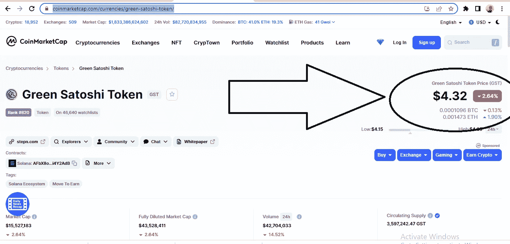

# 移动到收入游戏:斯戴普鞋 NFT 盈利吗？

> 原文：<https://medium.com/coinmonks/move-to-earn-tokens-are-they-profitable-c5e16d2477d3?source=collection_archive---------29----------------------->

早在 2017 年，一些区块链开发者聚集在一起，使用加密货币来解决体育行业的某些挑战。

当我听说体育代币时，我总是会想到 Lympo，因为他们是第一家提供真正意义上的体育代币的公司。我愿意被纠正。

[**Source**](https://www.google.com/url?sa=i&url=https%3A%2F%2Fcoinculture.com%2Fau%2Fmarkets%2Fmove-to-earn-nft-games-will-it-become-a-new-form-of-work%2F&psig=AOvVaw2wRQmQ8phI-l-TctOmyqsr&ust=1650381248578000&source=images&cd=vfe&ved=0CA4Q3YkBahcKEwiIzau48533AhUAAAAAHQAAAAAQAw)

在 [**Lympo**](https://lympo.io/) 之后，又来了几个山寨项目，声称是更好的版本。

然后我们让 **JustMove** ，这个引起了足够的关注，在 coinmarketcap.com 排名前 100

但是我很惊讶它还在挣扎。我们有 [**剂量令牌**](https://dosetoken.com/) 与 **move2earn** 加密货币属于同一类别。

人们越来越担心这些创新的运动密码使用用户的陀螺仪来生成真实数据。

以免我忘记，这些项目是为了奖励你健身，如果你跑了一定的距离，你将获得代币奖励。明白了吗？基本上，你是通过跑步、慢跑或散步来挖掘密码的。需要一个重力计/全球定位系统来监控你的活动。

所以，有一个问题。这些信息存储在哪里？您的数据有多安全？

有人在出售/购买数据吗？

很难回答所有这些问题。但是让我们假设最坏的情况，你的数据是不安全的。

但是有什么好处吗？是的。你有保持健康的动力，你也因此而获得回报。然后你会因为你一直在做的没有回报的事情而获得微小的回报。

但是如果你因为奖励而开始跑步，研究表明这通常是不值得的。不过也有一些观点认为一个新的移动赚取令牌是有利可图的，它被称为 [**StepN**](https://www.stepn.com/) 。

你需要问自己；回报与我投入的精力和个人数据相符吗？这个问题你要自己回答。在 [**Lympo**](https://lympo.io/) 之后，又有几个山寨项目到来，并声称是更好的版本。

然后我们有了 **JustMove** ，这个得到了足够的关注，进入了 coinmarketcap.com 100 强

但是我很惊讶它还在挣扎。而且我们有 [**剂量令牌**](https://dosetoken.com/) 同 **move2earn** 加密货币的类别。

人们越来越担心这些创新的运动密码使用用户的陀螺仪来生成真实数据。

免得我忘了，这些项目都是为了奖励你健身，如果你跑了一定距离，就奖励你一个代币。明白了吗？基本上，你是通过跑步、慢跑或散步来挖掘密码的。需要陀螺仪/全球定位系统来监控你的活动。

所以，有一个问题。这些信息存储在哪里？您的数据有多安全？

有人在出售/购买数据吗？

很难回答所有这些问题。但是让我们假设最坏的情况，你的数据是不安全的。

但是有什么好处吗？是的。你有保持健康的动力，你也因此而获得回报。然后你会因为你一直在做的没有回报的事情而获得微小的回报。

但是如果你因为奖励而开始跑步，研究表明这通常是不值得的。然而，有一些观点认为一种新的移动赚取令牌是有利可图的，它被称为 [**StepN**](https://www.stepn.com/) 。

你需要问自己；回报与我投入的精力和个人数据相符吗？这个问题你要自己回答。

# 但是让我们快速看一下 StepN

Source: [**Cointelegraph**](https://www.google.com/url?sa=i&url=https%3A%2F%2Fcointelegraph.com%2Fpress-releases%2Fstepn-announces-early-adopter-double-earning-program&psig=AOvVaw1VVv0n7gk2p5fUhwgFM0qj&ust=1650378350670000&source=images&cd=vfe&ved=0CA4Q3YkBahcKEwjIovXM6J33AhUAAAAAHQAAAAAQAw)

这是让运动爱好者从**获得更多利润的最新尝试。我读过很多关于它的观点，每个人都在谈论它的惊人之处。**

从 playstore 上的评论来看，很明显，过去几个月有超过 6000 名用户给它打了 3.9 星，这表明开发者和营销人员付出了很多努力。

我见过一些 YouTubers 上的人每天赚 213 美元，但在 NFT 鞋上的投资是 7500 美元。一个月零几天之内，有可能取得 100%的投资回报。现在，你的鞋子有现成的买家，价格也越来越高。

如果你在 [coinmarketcap](https://coinmarketcap.com/currencies/green-satoshi-token/) 上查看应用内货币(GST ),它现在正享受着可观的交易量，因为许多用户正在购买 GST，而其他通过跑步赚到的人正在出售。流动性是巨大的。

**让我们考虑 StepN** 的牛市情景

[**Source**](https://media.giphy.com/media/1yjrv5fIgCwtKOJzAL/giphy.gif)

当然，我们正处于一个区间熊市，有上升趋势的可能性，但没有人知道牛市何时会推高比特币和以太坊等主导货币的价格。

如果有一个巨大的上升趋势或现状保持在未来 3-5 个月，投资 StepN 移动到收入加密将是值得的。因为早期应用程序用户将能够达到收支平衡，在保持健康和享受更好健康的同时仍能赚更多的钱。

有人猜测，StepN 正在使用类似于 Axie **Play-to-Earn** 游戏的经济模式，一些爱好者认为，当它变得饱和时，StepN 的经济模式也将被摧毁。

下面是我对此的思考:收益递减规律影响着生活中的一切，StepN 在我看来不应该是个例外。

然而，如果你在这个阶段加入了潮流，当模型崩溃时，你不太可能受到影响。现在还有人靠阿谢赚钱吗？是的，在前期价格下跌后买入新底部的新股民。但是买了顶的明显亏损了，要过很久才能恢复。

**让我们考虑一下 StepN** 的熊市情景

> 在熊市中，一切都会崩溃。

我们应该假设绿色 Satoshi Token (GST)的价格现在在公开市场上是 2.5 美元。那些早到的人会惊慌失措，他们会在为时已晚之前扔掉他们的行李。

当这种情况发生时，价格将进一步跌至 1.2 美元。这就像一个完全的重置；)而且你要用很长时间 ***才能收支平衡*** 。

所以，如果你以现在的价格买了你的鞋，你能盈利的唯一方法是如果:

*   价格持续在 4 美元左右徘徊几个月，比如 2 到 3 个月
*   或者有一个上升趋势，价格现在是 6 美元或更多。这样，你会打破得更快。

# 把它包起来

StepN 是最新的运动密码，它每天都越来越受欢迎。他们与耐克有潜在的合作伙伴关系，这是一个好主意。

许多人使用该应用程序是为了钱，而不是为了身体健康锻炼或其背后的技术。一旦出现 ***经济模式*** 不再可持续的情况，人们的兴趣就会减弱。

如果你因为赚钱的潜力而使用 StepN，你需要像投资者一样思考。仔细分析你的进出计划。

根据我从朋友那里收集的意见，经过彻底的分析，我们预计 StepN 炒作将持续大约 8 个月。那么它将继续在健康和健身行业为人类服务更长的时间，而不会大肆宣传。每个人都会开始看到 StepN 的本来面目，而不是一个快速致富的应用程序。

你可以去网上了解更多。铸造你自己的 NFT 跑步鞋，每天跑步赚取商品及服务税代币。

这篇文章的灵感来自于我在 WhatsApp 上的系列讲座。我通过定期更新 WhatsApp 来教授所有关于加密和区块链的知识。

如果你从这篇文章中获得了一些有价值的见解，给 50 个掌声或者什么都不给:)事实上，50 个掌声给我高潮，我有点过敏。

如果这篇文章对你有帮助，请在这里 给我买杯咖啡

**

[**Source**](https://tenor.com/view/coffee-gif-23439328)** 

**最后，不要忘记跟随我获得更多有价值的加密和区块链信息。**

# **关于作者**

****Ojeniyi Ayobami Abimbola** 自 2015 年以来一直从事加密货币交易，他是区块链的内容创作者和 Cryptoniche 的加密教练。你可以在 https://t.me/cryptoniche_hangout[和他联系](https://t.me/cryptoniche_hangout)**

**【Tubebuddy 附属链接:[https://www.tubebuddy.com/abimbola](https://www.tubebuddy.com/abimbola)**

**如果你注册了附属链接，我会从中获得一小笔佣金，这也是从经济上支持这个博客的一种方式。**

****或者加入隐壁龛电报频道:**[https://t.me/cryptoniche_hangouts](https://t.me/cryptoniche_hangouts)**

****在推特上和他连线:**[https://mobile.twitter.com/ojeniyi_ayobami](https://mobile.twitter.com/ojeniyi_ayobami)**

**要不要终身被动收入？在这里阅读他的最后一篇文章 [**！！！**](https://contentking.medium.com/this-undoubtly-the-best-way-to-earn-passive-income-through-cryptocurrency-7ce547cedbe)**

**我有一个免费的礼物给你:“如何在年底前成为密码百万富翁。”C [**点击这里下载**](https://ojeniyiayobami.crd.co/) 。**

**为你制作的几十个加密内容， [**现在就订阅**](https://www.youtube.com/c/CryptoNiche/videos)**

*****订阅我的频道，了解如何在加密货币领域赚钱的信息。*****

**PS:我是加密货币交易员，但我不是财务顾问。投资加密货币前请做好个人调研。**

> **加入 Coinmonks [电报频道](https://t.me/coincodecap)和 [Youtube 频道](https://www.youtube.com/c/coinmonks/videos)了解加密交易和投资**

# **另外，阅读**

*   **[3 商业评论](/coinmonks/3commas-review-an-excellent-crypto-trading-bot-2020-1313a58bec92) | [Pionex 评论](https://coincodecap.com/pionex-review-exchange-with-crypto-trading-bot) | [Coinrule 评论](/coinmonks/coinrule-review-2021-a-beginner-friendly-crypto-trading-bot-daf0504848ba)**
*   **[莱杰 vs Ngrave](/coinmonks/ledger-vs-ngrave-zero-7e40f0c1d694) | [莱杰 nano s vs x](/coinmonks/ledger-nano-s-vs-x-battery-hardware-price-storage-59a6663fe3b0) | [币安评论](/coinmonks/binance-review-ee10d3bf3b6e)**
*   **[加密交易机器人](/coinmonks/crypto-trading-bot-c2ffce8acb2a) | [Bingbon 评论](https://coincodecap.com/bingbon-review)**
*   **[Bybit Exchange 审查](/coinmonks/bybit-exchange-review-dbd570019b71) | [Bityard 审查](https://coincodecap.com/bityard-reivew) | [Jet-Bot 审查](https://coincodecap.com/jet-bot-review)**
*   **[3 commas vs crypto hopper](/coinmonks/3commas-vs-pionex-vs-cryptohopper-best-crypto-bot-6a98d2baa203)|[赚取加密利息](/coinmonks/earn-crypto-interest-b10b810fdda3)**