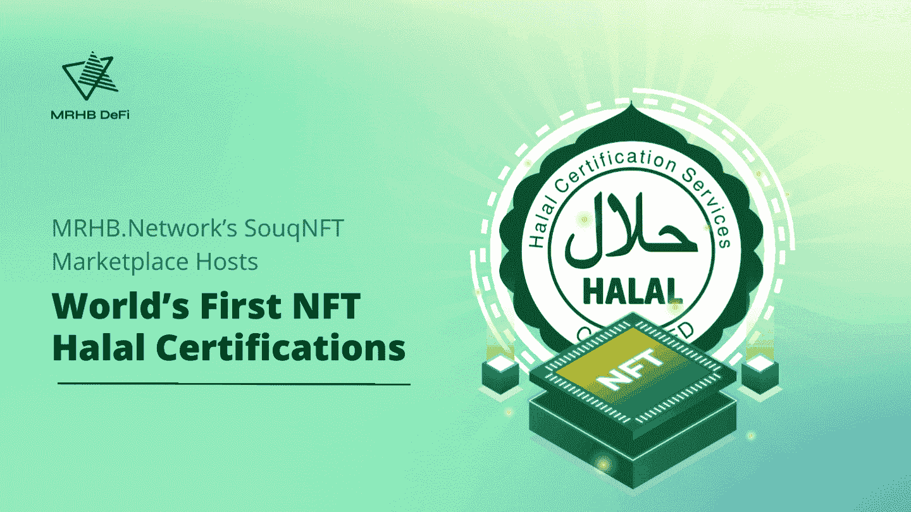

# MRHB。网络的 SouqNFT 市场主办了世界上第一个基于 NFT 的清真认证

> 原文：<https://medium.com/coinmonks/mrhb-networks-souqnft-marketplace-hosts-world-s-first-nft-based-halal-certifications-929c8ab7363b?source=collection_archive---------44----------------------->

*阿联酋迪拜***—**NFT 清真市场 [SouqNFT](https://www.souqnft.com) 现在拥有世界上首个 NFT 清真合规认证。由 [Shariah Experts Ltd.](https://shariahexperts.com) 铸造和发行的 NFT 证书由伦理分散金融(DeFi)平台 [MRHB 提供支持。网络](https://mrhb.network)。

这些 NFT 是记录在区块链上的第一批完全不可变的清真合规认证，为清真认证行业提供了新的透明度。NFTs 将允许公司公开验证他们的商业行为和产品是否经过清真认证，这意味着根据伊斯兰法律原则他们是道德的。

“NFT 的清真合规认证缺乏可信度，这满足了清真经济领域的迫切需求，在这个领域，伪造认证很常见或者很难验证，尤其是在[清真食品行业](https://www.salaamgateway.com/story/halal-food-industry-challenged-with-fraudulent-products-and-certification-disputes)。MRHB DeFi 首席执行官 Naquib Mohammed 说:**NFT 是独一无二的，既不可替换也不可互换——这使它们成为不可变证书的完美技术。“区块链的完全透明也意味着任何人都可以很容易地用 Shariah Expert 的公钥交叉检查证书，从而毫无疑问地证实是这个特定的 Shariah 咨询公司铸造了 NFT 并签发了证书。**默认情况下，NFT 包含所有权证明。****

NFT 证书的发行人 Shariah Experts 是一家总部位于伦敦的咨询公司，成立于 2020 年，其使命是按照伊斯兰原则指导 Web3 项目。伊斯兰教法专家的*法特瓦*(法律裁决)包括伊斯兰银行和金融、黄金和白银、*天课*对金融机构和投资者的施舍，以及*宗教基金*慈善捐赠。该公司由世界著名的伊斯兰教法学者 Farrukh Habib 博士和 Mufti Billal Omarjee 领导。新加坡黄金加密平台[缓存。Gold](https://cache.gold/) 是 SouqNFT marketplace 上铸造的第一个获得清真认证的 NFT。

Shariah 专家的联合创始人 Habib 博士说:“Shariah 专家认为，以 NFT 形式对证书进行令牌化有助于避免繁琐的身份验证方法和缓慢的验证过程。“其他方法在这一过程中容易出现多个故障点，例如丢失或破坏纸质或数字证书。非功能性测试是一种更加简化和持久的解决方案。”

SouqNFT marketplace 于 2021 年 12 月推出，是 MRHB DeFi 推出的第一款产品及其 [$MRHB](https://coinmarketcap.com/currencies/marhabadefi/) 令牌。值得注意的是，SouqNFT 也是世界上第一个列出清真认证 NFT 的 NFT 市场，保证用户永远不会在网站上发现不适当的内容。Shariah Governance Board (SGB)关注所有提交给市场的 NFT，并进一步得到 NSFW 和 NLP 机器学习算法的帮助。

**打造一个道德的 Web3 生态系统**

MRHB DeFi Network 的成立是为了创建一个清真 DeFi 产品和服务的平台生态系统，专门为那些只关心做出道德财务决策的人而设计。这包括伊斯兰金融部门，这是一个代表超过 10 亿人和价值 3 万亿美元的市场。为了被伊斯兰金融视为清真，企业必须遵守严格的道德和融资原则，包括避免社会剥削、利息或高利贷，支持透明度、可持续性、资产或公用事业支持的融资以及公平的风险回报分担——所有这些原则在穆斯林社区之外都具有普遍吸引力。

“我们真诚地希望，我们在 SouqNFT 上举办的 NFT 证书将激励其他人加入 MRHB DeFi Network，以建立一个专注于道德商业实践的 Web3 生态系统，”Naquib 说。“加密货币行业长期以来一直不受监管，这带来了许多不良行为者和不道德的情况。对于那些对是非有强烈信念的人来说，需要在 cryptoverse 中建立一个安全、可信的空间，我们认为区块链可以成为实现这一目标的完美工具。”

MRHB DeFi Network 最近推出了他们的旗舰产品， [Sahal Wallet](https://finance.yahoo.com/news/mrhb-defi-launches-sahal-wallet-142600061.html) ，这是一款自我保管的多链加密货币钱包，专为仅兼容 halal 认证的令牌而打造。该钱包也是 MRHB DeFi 生态系统其余部分的门户网站，包括直接链接到 SouqNFT，使任何人都可以轻松地使用 MRHB DeFi 网络平台作为清真 cryptoverse 的可信看门人，此外还为该生态系统开发了五种产品，包括无息加密融资、跨链 DEX 聚合器和流动性收割机，以及旨在为贫困社区创造更好机会的企业家启动平台和分散慈善事业(DePhi)。

MRHB DeFi Network 的愿景得到了许多合作伙伴和投资者的支持，包括 [Polygon Technology](https://polygon.technology/) 、 [Sheesha Finance](https://www.sheeshafinance.io/) 、[澳大利亚海湾资本](https://www.ausgulf.com)、 [NewTribe Capital](https://www.newtribe.capital/) 、[区块链澳大利亚](https://blockchainaustralia.com.au/)、 [Mozaic](https://nwgp.com/#mosaic) 、[康塔戈数字资产](https://www.contango.digital/)、 [ZKSync](https://zksync.io/) 、 [Acreditus Partners](https://acreditus.com/) 、 [EMGS](http://emgsconsulting.com/)

**关于 MRHB DeFi 网络**

MRHB DeFi 网络是一个清真、分散的金融平台，通过遵循基于信仰的金融和商业原则，体现“道德和包容性 DeFi”的真正精神，所有被排斥的社区都可以从 DeFi 的全部赋权潜力中受益。

这个多元化的团队由研究人员、技术专家、有影响力的人士、伊斯兰金融科技专家、商业企业家和行业专业人士组成，他们聚集在一起，共同确保 MRHB DeFi 以一种将影响整个社会的方式盛行，从根本上弥合信仰意识社区和区块链世界之间的差距。

**MRHB DeFi 网络官方渠道**

网址: [https://mrhb.network](https://mrhb.network/)

推特:【https://twitter.com/marhabadefi 

电报:[https://t.me/mdf_official](https://t.me/mdf_official)

电报通知:[https://t.me/marhabadefi_ANN](https://t.me/marhabadefi_ANN)

YouTube:[https://www.youtube.com/c/MarhabaDeFi](https://www.youtube.com/c/MarhabaDeFi)

中:[https://medium.com/@mrhbdefi](/@mrhbdefi)

领英:[https://www.linkedin.com/company/marhabadefi](https://www.linkedin.com/company/marhabadefi)

不和:[https://discord.com/invite/DubSjKmkBX](https://discord.com/invite/DubSjKmkBX)

https://www.facebook.com/MRHBDeFi

> 加入 Coinmonks [电报频道](https://t.me/coincodecap)和 [Youtube 频道](https://www.youtube.com/c/coinmonks/videos)了解加密交易和投资

# 另外，阅读

*   [AscendEx Staking](https://coincodecap.com/ascendex-staking)|[Bot Ocean Review](https://coincodecap.com/bot-ocean-review)|[最佳比特币钱包](https://coincodecap.com/bitcoin-wallets-india)
*   [Bitget 回顾](https://coincodecap.com/bitget-review) | [双子 vs 区块链](https://coincodecap.com/gemini-vs-blockfi) | [OKEx 期货交易](https://coincodecap.com/okex-futures-trading)
*   [美国最佳加密交易机器人](https://coincodecap.com/crypto-trading-bots-in-the-us) | [经常性回顾](https://coincodecap.com/changelly-review)
*   [在印度利用加密套利赚取被动收入](https://coincodecap.com/crypto-arbitrage-in-india)
*   [霍比审核](https://coincodecap.com/huobi-review) | [OKEx 保证金交易](https://coincodecap.com/okex-margin-trading) | [期货交易](https://coincodecap.com/futures-trading)