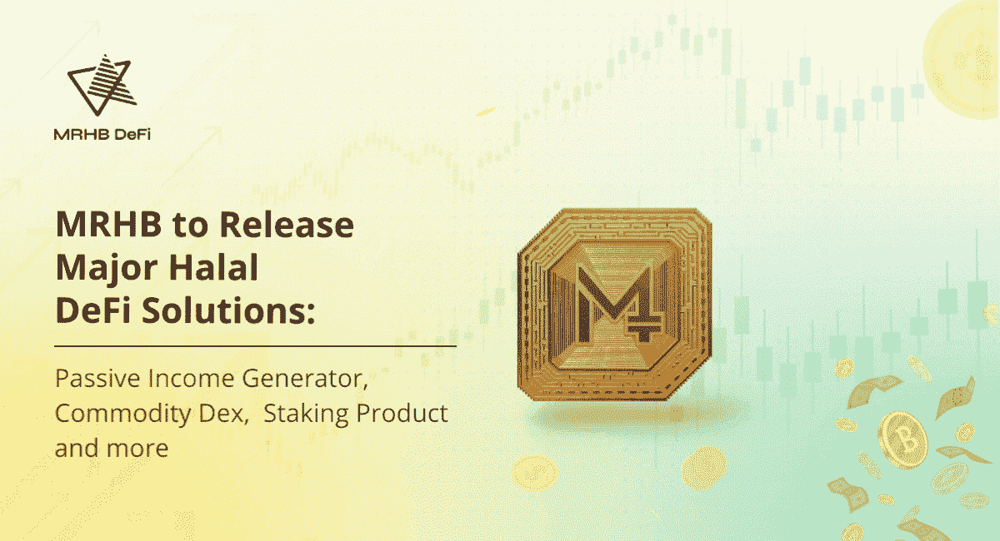

# MRHB 将发布主要的 Halal DeFi 解决方案，用于被动加密收入、商品交易和赌注

> 原文：<https://medium.com/coinmonks/mrhb-to-release-major-halal-defi-solutions-for-passive-crypto-income-commodity-exchange-staking-41b0fee9add2?source=collection_archive---------57----------------------->

*阿联酋迪拜，2022 年 6 月 10 日*——关注道德的分散式金融平台 [MRHB。Network](https://mrhb.network/) 宣布了三项世界首创的产品/功能发布，以及将在未来六个月内添加到其 halal DeFi 平台的数十项新增强功能。在发布这一产品的同时，从 8 月起还将增加十几项开发，为明年推出的其他四种主要产品铺平道路。

“MRHB DeFi Network 有一个非常强大的路线图，可以快速构建一个包含道德和清真金融解决方案的全功能 DeFi 生态系统。这个项目的首席执行官和创始人 [Naquib Mohammed](https://www.linkedin.com/in/mohammednaquib/) 说:“我们今年夏天推出的开发将为我们的平台带来广泛的功能和实用性，我们非常高兴能够向我们的社区展示这些功能和实用性。

"**无论市场是上涨还是下跌，MRHB 都会继续为整个区块链生态系统的发展做出贡献。我们 100%致力于我们革命性的长期愿景——MRHB 将从拥挤的项目海洋中脱颖而出**，”Naquib 宣布。

**“真正清真”的 DeFi 解决方案:流动性收割机、M.I.R.O .和 CommDex**

在第三季度至第四季度推出的两款备受期待的新加密财富产品包括**用于产生被动收入/财富的流动性收割机和 M.I.R.O. (Marhaba 激励&奖励产品)，这是世界上第一款 halal DeFi staking 解决方案。**

MRHB DeFi 解决方案设计师、MRHB 首席技术官 [Deniz Dalkilic](https://www.linkedin.com/in/denizdalkilic/) 解释道:

“**我们的技术团队花了将近 6 个月的时间与 Shariah Governance Board(“SGB”)一起寻找实质上真正清真的加密解决方案，而不仅仅是形式上。”**

crypto 中的许多收入产品依赖于基于利息的借贷策略，这在以道德为中心的生态系统中被视为高利贷和可能的剥削。

Deniz 继续说，“相反，我们将为我们的最终用户使用一种非常不同的方法，他们可以从被 SGB 视为清真的不同基础协议中获得回报。收割机还将提供手动(主动)或自动(被动)功能的选项，如果您参与赌注计划，您可以获得更好的选项或提前获得某些 VIP 策略，以及基于您锁定金额和级别的许多其他特权。对 M.I.R.O .来说，对锁定代币的奖励是基于一种分层激励的赌注模式。

MRHB 社区还可以期待开创性的“CommDex”功能，这是一种分散的商品支持代币交易所，可通过全球首款专门用于存放清真代币的自助保管多链钱包 [Sahal Wallet](https://finance.yahoo.com/news/mrhb-defi-launches-sahal-wallet-142600061.html) 访问。

丹尼斯说:“通过 CommDex，我们将实物支持的黄金和白银进行代币化——通过这些代币，你可以购买一克实物黄金或白银，存放在我们合作伙伴的金条或金库里从黄金和白银的通用财富保值解决方案开始，我们将扩展到其他实物商品，如小麦、玉米和铁。"

**其他备受期待的技术发展包括 Sahal Wallet 的集成，如比特币兼容性、可逆交易和游戏化功能。**

从 5 月份开始到接下来几个月的发展路线图摘要如下:

*   【2022 年 5 月: **Sahal Wallet** —令牌显示和 Shariah coins API 和管理面板的后端升级； **SouqNFT —** NFT 报道新增；**流动性采集器**版本 1(主动管理)
*   **2022 年 6 月:** **Sahal Wallet** —价格图表以及与 Avalanche 和 NFTs 的集成；推荐计划；**流动性收割机** —测试、审计和 **M.I.R.O.** 押记整合； **M.I.R.O.** —开发标记和投票合同以及用户界面门户
*   **2022 年 7 月:** **CommDEX —** 推出金银代币**；** **Sahal 钱包** —与比特币、Fantom 和 RSK 的集成。**SouqNFT**—Fantom integration，一款基于 fiat onramp、GAN 的美术工具，提示性搜索；**流动性收割机**版本 2 (被动)— UI 升级
*   **2022 年 8 月及以后:** **M.I.R.O.** —钱包内赌注、非金融交易和激励层级； **Sahal Wallet** —游戏化挖掘标签、可逆交易、五种新语言的本地化、多钱包功能、与**Liquidity harvest**r 版本 1、ZKSync 和 Arbitrum 的集成； **SouqNFT** —独特的 NFT 检查器和反向图像查找；**流动性采集器**版本 2——测试、审计和 **M.I.R.O.** 打桩集成

MRHB 顾问委员会的负责人 Khalid Howladar 指出，“**我们仍然处于一个雄心勃勃的伦理生态系统产品套件愿景的早期阶段。最终，该团队希望通过一个可信的门户网站**，为社区提供安全、便捷的访问各种强大的清真 DeFi 服务的途径。”

**通往 Marhaba 的道路，世界上第一个清真 DeFi 平台**

MRHB——读作“Marhaba ”,在阿拉伯语中是“欢迎”的意思——成立的目的是为超过 18 亿关注做出道德财务决策的人提供服务，这在业内尚属首次。这包括世界上的穆斯林人口，这是一个代表着 3 万亿美元巨大市场的人口统计数据，此前由于该行业缺乏清真选项，该市场被排除在加密货币领域之外。

MRHB DeFi Network 通过严格的清真审查流程将每一个令牌、产品和服务放在其平台上，从而满足了这一需求，确保道德商业实践在每一步都得到遵循。

该公司于 2021 年 12 月在超额认购的 IDO 中推出了他们的 MRHB 令牌，筹集了超过 550 万美元的资金。超过 85%的投资者是来自 106 个不同国家的 6 万多名热情支持者的成员。

上个月，MRHB DeFi Network 获得了[全球品牌奖](https://www.globalbrandsmagazine.com/award-winners-2022/)的“最佳新伊斯兰加密平台”(加密/外汇类别)。MRHB 令牌还在 2022 年 1 月和 2022 年 3 月在纳斯达克和 InvestorPlace 作为“杀手密码”被[展示](https://www.nasdaq.com/articles/7-killer-cryptos-to-buy-for-january)。另一项创举是，伊斯兰教法专家[在 MRHB 的](https://www.globenewswire.com/en/news-release/2022/04/29/2432584/0/en/Shariah-Experts-Ltd-has-Issued-the-World-s-First-NFT-Based-Halal-Certification-on-SouqNFT.html) [SouqNFT](https://souq.mrhb.network/) 平台上推出了全球首个 NFT 清真认证。

MRHB 雄心勃勃的 2023 年产品发布路线图将为该平台添加四种主要产品和服务。其中包括:

*   无息加密融资提供分散的清真贷款，避免高利贷
*   一个企业家发射台为那些不幸的人提供了一个实现梦想的途径
*   致力于分散慈善事业的整个平台(DePhi)
*   实现端到端财务透明的分散自治治理(DAG)

在这四个产品发布后，Marhaba 计划迁移到他们自己的第 1 层区块链。

MRHB DeFi Network 的愿景得到了许多合作伙伴和投资者的支持，包括 [Polygon Technology](https://polygon.technology/) 、 [Sheesha Finance](https://www.sheeshafinance.io/) 、[澳大利亚海湾资本](https://www.ausgulf.com)、 [NewTribe Capital](https://www.newtribe.capital/) 、[区块链澳大利亚](https://blockchainaustralia.com.au/)、 [Mozaic](https://nwgp.com/#mosaic) 、[康塔戈数字资产](https://www.contango.digital/)、 [ZKSync](https://zksync.io/) 、 [Acreditus Partners](https://acreditus.com/) 、 [EMGS 集团](http://emgsconsulting.com/)

**关于 MRHB DeFi 网络**

MRHB DeFi 网络是一个清真、分散的金融平台，通过遵循基于信仰的金融和商业原则，体现“道德和包容性 DeFi”的真正精神，所有被排斥的社区都可以从 DeFi 的全部赋权潜力中受益。

这个多元化的团队由研究人员、技术专家、有影响力的人士、伊斯兰金融科技专家、商业企业家和行业专业人士组成，他们聚集在一起，共同确保 MRHB DeFi 以一种将影响整个社会的方式盛行，从根本上弥合信仰意识社区和区块链世界之间的差距。

**MRHB DeFi 网官方渠道**

网址: [https://mrhb.network](https://mrhb.network/)

推特:[https://twitter.com/marhabadefi](https://twitter.com/marhabadefi)

电报:[https://t.me/mdf_official](https://t.me/mdf_official)

电报通知:[https://t.me/marhabadefi_ANN](https://t.me/marhabadefi_ANN)

YouTube:[https://www.youtube.com/c/MarhabaDeFi](https://www.youtube.com/c/MarhabaDeFi)

中:[https://medium.com/@mrhbdefi](/@mrhbdefi)

领英:【https://www.linkedin.com/company/marhabadefi 

不和:【https://discord.com/invite/DubSjKmkBX】T4

https://www.facebook.com/MRHBDeFi:[脸书](https://www.facebook.com/MRHBDeFi)

电报(阿拉伯语):[https://t.me/mdf_arabic](https://t.me/mdf_arabic)

电报(俄语):[https://t.me/marhabadefi_russia](https://t.me/marhabadefi_russia)

电报(土耳其语):[https://t.me/MarhabaDefiTR](https://t.me/MarhabaDefiTR)

电报(波斯语):[https://t.me/mrhbdefi_persian](https://t.me/mrhbdefi_persian)

电报(乌尔都语/印地语):[https://t.me/MRHBDeFi_Urdu_Hindi](https://t.me/MRHBDeFi_Urdu_Hindi)

SouqNFT market place:[https://souq . mrhb . network](https://souq.mrhb.network)

> 加入 Coinmonks [电报频道](https://t.me/coincodecap)和 [Youtube 频道](https://www.youtube.com/c/coinmonks/videos)了解加密交易和投资

# 另外，阅读

*   [霍比评论](https://coincodecap.com/huobi-review) | [OKEx 保证金交易](https://coincodecap.com/okex-margin-trading) | [期货交易](https://coincodecap.com/futures-trading)
*   [麻雀交换评论](https://coincodecap.com/sparrow-exchange-review) | [纳什交换评论](https://coincodecap.com/nash-exchange-review)
*   最好的[加密税务软件](/coinmonks/best-crypto-tax-tool-for-my-money-72d4b430816b) | [硬币追踪评论](/coinmonks/cointracking-review-a-reliable-cryptocurrency-tax-software-5114e3eb5737)
*   [Stackedinvest 评论](https://coincodecap.com/stackedinvest-review) | [北海巨妖评论](/coinmonks/kraken-review-6165fc1056ac) | [bitFlyer 评论](https://coincodecap.com/bitflyer-review)
*   最佳[加密借贷平台](/coinmonks/top-5-crypto-lending-platforms-in-2020-that-you-need-to-know-a1b675cec3fa) | [杠杆令牌](/coinmonks/leveraged-token-3f5257808b22)
*   最佳[加密制图工具](/coinmonks/what-are-the-best-charting-platforms-for-cryptocurrency-trading-85aade584d80) | [最佳加密交易所](/coinmonks/crypto-exchange-dd2f9d6f3769)