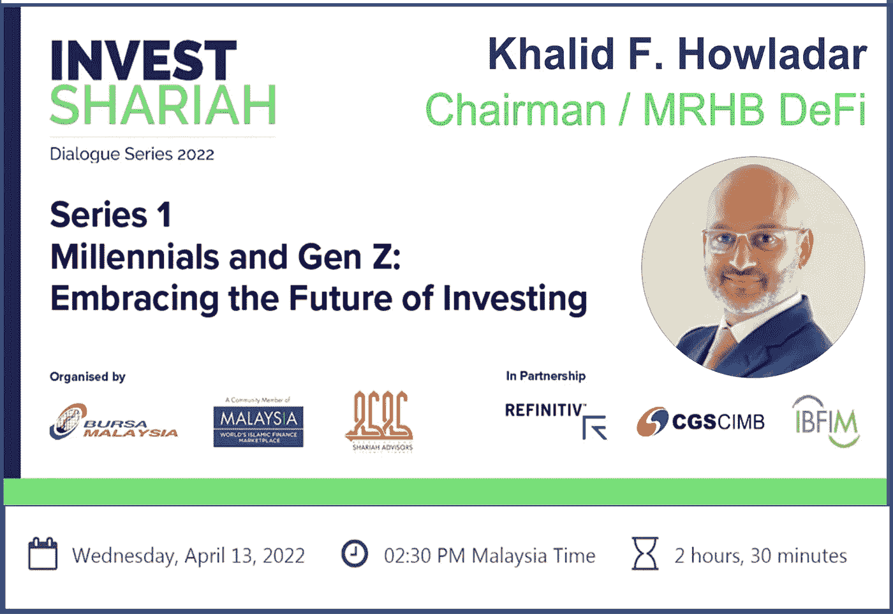
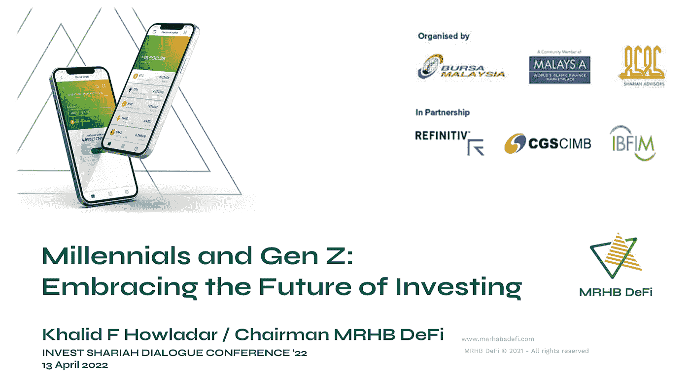

# MRHB 的 Khalid Howladar 将首次亮相马来西亚证券交易所组织的投资伊斯兰法系列

> 原文：<https://medium.com/coinmonks/mrhbs-khalid-howladar-to-debut-the-invest-shariah-series-organized-by-bursa-malaysia-916b1a9db47d?source=collection_archive---------79----------------------->

**事件详情**

**日期和时间:马来西亚时间**2022 年 4 月 13 日星期三下午 2:30

**报名链接:**[**https://event . on24 . com/WCC/r/3700912/f 48 D1 ba 9d 72562 facc 1831 e 7c 5454165**](https://event.on24.com/wcc/r/3700912/F48D1BA9D72562FACC1831E7C5454165)

周三即将举行的是[Invest Shariah Dialogue Series 2022](https://event.on24.com/wcc/r/3700912/F48D1BA9D72562FACC1831E7C5454165)的第一部分，这是由 [Bursa Malaysia](https://www.bursamalaysia.com/) 组织的年度四部分系列，为行业专家提供了一个讨论伊斯兰资本市场和 Shariah 投资相关话题的平台。

迪拜的 Khalid Howladar 将会就千禧年和 Z 世代:拥抱投资的未来发表演讲。Howladar 是 MRHB 顾问委员会的主席。网络，伊斯兰金融领域的一个里程碑式的 DeFi 项目，提供清真和道德的分散金融解决方案。

谈话要点包括:

*   关于加密是清真还是圣地，以及下一代应该参与还是回避这个领域的辩论，千禧一代和 Z 世代是加密的最大采纳者，这个行业现在价值约 2 万亿美元
*   分散金融(DeFi)的机会和使用案例及其在伊斯兰金融和支持可持续性目标中的作用(如果有)。
*   澄清这些术语——区块链和加密货币。对这些数字创新是否存在误解——它们是否有任何价值，或者只是纯粹的猜测。
*   MRHB 如何提高千禧一代和 Z 世代的安全投资标准，以及该平台如何创造未来的投资机会。

**关于 MRHB DeFi**

MRHB(发音为“mar haba”)DeFi 是一个分散化的金融平台，旨在将道德引入 DeFi 空间，除了现有的加密本地人之外，还支持纳入基于信仰的社区和其他受排斥的社区，以便每个人都可以受益于 DeFi 的全部赋权潜力，帮助建立一个真正的点对点金融和经济价值体系。

基于区块链的信条，如信任、透明和安全，MRHB DeFi 将普遍适用的伊斯兰金融原则融入到区块链的信条中，以提供一套也符合 ESG 的产品。

该项目由一个多元化的强大团队提供支持，该团队的背景涵盖加密、技术、符合信仰的投资、金融和经验丰富的行业资深机构。

**MRHB DeFi 官方渠道**

[网站](https://mrhb.network/) | [推特](https://twitter.com/marhabadefi) | [电报聊天](https://t.me/mdf_official) | [电报公告](https://t.me/marhabadefi_ANN) | [媒体](/@mrhbdefi) | [文档](https://marhabadefi.com/info-centre.php) | [脸书](https://www.facebook.com/MRHB-DeFi-105893235209147/) | [LinkedIn](https://www.linkedin.com/company/marhabadefi/) | [电报阿拉伯语社区](https://t.me/mdf_arabic) | [俄语社区](https://t.me/mdf_russia) | [土耳其语社区](https://t.me/MarhabaDefiTR) | [波斯语社区](https://t.me/mrhbdefi_persian) | [乌尔得](https://t.me/MRHBDeFi_Urdu_Hindi)

> 加入 Coinmonks [电报频道](https://t.me/coincodecap)和 [Youtube 频道](https://www.youtube.com/c/coinmonks/videos)了解加密交易和投资

# 另外，阅读

*   [分散交易所](https://coincodecap.com/what-are-decentralized-exchanges) | [比特 FIP](https://coincodecap.com/bitbns-fip) | [宾邦评论](https://coincodecap.com/bingbon-review)
*   [用信用卡购买密码的 10 个最佳地点](https://coincodecap.com/buy-crypto-with-credit-card)
*   [加拿大最佳加密交易机器人](https://coincodecap.com/5-best-crypto-trading-bots-in-canada) | [Bybit vs 币安](https://coincodecap.com/bybit-binance-moonxbt)
*   [阿联酋 5 大最佳加密交易所](https://coincodecap.com/best-crypto-exchanges-in-uae) | [SimpleSwap 评论](https://coincodecap.com/simpleswap-review)
*   [购买 Dogecoin 的 7 种最佳方式](https://coincodecap.com/ways-to-buy-dogecoin) | [ZebPay 评论](https://coincodecap.com/zebpay-review)