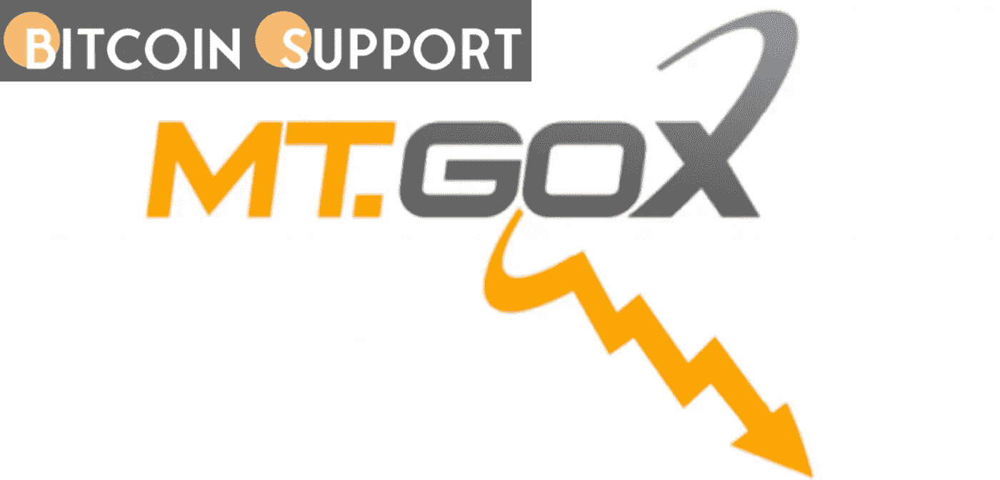
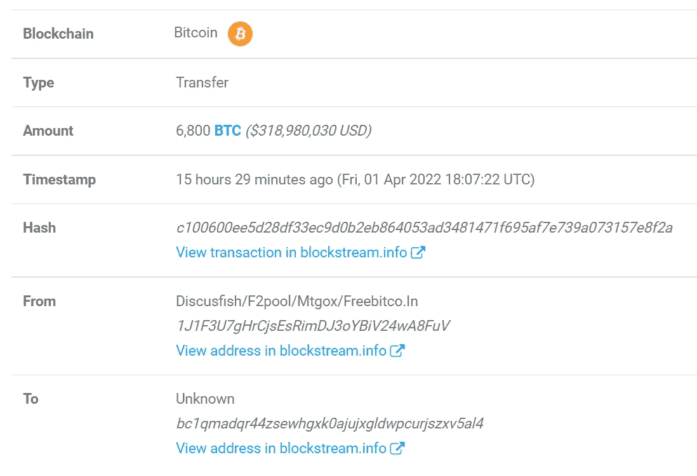

# Mt. Gox 钱包转账 6800 BTC，因为前首席执行官打算支付 60 亿美元的加密货币

> 原文：<https://medium.com/coinmonks/mt-gox-wallet-transfers-6-800-btc-as-ex-ceo-intends-to-disburse-6-billion-in-cryptocurrency-80d09246f954?source=collection_archive---------17----------------------->

**Visit our website:-** [**https://bitcoinsupports.com/**](https://bitcoinsupports.com/)

前首席执行官马克·卡佩斯(Mark Karpeles)透露，该交易所在关闭时控制着约 20 万枚比特币，其中受托人此前以 6 亿美元的价格出售了 5 万枚比特币。

就在前首席执行官马克·卡佩斯(Mark Karpeles)宣布计划将价值 60 亿美元的 BTC 分散给债权人的几天后，一个属于臭名昭著的比特币(BTC)交易所 Mt. Gox 的冰冷钱包将 6800 BTC 转移到了一个不知名的钱包中。

Mt. Gox 是一家位于东京的比特币交易所，在一次网络攻击导致 85 万 BTC 损失后，于 2014 年 2 月关闭。卡佩斯在最近的一次采访中透露，该公司倒闭后，该交易所控制了大约 20 万 BTC，其中受托人已经以 6 亿美元的价格出售了大约 5 万 BTC。根据卡普莱斯的说法，Mt. Gox 剩余的 15 万 BTC 随着时间的推移已经增值，现在价值超过 60 亿美元。在这一披露之后，这位前首席执行官确认了重新分配资金和解决债权人债务的步骤。卡普莱斯接受采访五天后，Crypto Twitter 的@whale-alert 报道称，6800 名 BTC 从一个属于现已停业的 Mt. Gox 交易所的冰冷钱包中被转移到一个不知名的钱包中，价值约 3.19 亿美元。

**Visit our website:-** [**https://bitcoinsupports.com/**](https://bitcoinsupports.com/)

尽管已经停业八年多，Mt. Gox 的工作人员此前已经公布了一项补偿债权人的策略。另一方面，转移 6800 BTC 可能表明这一计划的开始。

[https://twitter.com/BearsRare/status/1504293859467350019](https://twitter.com/BearsRare/status/1504293859467350019)

稀有熊，一个新成立的不可伪造令牌(NFT)倡议，证实了 3 月 18 日一次成功的网络钓鱼企图，导致超过 80 万美元的 NFTs 被盗。

黑客进入了一个不和谐版主的账户，传播钓鱼链接，榨干用户的银行账户。稀有熊团队最终能够停用被劫持的帐户，并保护系统免受其他入侵。

**访问我们的网站:-**[**https://bitcoinsupports.com/**](https://bitcoinsupports.com/)

**免责声明:以上为作者观点，不应视为投资建议。读者应该自己做研究。**

> 加入 Coinmonks [电报频道](https://t.me/coincodecap)和 [Youtube 频道](https://www.youtube.com/c/coinmonks/videos)了解加密交易和投资

# 另外，阅读

*   [印度加密交易所](/coinmonks/bitcoin-exchange-in-india-7f1fe79715c9) | [比特币储蓄账户](/coinmonks/bitcoin-savings-account-e65b13f92451)
*   [OKEx vs KuCoin](https://coincodecap.com/okex-kucoin) | [摄氏替代品](https://coincodecap.com/celsius-alternatives) | [如何购买 VeChain](https://coincodecap.com/buy-vechain)
*   [币安期货交易](https://coincodecap.com/binance-futures-trading)|[3 comas vs Mudrex vs eToro](https://coincodecap.com/mudrex-3commas-etoro)
*   [如何购买 Monero](https://coincodecap.com/buy-monero) | [IDEX 评论](https://coincodecap.com/idex-review) | [BitKan 交易机器人](https://coincodecap.com/bitkan-trading-bot)
*   [CoinDCX 评论](/coinmonks/coindcx-review-8444db3621a2) | [加密保证金交易交易所](https://coincodecap.com/crypto-margin-trading-exchanges)