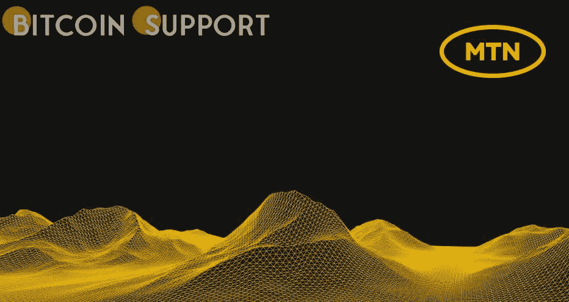

# 南非移动网络运营商 MTN 购买了元宇宙的土地

> 原文：<https://medium.com/coinmonks/mtn-a-south-african-mobile-network-operator-has-purchased-metaverse-land-a3f32e6bd5bf?source=collection_archive---------74----------------------->

**Visit our website:-** [**https://bitcoinsupports.com/**](https://bitcoinsupports.com/)

南非移动网络运营商 MTN 最近成为首批进入元宇宙的公司之一，在虚拟世界 Ubuntuland 购买了 144 块数字土地，金额未披露。MTN 的目标是“放大消费者的数字体验”。

据消息人士透露，南非移动网络运营商 MTN 最近在元宇宙乌班图兰购买了 144 块数字土地。据报道，MTN 是首批进入元宇宙的南非公司之一。根据 Mybroadband 的报告，MTN 现在控制着 144 块总面积为 12 平方米的土地。MTN 集团营销主管 Bernice Samuels 称赞了公司迁至元宇宙的举措，并描述了这一举措如何符合其雄心勃勃的 2025 计划。据这位高管称，

这正是我们雄心 2025 战略的理念:驾驭趋势，增强消费者的数字体验和参与。我们一直站在技术和数字进步的前沿，我们对元宇宙为我们和我们的客户提供的可能性感到兴奋。

这家移动网络运营商接着说，它在元宇宙的存在表明了它对非洲创新的承诺。报道称，MTN 还将试图通过其在元宇宙的存在来提升其“消费者吸引力”。根据研究，这将通过一系列结合游戏和音乐等消费者激情点的体验来实现。

**访问我们的网站:-**[**https://bitcoinsupports.com/**](https://bitcoinsupports.com/)

**免责声明:以上为作者观点，不应视为投资建议。读者应该自己做研究。**

> 加入 Coinmonks [电报频道](https://t.me/coincodecap)和 [Youtube 频道](https://www.youtube.com/c/coinmonks/videos)了解加密交易和投资

# 另外，阅读

*   [OKEx vs KuCoin](https://coincodecap.com/okex-kucoin) | [摄氏替代品](https://coincodecap.com/celsius-alternatives) | [如何购买 VeChain](https://coincodecap.com/buy-vechain)
*   [币安期货交易](https://coincodecap.com/binance-futures-trading)|[3 commas vs Mudrex vs eToro](https://coincodecap.com/mudrex-3commas-etoro)
*   [如何购买 Monero](https://coincodecap.com/buy-monero) | [IDEX 评论](https://coincodecap.com/idex-review) | [BitKan 交易机器人](https://coincodecap.com/bitkan-trading-bot)
*   [CoinDCX 评论](/coinmonks/coindcx-review-8444db3621a2) | [加密保证金交易交易所](https://coincodecap.com/crypto-margin-trading-exchanges)
*   [红狗赌场评论](https://coincodecap.com/red-dog-casino-review) | [Swyftx 评论](https://coincodecap.com/swyftx-review) | [CoinGate 评论](https://coincodecap.com/coingate-review)
*   [Bookmap 点评](https://coincodecap.com/bookmap-review-2021-best-trading-software) | [美国 5 大最佳加密交易所](https://coincodecap.com/crypto-exchange-usa)
*   [如何在 FTX 交易所交易期货](https://coincodecap.com/ftx-futures-trading) | [OKEx vs 币安](https://coincodecap.com/okex-vs-binance)
*   [CoinLoan 审查](https://coincodecap.com/coinloan-review) | [YouHodler 审查](/coinmonks/youhodler-4-easy-ways-to-make-money-98969b9689f2) | [BlockFi 审查](https://coincodecap.com/blockfi-review)
*   [XT.COM 评论](https://coincodecap.com/profittradingapp-for-binance)币安评论 |
*   [SmithBot 评论](https://coincodecap.com/smithbot-review) | [4 款最佳免费开源交易机器人](https://coincodecap.com/free-open-source-trading-bots)
*   [比特币基地僵尸程序](/coinmonks/coinbase-bots-ac6359e897f3) | [AscendEX 审查](/coinmonks/ascendex-review-53e829cf75fa) | [OKEx 交易僵尸程序](/coinmonks/okex-trading-bots-234920f61e60)