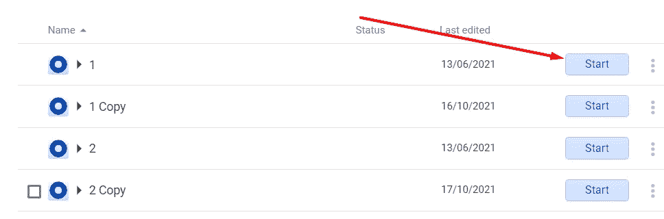
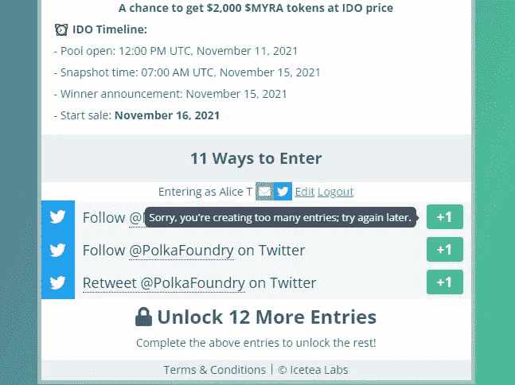

# 多会计:这是什么

> 原文：<https://medium.com/coinmonks/multi-accounting-what-is-this-af423fbf1b28?source=collection_archive---------10----------------------->

## 通常情况下，超过 100，000 人可以要求 300 个分配，这当然使得赢得白名单的机会可以忽略不计。但是有一条出路——多重核算。数学很简单:如果你做 100 个账户，赢的几率比你只做 1 个账户高 100 倍。

很多人觉得多记账很费时间。是的，它是。你可以用它获得很多好项目的拨款，但同时你也会花费大量的精力和时间去完成上百个任务，填写上百个表格。这通常由那些资本非常有限(最多 100，000 美元)的人使用，因为它不需要大量的货币支出(各种账户只需要 200-500 美元)。

我们对此表示谴责。以下所有内容都是介绍性材料。诚实参与。

# 多会计怎么准备？

## **推特账号**

在多账户保护方面，Twitter 是最被误解的社交网络。你可能会问“为什么？”。答案是平台可以白白封禁你的账号。是的，你没听错，“无缘无故”是账户被封的常见原因。也就是说，你可以第一次登录一个账户，尝试执行一个动作，发现你的账户处于永久或临时封禁状态。(是的，【swap.net】****账号在项目开始时几乎每周都被封禁，因为我们写了很多并经常与合作伙伴报价)****

********

****我可以肯定地告诉你，最终你为白名单购买的任何 Twitter 帐户都会被禁止，但当然你可以在运行帐户时使用带有反检测浏览器的代理来延长帐户的寿命(我将在下面的段落中谈到它们)。****

****最好购买寿命为 6 个月或更长的账户，因为 Twitter 对新规则的要求很严格。这些网站为数码产品提供网上商店租赁服务，因此可以通过产品名称方便地搜索他们提供租赁服务的所有网站。****

## ******电报账户******

****伟大和强大的帕维尔·杜罗夫，电报的创造者，已经帮了很大的忙，几乎没有增加反多 acc 保护。当然，如果你从所有帐户发送垃圾邮件，你会被阻止(只限于向非互惠联系人发送消息)，但如果你偶尔注册多个群或与一些机器人互动，被禁止的可能性微乎其微。****

****所有电报账户都可以在没有任何代理的情况下访问。有些人说你需要他们，但我没有他们也过得很好。****

****当购买电报帐户时，注意他们被发给你的格式。对于我使用的存储和运行帐户的方法，您将需要 TDATA 格式。****

********

## ****反检测浏览器****

****这些程序可以替代浏览器指纹，唯一地识别互联网，并允许你在不同的网站上同时使用多个帐户。现在市场上有很多不同的反检测软件，所以这里有一个列表，你可以从中选择适合你的浏览器。****

*   ****海豚蚂蚁****
*   ****[靛蓝浏览器](https://indigobrowser.com/)****
*   ****[隐姓埋名](https://incogniton.com/)****
*   ****[林肯球体](https://ls.tenebris.cc/)****
*   ****[AdsPower](https://www.adspower.net/)****
*   ****[戈洛金](https://gologin.com/)****
*   ****[Octo 浏览器](https://octobrowser.net/)****
*   ****[多重登录](https://multilogin.com/)****

****所有反检测浏览器执行的功能大致相同，所以我看不出它们之间有很大的区别。****

****下面是在 Multilogin 中使用代理创建一个配置文件的说明(所有浏览器中的算法都是相似的)。****

******1。创建新的。******

********

******2。输入配置文件的名称，并选择保存它的文件夹。******

********

******3。编辑代理设置。******

********

******4。设置 Http 代理，从中输入数据，然后单击“创建配置文件”。******

****************

******5。完成后，您现在可以使用“开始”按钮启动配置文件。******

********

## ******不和账******

****他们的反多账户系统工作很弱(在电报级别)，所以你可以安全地从一个设备登录许多账户，不用担心禁令。****

********

## ****代理人****

****代理服务器是在用户和互联网资源之间起中介作用的远程计算机。它的任务是将用户的所有请求传送到互联网，并将收到的响应广播回来。****

****使用代理是为了让各种网站无法通过他们的反欺诈系统检测到你已经注册了数百个账户，而不是允许的一个。****

********

****代理在多账户中扮演着重要的角色，因为如果没有代理，你的 Twitter 账户通常会被禁止，而 Gleam 和 Sweepwidget 等白名单平台会禁止你加入白名单。****

****你可以在很多网站上购买代理，以下是其中一些网站的列表:****

*   ****[代理 6](https://proxy6.net/en/)****
*   ****[AWMProxy](https://awmproxy.com/)****
*   ****[近端线](https://proxyline.net/)****

****白名单最常见的代理是 ipv4 共享代理，所以我建议你买。最便宜的 ipv4 共享代理无法使用 Gleam 表单，因此您需要购买更贵的代理，如 [**Proxy6**](https://proxy6.net/en/) 或 [**Proxyline**](https://proxyline.net/en/) 。****

## ****邮件****

****为了注册账户，大多数网站需要一个我们需要访问的电子邮件(你不能随便写一个)，因为我们可能需要它来接收带有各种验证码的电子邮件或检查白名单结果。****

****对于 Sweepwidget 表单，您需要购买其他域名的电子邮件。对于这些你可以使用 gmail.com(不推荐，因为它们太贵)，hotmail.com，outlook.com，yahoo.com。****

********

## ****钱包地址****

****99%的白名单在注册时会询问你的钱包。当然你可以在同一个 Metamask 中手动创建上百个钱包，但是太费时间了，所以我建议使用 [**Cointool**](https://cointool.app/dashboard) 。****

****如何一次创建多个钱包:****

****1.在 [**Cointool**](https://cointool.app/dashboard) 上你需要找到批量钱包生成并点击它。****

********

****2.选择我们需要钱包的网络。****

********

****3.输入我们需要的钱包数量，然后单击其右侧的箭头。****

********

****4.下载完成后(网站上的蓝线)，按“导出”。****

********

****5.完成后，您现在可以从下载的 Excel 电子表格中获取地址。此外，除了地址，还有私人密钥和助记符。****

********

# ****如何针对白名单进行不同形式的多任务处理？****

****大多数项目使用标准化的表格来运行他们的公共印章的白名单。这些形式中的一些是微光、掠射和病毒掠射。当然，不同项目的任务可能略有不同，但总体而言，多重核算的方法是相同的。****

## ****闪光****

****硬级别，因为首先，它们需要昂贵的代理，其次，这种形式必然需要社交媒体的链接来验证任务的完成。****

****除了购买更贵的代理之外，没有其他方法来处理廉价代理被禁止的问题，但社交网络(Twitter，Discord)绑定有一个小技巧:在成功完成所有任务后，你可以从你的帐户中解除绑定。****

## ****如何使用这个情报:****

******1。完成所有任务，例如与 Twitter 相关的任务。******

********

******2。按下“注销”旁边的“编辑”按钮。******

********

******3。按十字并“保存”。******

********

******4。现在，您可以注销您的帐户，并将 Twitter 链接到下一个帐户。******

****一般来说，您可以在每个反检测浏览器配置文件中填充大约 15-20 个闪烁，之后通常会出现“条目太多”的错误，因为从同一个 IP 填充了大量的表单。它会在几天后自行解决，因此如果出现此错误，您应该切换到另一个反检测浏览器配置文件。****

********

****对了，别忘了在你的 Twitter 账号上放个头像，不然你填表的时候可能会出错。****

********

## ****Gleam 表格的一些有趣细节:****

*   ****“还有一步，请完成安全检查以访问 gleam.io”验证码只能与 IP 相关，不能与指纹相关。创建 gleam 时，您可以将 captcha 设置为必填项，但这要么在登录前出现在 gleam 窗口中，要么在您执行第一个操作时出现。****
*   ****如果你在获得授权、符合规定之前被禁止，这只是知识产权的问题，因为他们在协议中写道，他们只在获得授权或符合规定后收集指纹数据。****
*   ****他们有一个影子禁令，账户被标记为“无效”。条款没有透露。但是至少有一个邮件验证器来检查邮件的存在和其他一些特性。你可以试试看这里:verifalia.com****
*   ****通过 gleam 进行的获奖者评选不取决于分数。用户列表被赋予从 1 到 x 的值，然后随机选择获胜的用户(这通过 gleam 工作，但没有人取消上传到表中，然后他们就可以在那里了)。同样，无效用户不参与卸载或选择获胜者。****
*   ****不可能通过 gleam 本身按 IP 国家建立出口。同样，例外是如果他们没有通过表格自己删除这些字符串。****
*   ****获奖者的选择可以在一个日期范围内，因此值得在不同的日子填写，而不是一次全部填写。****

****此外，从我们的测试表单下载数据后，我们了解到:****

****1.首先，导出数据如下所示:****

********

****它不导出参与者的数量，只导出所有的动作，如果双击，可以按点数排序。如果你手动选择获胜者，完全移除这个国家是一件现实的事情。****

****2.不过，重要的是行动的数量，因为通过 gleam 选择获胜者会在单独的行上记录每个行动。胜利者不是一个人，而是这个人采取的一排行动。因此，结论是:行动越多，表格中关于你的条目就越多，获胜的机会就越大。****

********

****3.IP 是不卸载的，所以卸载到桌子上的时候没有办法检查你有没有从 20 个有 1 个 IP 的账号做过任务，但是有可能从某个 IP 看到一个人的所有动作，在那里你可能会被抓到。****

## ****扫描宽度****

****中等水平，因为虽然没有必要绑定任何社交网络，但他们有一个非常不明确和僵化的反多阿克 systemю.****

****经常发生的情况是，即使是几个推荐，该帐户也被“标记”为垃圾邮件，因此它不会参与白名单抽奖。****

****对于从一个 ipi 注册的两个或多个帐户，所有从该 ipi 注册的帐户都会立即被标记为“垃圾邮件帐户”，因此在每个帐户注册后，您需要更改代理。****

********

****要注册一个帐户，你将需要与 gmail.com，hotmail.com，outlook.com，yahoo.com 域的电子邮件。****

********

****但是这种类型的表单有一个很大的优势——它们根本不会以任何方式检查已完成的任务。也就是说，你可以点击表格中的链接，然后点击你已经完成了任务，这一切都将为你计算。****

## ****Viralsweep****

****简单级别，因为你可以从一个 IP 创建数千个帐户，尽管 Twitter 订阅有支票，但你仍然可以使用一个 Twitter 帐户创建数千个 Viralsweep 表单。****

****Viralsweep 的另一个小功能是，一旦 Twitter 帐户连接上，它就会自己完成所有任务。当然，您仍然需要点击任务中的链接，但是它们会自动完成。****

****如何使用一个 Twitter 帐户填写多种表格:****

****1.在谷歌 Chrome 设置中，你需要找到 cookies(Chrome://settings/cookies ),然后在这个页面的最底部点击“添加”按钮，它就在“永远不能使用 cookies 的网站”的对面。****

********

****2.在打开的面板中输入“[https://app.viralsweep.com/](https://app.viralsweep.com/)”，然后按“添加”。****

********

****3.进入白名单页面，刷新页面，回到 chrome://settings/cookies。****

****4.取消对 https://app.viralsweep.com/的[保存 cookies 的限制。](https://app.viralsweep.com/)****

****************

****5.填写表格，并在每个完成的表格后从第一点开始重复这些说明。****

# ****Coinlist 多重会计****

****我希望你已经知道了 Coinlist。而即使没有，通过大大的缩写，也可以用短短三个字来形容:“海豹的平台”。****

****你为什么想要多路访问它？非常简单:在 Coinlist safes，分配的分配是基于随机队列的(每个人都进入特定安全选项的队列，Coinlist 随机向每个参与者分发队列号)。自然地，当从例如一百个帐户参与时，在队列中获得正确位置的机会比从一个帐户参与时更高。****

## ****怎么会？****

****1.购买 IPv4 共享或个人代理。****

********

****2.在反检测浏览器中创建代理配置文件。****

********

****3.前往 https://coinlist.co/[注册您的账户。](https://coinlist.co/)****

********

****4.使用信中的链接确认邮件。****

********

****5.进入[https://coinlist.co/wallets/new](https://coinlist.co/wallets/new)，填写所有需要的数据并点击“保存&继续”。****

********

****6.选择您的居住国家，勾选方框，然后按“保存并继续”。****

********

****7.输入所有必需的数据(任何电话号码都可以)，然后按“保存并继续”。****

********

****8.按“开始”，选择您的国家和您想要验证的文件。然后按“在手机上继续”，输入你的电子邮件，点击“发送”。****

********************************

****9.在电子邮件中，右键单击“此处”，复制链接并将其发送给将为您进行验证的人。****

********

****10.当此人通过验证后，您将被带到一个页面，要求您输入此人的职业(“学生”)，在下一个页面上，您将被要求将一个 Google ID 链接到您的帐户(使用 Authy 应用程序，因为它更方便)。****

********

****11.等待验证的结果。如果看到“申请通过”，说明验证已经通过。验证通常需要 10 分钟到 7 天。****

********

****有一个选择，找到一些朋友/熟人，为你工作，带人来验证。****

****当然，你可以尝试在 OTC(人们出售各种账户、分配等的聊天)上找人，但往往这种聊天中的卖家不干净，多次验证相同的护照数据，这可能会导致你的账户被禁。****

# ****交换。网队
官网—[https://swap.net/](https://swap.net/)
推特—[https://twitter.com/NFTSwapnet](https://twitter.com/NFTSwapnet)
不和—[https://t.co/uzz0Qt12tf](https://t.co/uzz0Qt12tf)
中—[https://medium.com/@NFTSwapnet](/@NFTSwapnet)
Docs&白皮书—[http://docs.swap.net](https://t.co/5qc7Mxt2p5)****

> ****加入 Coinmonks [电报频道](https://t.me/coincodecap)和 [Youtube 频道](https://www.youtube.com/c/coinmonks/videos)了解加密交易和投资****

# ****另外，阅读****

*   ****[加拿大最佳加密交易机器人](https://coincodecap.com/5-best-crypto-trading-bots-in-canada) | [Bybit vs 币安](https://coincodecap.com/bybit-binance-moonxbt)****
*   ****[阿联酋 5 大最佳加密交易所](https://coincodecap.com/best-crypto-exchanges-in-uae) | [SimpleSwap 评论](https://coincodecap.com/simpleswap-review)****
*   ****[购买 Dogecoin 的 7 种最佳方式](https://coincodecap.com/ways-to-buy-dogecoin) | [ZebPay 评论](https://coincodecap.com/zebpay-review)****
*   ****[最佳期货交易信号](https://coincodecap.com/futures-trading-signals) | [流动性交易所评论](https://coincodecap.com/liquid-exchange-review)****
*   ****[火币加密交易信号](https://coincodecap.com/huobi-crypto-trading-signals) | [Swapzone 审查](/coinmonks/swapzone-review-crypto-exchange-data-aggregator-e0ad78e55ed7)****