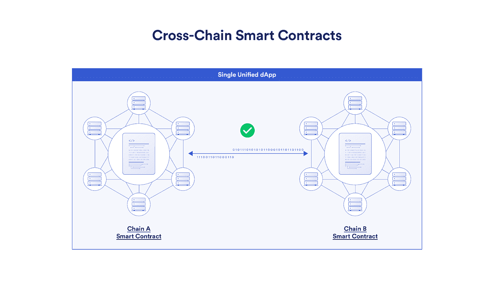

# 多链 vs 跨链和桥攻击:有什么区别？

> 原文：<https://medium.com/coinmonks/multi-chain-vs-cross-chain-and-bridge-attack-whats-the-difference-21ed90fa3214?source=collection_archive---------35----------------------->

当你开始了解区块链时，‍Cross-chain 和多连锁店是你会经常看到的两个流行词。这两个术语指的是区块链之间相互通信、交换数据和共同工作的方式。但是它们有什么不同呢？每个术语是什么意思，它们对加密货币的未来有什么影响？我将解释你需要知道的关于跨链和多链以及桥攻击的一切。

# 什么是交叉链(//桥接区块链)？

交叉链是两个不同区块链之间的一种区块链通信。它的功能类似于金门大桥或任何其他允许用户从 A 点移动到 b 点的桥梁。这就是为什么这被称为跨链桥，它连接两个区块链，以便用户可以在它们之间发送加密货币。

[Source](https://blog.chain.link/cross-chain-smart-contracts/)

目前，世界上有许多区块链系统，一个缺点是它们是孤立的，没有互联。不同的区块链网络孤立运行，因此它们无法相互通信。这就是这种跨链技术发挥作用来解决这些问题并提供解决方案的地方。

它允许用户直接在另一台区块链上交换代币，而不需要中介。例如，您可以将 ERC-20 令牌交换为 BSC 令牌。如果两家公司都有自己的区块链，那么它们可以使用跨链通信来让每家公司访问另一家公司的数据，并使它们能够互操作。[自动交换、继电器和适配器](https://dl.acm.org/doi/abs/10.1145/3410699.3413799)是跨链技术的主要推动者。

# 什么是多链(//并行区块链)？

多链是一种区块链，由多个相互连接的平行区块链组成。它必须至少有两个像以太坊，币安，阿尔格兰德或其他区块链连锁店。

例如，一个项目可能通过为每个功能创建一个区块链并将它们链接在一起来实现一个多链区块链。

多链区块链的主要优点是它们是可伸缩的和可互操作的。这种优势来自于多链中的每个区块链都是独立的，并且相互连接。

此外，多链技术的好处是能够创建比主链运行更快、更便宜的链。这开启了一个充满机遇的世界，包括新货币、侧链和其他创新。这有助于创建更复杂、更灵活的智能合约和去中心化应用(DApps)。

# 什么是桥攻击？

现在我们来谈谈大桥袭击事件。当攻击者利用两个区块链之间的跨链通信为自己谋利时，就会发生桥接攻击。这可以通过发送虚假或伪造的存款或接管验证器节点来实现。

你可能很容易在像聚桥、浪人桥、虫洞桥、量子位桥、虫洞桥这样的项目中找到关于黑客攻击的新闻。

比如导致 3.25 亿美元损失的[虫洞攻击](https://cointelegraph.com/news/wormhole-token-bridge-loses-321m-in-largest-hack-so-far-in-2022)，攻击者通过在指令中注入恶意账户绕过验证签名过程，伪造消息用假存款铸造虫洞包裹的以太。

在[浪人黑客](https://www.cryptovantage.com/news/why-are-cross-chain-cryptocurrency-bridges-so-vulnerable-to-attack/)事件中，攻击者控制了大多数验证器节点，并授权欺诈性和欺骗性转账，导致 6.25 亿美元的盗窃。Ronin 只有 9 个桥验证器节点，其中 5 个被攻击者占领。

以太坊创始人 Vitalik Buterin 在 [reddit](https://old.reddit.com/r/ethereum/comments/rwojtk/ama_we_are_the_efs_research_team_pt_7_07_january/hrngyk8/) ' *上表达了他的担忧，他说:“我对多链区块链生态系统持乐观态度(确实有一些不同价值观的独立社区，他们分开生活比所有人都在同一件事情上争夺影响力要好)，我对跨链应用持悲观态度。”*

这主要是因为跨链平台由于其本质上的脆弱性而发生了如此多的桥接攻击。

因此，智能合同审计是桥梁安全的一个关键过程。如果智能合同安全审计在代码发布到区块链之前就发现并修复了漏洞，许多最大的跨链桥黑客攻击就可能被阻止。同样重要的是保持最佳的安全实践，以避免社会工程黑客的企图，如欺骗。

> 那么，你觉得这篇文章有帮助吗？如果你喜欢我的其他文章，请给我买杯咖啡。为什么请我喝咖啡？没有第三方广告，没有附属链接，没有跟踪 cookies。只是诚实的内容。谢谢！给哈里买些咖啡。

> 加入 Coinmonks [电报频道](https://t.me/coincodecap)和 [Youtube 频道](https://www.youtube.com/c/coinmonks/videos)了解加密交易和投资

# 另外，阅读

*   [如何在 FTX 交易所交易期货](https://coincodecap.com/ftx-futures-trading) | [OKEx vs 币安](https://coincodecap.com/okex-vs-binance)
*   [CoinLoan 评论](https://coincodecap.com/coinloan-review) | [YouHodler 评论](/coinmonks/youhodler-4-easy-ways-to-make-money-98969b9689f2) | [BlockFi 评论](https://coincodecap.com/blockfi-review)
*   [XT.COM 评论](https://coincodecap.com/profittradingapp-for-binance) | [币安评论](https://coincodecap.com/xt-com-review)
*   [SmithBot 评论](https://coincodecap.com/smithbot-review) | [4 款最佳免费开源交易机器人](https://coincodecap.com/free-open-source-trading-bots)
*   [比特币基地僵尸工具](/coinmonks/coinbase-bots-ac6359e897f3) | [AscendEX 审查](/coinmonks/ascendex-review-53e829cf75fa) | [OKEx 交易僵尸工具](/coinmonks/okex-trading-bots-234920f61e60)
*   [如何在印度购买比特币？](/coinmonks/buy-bitcoin-in-india-feb50ddfef94) | [瓦济克斯评论](/coinmonks/wazirx-review-5c811b074f5b)