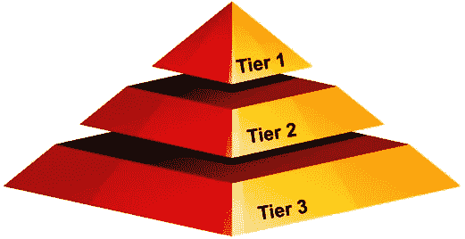
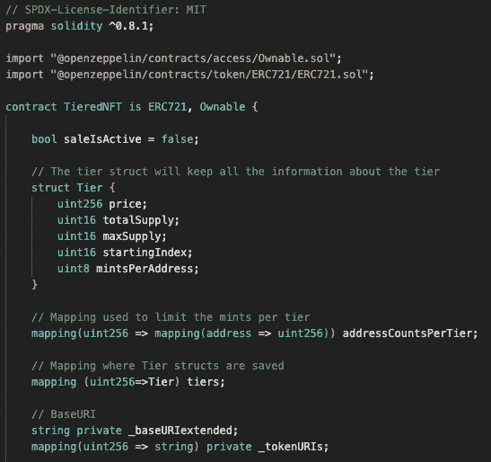
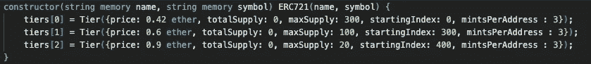
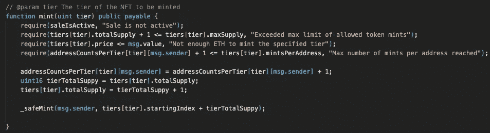
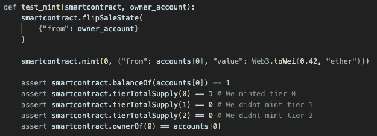
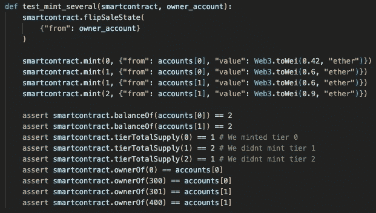

# 多层 NFTs

> 原文：<https://medium.com/coinmonks/multi-tier-nfts-5a5b693774ae?source=collection_archive---------0----------------------->

您是否曾想过，是否有可能在同一个 NFT 项目中创建不同价格和象征性供应的层级？几周前，我和一些朋友正在为我们正在进行的一个基于公用事业的 NFT 项目集思广益。NFTs 将作为我们服务的一种订阅，所以我们很快意识到拥有不同的层级将是有益的，就像你拥有不同的订阅级别一样。本质上，会有更多更便宜、更容易获得的代币，也会有更少的更稀有、更昂贵的代币。

Tiers in a pyramid

每一层都有不同的价值，比如价格和供应量，从一开始就有效地“强化”了它们的稀有性。作为一个额外的要求，应该可以在任何时候从任何层铸造令牌，只需在契约调用中指定即可。

这个想法与 NFT 项目中的传统做法相反，在传统项目中，所有代币通常有 1 个铸造价格，或者在铸造了 X 个代币后价格会发生变化的顺序定价结构。这最后一个例子有点类似，但仍然不同于我们试图实现的，因为事实上每一层只能在前一层完成后铸造。

作为一名开发人员，我立即开始思考这样的功能在代码中会是什么样子。我的直觉告诉我，构建这样一个智能合同应该很容易，可能已经有人这么做了。令我惊讶的是，我在网上找不到任何好的解决方案，所以我决定写我自己的，这就是我今天想与你分享的。

# 智能合同

我用 Solidity 编写了 smartcontract，因为它是最容易使用和广泛使用的区块链编程语言。

Smartcontract definition and state variables

我们首先指定 solidity 编译器版本，并导入 NFT 项目所需的两个基本接口，ERC721 和 Ownable。第一个状态变量*saleisaictive*是一个布尔值，它只是指示这个智能合同的销售是否活跃，或者换句话说，是否允许人们制造 NFT，没有什么新的。

有趣的部分开始于 ***层*** 结构的定义，在这里我们将存储层特定的属性。每个 ***层*** 将有:

*   **价格:**该层的价格
*   总共制造了多少枚这一等级的代币
*   这一层可以铸造多少枚代币
*   **startingIndex** :该层从哪个 tokenID 开始
*   **mintsPerAddress** :允许每个地址为该层制造多少个 mints

接下来，我们创建一个嵌套映射，其中我们将保存一个地址为特定层进行了多少次 mints 的信息。第一个索引将指向相应的层，第二个索引指向该层的地址的造币数。

接下来是另一个映射，**层，**层，它将简单地保存我们刚刚描述的所有数据，并在**层进行索引。**

最后，我们有基本和令牌 URI 变量，这将允许我们将特定的 URIs 与每个令牌 ID 相关联。这些将指向分布式文件系统，如 IPFS，它将保存该令牌的元数据。

那么我们的构造函数会是什么样子呢？

Constructor

我们将名称和符号指定为构造函数中的参数，然后硬编码每个层，并将其添加到层映射中。对于这个示例项目，我们采用 3 层系统，其中

1.  第 0 层的最大供应量为 300，成本为 0.42 乙醚
2.  第 1 层的最大供应量为 100，成本为 0.6 乙醚
3.  第二层的最大供应量是 20，消耗 0.9 以太

我们现在准备检查 mint 函数。

Mint function

我们将遵循通常的 [**检查效果交互**](https://fravoll.github.io/solidity-patterns/checks_effects_interactions.html) 模式因此我们首先断言 mint 函数的所有要求都已满足。在这种情况下，我们检查以下需求

*   销售活跃
*   尚未达到最大供应等级
*   交易价值足以铸造该层
*   进行交易的地址没有超过该层的每个地址的最大硬币数量。

注意，这些需求都依赖于被指定为 mint 函数的参数的层。

检查完成后，我们可以继续效果。我们根据指定层级的发件人地址更新薄荷糖的数量，并且我们还更新层级总供应量。在最后一步之前，我们将当前的总供应值保存在一个变量中，以便能够在 *_safeMint* 方法中指定 tokenId，这将是我们唯一的交互。

# 试验

为了确保我们的 smartcontract 满足我们的初始需求，我们可以用 python 编写一些测试。

Single mint test

最基本的测试包括铸造一个令牌，并断言一些我们期望以后得到的值。我们从翻转销售状态开始，以确保销售是活动的。然后，我们通过提供 0.42 ether 从最低层创建一个令牌，正如在我们的构造函数中为第 0 层指定的那样。完成这些之后，我们可以对智能合同的状态有一些预期

*   自然，铸造 1 个代币的账户余额应该是 1
*   第 0 层的总供应量应为 1，因为该层仅铸造了 1 个令牌
*   第 1 层和第 2 层的总供应量应为 0，因为没有从这些层铸造令牌
*   最后，ID 为 0 的令牌的所有者应该是刚刚从第 0 层生成令牌的同一帐户，因为我们指定该层应该从索引 0 开始

> 交易新手？试试[加密交易机器人](/coinmonks/crypto-trading-bot-c2ffce8acb2a)或者[复制交易](/coinmonks/top-10-crypto-copy-trading-platforms-for-beginners-d0c37c7d698c)

这很简单！现在是一个稍微复杂一点的测试，多个账户铸造多个代币

Multiple mint test

这里，我们有一个帐户从第 0 层和第 1 层铸造令牌，而另一个帐户铸造第 1 层和第 2 层。同样，我们可以预期:

*   两个账户都应该有 2 英镑的余额，因为他们都铸造了 2 枚代币
*   第 0 层和第 2 层的总供应量应为 1，而第 1 层的总供应量应为 2
*   令牌 id 0 和 300 的所有者应该是帐户 0，而 id 301 和 400 的所有者应该是帐户 1。同样，这是基于构造函数中定义的起始索引

显然，这两个测试本身并不是决定性的，但很好地表明了我们的 smartcontract 的行为符合我们的设计。

# **问题**

在 ERC721 smartcontract 中设置层似乎确实很容易，但它也有两个主要缺点:

*   合同中的层级结构使得 NFT 项目不可能有通常的抽奖式抽奖。铸造代币的用户总是可以检查他们将要铸造的代币的 id 是什么，这样就没有了惊喜的成分。大多数项目中的随机性是通过在任意索引处开始造币厂而引入的，这在我们设计该合同的方式中是不可能的。
*   另一个缺点是，分层结构要求我们随时指定生成的令牌 Id。这使得它与优化的 NFT 接口不兼容，如 [ERC721A](https://www.erc721a.org/) ，因此铸造多个令牌的 gas 优化必须手动完成。

感谢您花时间阅读我的帖子，我希望它在某些方面对您有用！如果你想查看完整的源代码，这里有一个资源库的链接:[https://github.com/filipkny/TieredNFT](https://github.com/filipkny/TieredNFT)

如果你想在推特上关注我:[https://twitter.com/cryptowski1337](https://twitter.com/cryptowski1337)