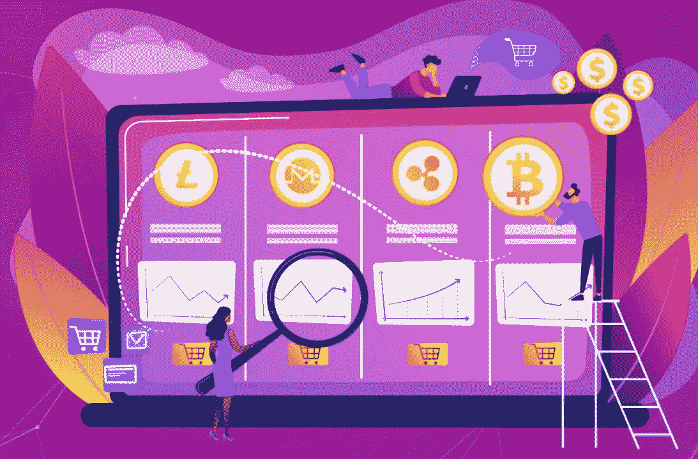
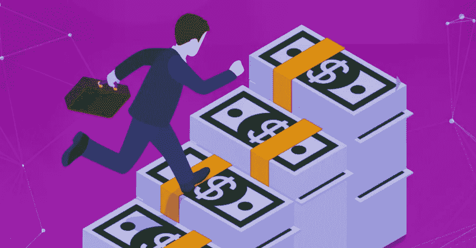

# 多收益生成资产是另一个即将推出的最佳投资。

> 原文：<https://medium.com/coinmonks/multi-yield-generating-asset-is-another-best-venture-to-be-unveil-da09d58caf73?source=collection_archive---------56----------------------->

你能从多收益发电资产中获得 399，025.80%的 APY 吗？是啊！。在这篇文章中，我将简要解释什么是 MYGA，特点和功能，包括如何购买 MYGA 令牌。

什么是 MYGA？
MYGA 是另一种多收益产生资产，一种新的金融生态系统，它提供并使赌博变得丰富和有利可图，只需在他们的祖国 MYGA 或 BUSD BNB 奖励每个用户或代币持有者一定数量的回报。MYGA 令牌是通过币安智能链构建、设计和部署的，旨在为用户提供流畅、易用的服务。为了弥合许多人对以太坊毒气横行引起所有用户情绪的哭喊，这是通过币安链引入和配置它的主要原因，也是为了给用户提供最高收益的奖励。
再者。，你也知道有 6%的每笔交易成功执行，使您的奖励在 BNB，BUSD 保留在您的钱包里吗？是的，这是绝对正确的！[你可以在这里找到](https://myga.money/#)。

**MYGA 如何运作**
MYGA 是一个简单的前沿功能，为用户提供自动下注功能，即所谓的买入-持有-赚取；这表明，在每一笔交易中，持有人都会获得一定比例的奖励，而买家在每笔成功执行的交易中也会获得 6%的奖励，从而将他们在 BNB 和 BUSD 的奖励保留在您的钱包中。MYGA 是 SAFUU 的一个分支或升级，SAFUU 已经为用户提供了最大的功能。
因此，买入-持有-赚取；是一种购买并在钱包中持有 MYGA 代币的方式，以保持您的收入，您将获得一些 rebase 奖励作为利息直接支付到您的钱包中。你猜怎么着？您的 MYGA 令牌将保持每 15 分钟增加一次，这使得每个用户从该平台获益变得非常有趣。

**特色 MYGA**
**彩票**
MYGA 彩票保证不可撤销的回购和持有压力。根据调查，每周他们都会分配一小部分 MYGA 国债策略，并随机赠送给 10 名 MYGA 代币持有者。这让你很有兴趣购买并持有，成为从彩票中受益的最幸运的人之一。

**倒影；** MYGA 合约让持有者通过 BNB 或巴斯德参与用户执行的每一笔买卖，或者只是购买/出售或将 MYGA 代币转移到另一个钱包的过程。这表明，在每一笔交易中，持有人都会获得一定比例的奖励，并且在每笔成功执行的交易中，持有人会获得 6%的奖励，从而将他们在 MYGA 或 BNB 和 BUSD 的奖励保留在您的钱包中。

**虚空；你知道吗，所有 MYGA 代币买卖的 1.5%进入了被烧毁的钱包，也就是所谓的“作废”钱包。这是由于当更多的交易发生时，代币不断减少，导致很少和稀缺可能会减少流通。**

**国库分配；**这是 MYGA 平台的另一个最重要的部分，它为 MYGA 创业的增量和可持续性提供了一些极端关键的功能。财政部的职能是为保险基金提供额外的财政支持。[点击此处了解更多信息](https://www.docdroid.net/WTTri0M/myga-whitepaper-v1-pdf#page=8)

**如何购买 MYGA 代币**
要开始购买 MYGA 代币，请访问网站[https://myga.money/](https://myga.money/#)或联系[销售人员](https://discord.gg/QkfTrXxVpD)，他们将指导您开始购买流程。

我将为您提供一些可信的链接，以便与项目负责人和团队成员联系，并从平台定期更新

[网站](http://myga.money/#) | [白皮书](https://www.docdroid.net/WTTri0M/myga-whitepaper-v1-pdf) | [推特](https://twitter.com/MultiMyga) | [不和](https://discord.gg/QkfTrXxVpD) | [POA](https://bitcointalk.org/index.php?topic=5398616.msg60236501#msg60236501) | [用户；Rigmoney](https://bitcointalk.org/index.php?action=profile;u=3380226)

Discord 用户名:rigg money # 0243
# MYGA # my gamoney # MultiYieldGeneratingAsset # BEP 20 # BSC

> 加入 Coinmonks [电报频道](https://t.me/coincodecap)和 [Youtube 频道](https://www.youtube.com/c/coinmonks/videos)了解加密交易和投资

# 另外，阅读

*   [如何在 Uniswap 上交换加密？](https://coincodecap.com/swap-crypto-on-uniswap) | [A-Ads 评论](https://coincodecap.com/a-ads-review)
*   [WazirX vs CoinDCX vs bit bns](/coinmonks/wazirx-vs-coindcx-vs-bitbns-149f4f19a2f1)|[block fi vs coin loan vs Nexo](/coinmonks/blockfi-vs-coinloan-vs-nexo-cb624635230d)
*   [本地比特币审核](/coinmonks/localbitcoins-review-6cc001c6ed56) | [加密货币储蓄账户](https://coincodecap.com/cryptocurrency-savings-accounts)
*   [什么是保证金交易](https://coincodecap.com/margin-trading) | [美元成本平均法](https://coincodecap.com/dca)
*   [支持卡审核](https://coincodecap.com/uphold-card-review) | [信任钱包 vs 元掩码](https://coincodecap.com/trust-wallet-vs-metamask)
*   [Exness 回顾](https://coincodecap.com/exness-review)|[moon xbt Vs bit get Vs Bingbon](https://coincodecap.com/bingbon-vs-bitget-vs-moonxbt)