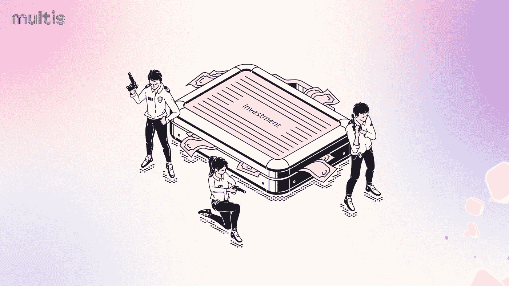
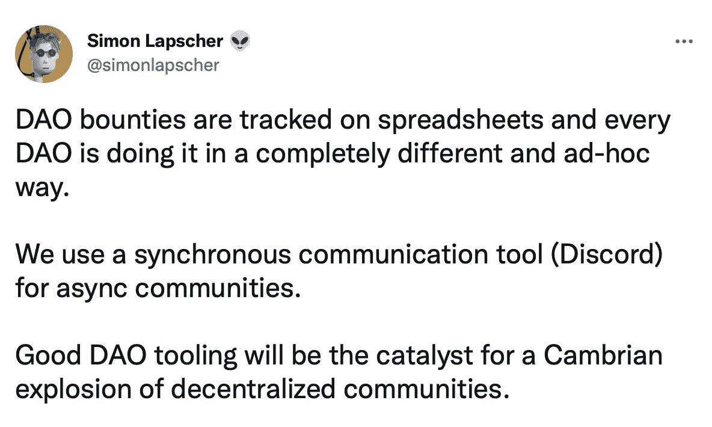
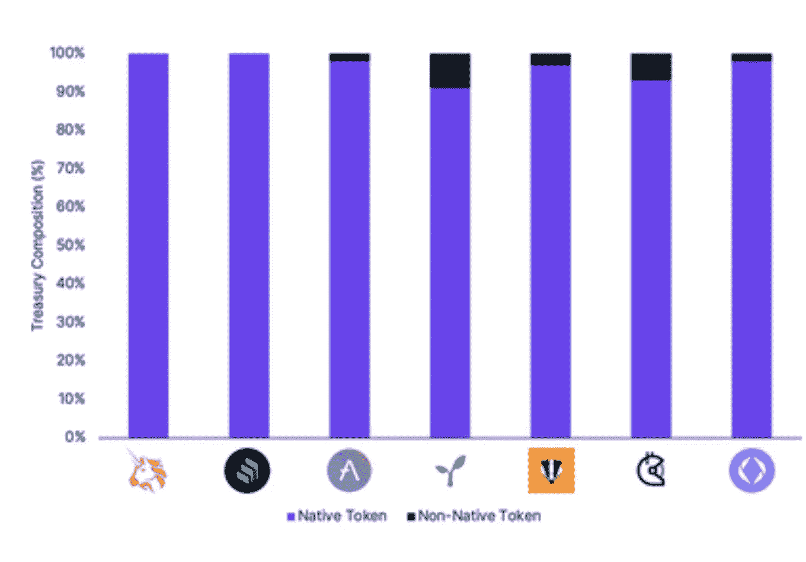
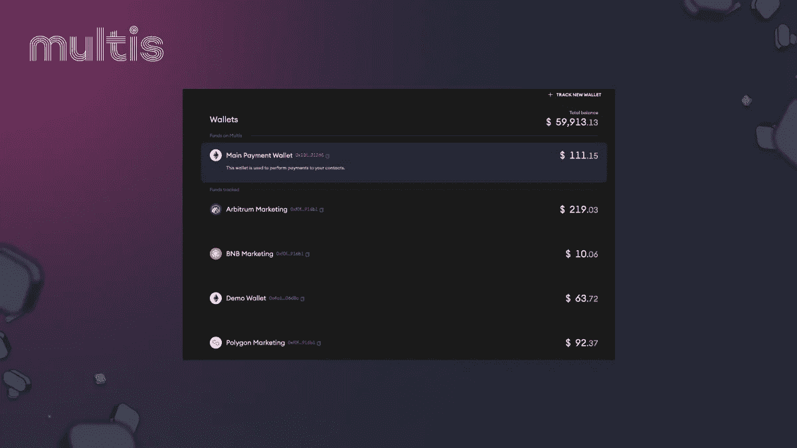
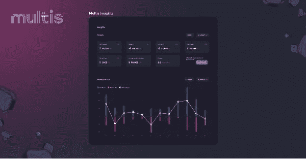

# 钉住你的刀——资金管理指南

> 原文：<https://medium.com/coinmonks/multis-nail-your-dao-a-guide-to-treasury-management-13106a9c967c?source=collection_archive---------15----------------------->

# 有效管理道司金库的步骤和资源

[创建和管理一个刀可以是很多工作](https://twitter.com/vincemanguy/status/1478744511933300737?s=20&t=O1mJlOn69mFUY7JKVDY70g)，我们明白了！

[Dao 打破了商业中使用的自上而下的传统模式，采用了一种更加社区驱动和意识形态化的运营方式。不利的一面是，这个领域仍然是](https://academy.moralis.io/blog/dao-vs-traditional-organization)[年轻的，不受监管的，而且很少有工具可以满足他们独特的需求。](https://twitter.com/mercebent/status/1506129413162758145?s=20&t=GxkfBP_B2jI3zFkoLwEr9w)

然而，在管理国库方面，几乎没有什么指导方针。与我们记忆中早已存在的企业融资不同，道金库是一个非常新的概念，有其自身的含义。不幸的是，许多[道司库“即兴发挥”并希望事情进展顺利。](https://twitter.com/simonlapscher/status/1437791689419198468?s=20&t=Ij-w6SqQ2_vJajhQBdS3sQ)

虽然我们不是 DAO，但我们有许多 DAO 使用 Multis，他们与我们分享了他们的最佳实践，尤其是在资金管理方面。

# 审查道财务管理的基本概念

无论您的组织类型如何，财资管理都有两个关键概念:

*   **长期思考:**鉴于其活动的性质，DAO 经理通常从周期或冲刺的角度思考问题。最成功的 Dao 建立了一个长期的社区。这同样适用于 Dao 管理其资金的方式。
*   **投资组合多样化:**投资组合多样化是对冲风险和资产价格波动的首要原则，我们都知道在加密市场中，这一点非常重要。

# 安全存放您的道金库

几乎所有的 Dao 都使用 Multisigs 来存储他们的国库。 Multisigs 通过提供以下优势，允许 Dao 进行协作交易:

*   **安全性:**multisigwallet 将您的资金锁定在智能合约中，所有交易都可以在链上验证。浏览器中没有资金，也没有钱包提供商管理您的私钥。
*   **团队协作:** Multisigs 为您提供了一种在一个公司钱包上形成“共享所有权”的方式。钱包所有者也可以邀请其他队友使用钱包。
*   **内置密钥恢复:**如果私钥丢失，其他所有者可以邀请您的新帐户加入 multisig，帮助您找回钱包。

我们推荐用 Gnosis Safe 储存——这是[资金管理的黄金标准。](https://multis.co/post/building-with-gnosis-the-gold-standard-of-multisig-wallets)

[我们如此热爱灵知安全，以至于我们在它上面建造了。](https://multis.co/post/building-with-gnosis-the-gold-standard-of-multisig-wallets) Gnosis Safe 有一些独特的特性，使它成为 DAOs 的顶级[操作系统:](https://twitter.com/gnosisSafe/status/1392162585449877509?s=20&t=gdryBPKw1GirOQOYHBJf_Q)

*   [**开源:**](https://twitter.com/koeppelmann/status/1356531244520124417?s=20&t=O1mJlOn69mFUY7JKVDY70g) Gnosis Safe 是开源的，也就是说你可以挖掘代码或者给你的 Safe 添加自定义模块。
*   [**安全应用:**](https://blog.gnosis.pm/turn-your-dapp-into-a-gnosis-safe-app-in-5-minutes-5cdb33a1cd46) 一个由[dapp](https://decrypt.co/resources/dapps)组成的生态系统，可从 Gnosis Safe 界面中访问，使用户能够使用其预定义的 multisig 策略将其安全帐户连接到 dapp，以实现安全交互。
*   **形式验证审计:** Gnosis 实现 f [形式验证过程](https://blog.gnosis.pm/formal-verification-a-journey-deep-into-the-gnosis-safe-smart-contracts-b00daf354a9c)来审计代码，保护代码免受漏洞和黑客攻击。

超过 1000 亿美元的资产安全地存放在 Gnosis 的保险箱中，在 DAO 领域受到广泛信任。

# 分散你的财富

Image Credit: Bankless

乍一看，Dao 将很大一部分资金以本地代币的形式持有似乎很直观[——因为这也是一些最著名的 Dao 正在做的事情](https://openorgs.info)。

当然，这是高风险的:如果你的投资组合中只持有你的本土代币，由于某种原因(管理、营销、竞争、熊市)，它的价值下跌了 30%，那么你的整个国债的价值将缩水 30%。这对于任何组织来说都是灾难性的，无论是否分散，Dao 应该能够随时履行其财务义务。

这就是为什么建议将一定比例的资金放在波动性较小的货币上。Stablecoins 是必备的。留出一定数量的稳定存款是保护自己免于违约和抵消运营支出的一种非常有效的方式。

# 4 种方法使你的财富多样化，变成稳定的收入

*   场外交易(OTC): OTC 销售允许你不通过二级市场直接交换代币。这个过程可以在 DAO 和它的社区之间直接实现。代币也可以直接出售给机构投资者。这种方法允许 Dao 尊重他们的授权时间表，并且对代币价格的影响最小。
*   市场销售:这意味着以最好的价格出售你的代币。尽管这种方法执行起来很快，但它可能会向你的利益相关者发出负面信号，尤其是如果你在大量出售的话。因此，它可能会压低代币价格。我们不建议 Dao 这样做。
*   条件订单策略:是“市场销售”的高级版本，您可以依靠基于条件的订单来选择代币销售的正确时间。
*   DeFi——金融衍生品:创建一个抵押化的债务头寸，使用 DeFi 协议，如 [UMA 的 range token](https://docs.umaproject.org/products/range-tokens) 、 [Visor](https://www.visor.finance/) 或利用创收协议，如 [Ribbon 的国库库](https://ribbonfinance.medium.com/ribbon-treasury-ee311f7ce7d8)也是将你的国库多样化为稳定债券的方法。

如果你正在寻找国债多样化的灵感，我们建议你研究以下建议:

*   [FF 资金多元化提案](https://forum.forefront.news/d/23-ff-treasury-diversification-proposal)
*   [口袋刀国库多元化提案](https://forum.pokt.network/t/pep-15-pocket-dao-treasury-diversification-proposal/1247)
*   [Gitcoin 资金多元化提案](https://gov.gitcoin.co/t/gitcoin-treasury-diversification/9698)

# 国债多样化工具:看看对冲基金

[hedge](https://hedgey.finance/)正在处理 4 种多样化策略中的两种，即场外交易协议和资金池有条件赎回协议。这两种协议都在 Dao 的资金管理中占有一席之地，具体取决于它们的成熟度、规模、机构群体和资金需求。

*   场外交易协议:他们的场外交易协议允许新的 Dao 向他们的第一个社区和投资者出售代币，甚至在他们拥有 AMM 流动性池之前。此外，OTC 协议与令牌时间锁协议相关联，该协议允许 DAO 以在给定的时间范围内锁定售出的令牌的方式出售令牌。这确保了投资者不能简单地丢弃代币，并允许长期激励联盟，这意味着 DAO 可以放心地向他们的社区提供代币折扣交易。对于投资者来说，他们的代币被锁定在一个附有一些有趣视觉效果的 NFT 中，如果他们在赎回日之前需要流动性，可以在二级市场交易，如 OpenSea。
*   资金池(备兑买入):对冲资金池协议是 Dao 通过出售备兑买入的稳定硬币从其代币中赚取收益的一种方式，同时也提供了一种负责任和透明的方式，让社区以固定价格购买代币。该协议允许任何令牌参与，设置对 DAO 和社区购买者都有意义的成交价格、到期价格和溢价价格；也不要求有永久甚至 AMM 流动性。这种产品是一种金融衍生产品，因此对于有时间对其资金管理和多样化进行更多实践和积极处理的 Dao 来说，它可以派上用场。

# 在你的道中赋予财政专家权力

> “在我们社区的早期，所有的财政决策都必须在社区范围内进行提议和讨论。这个过程最终既耗时又分散注意力。我们决定部署一个投票机制来选举一个委员会，该委员会授权支出国库资金并制定预算。他们自主工作，只在重大决策上咨询更大的社区”——Pickle DAO 的首席农业官谨慎安农说。

DAOs 的高度民主性质是很好的，但如果所有事情都由机构群体投票决定，这可能会使流程变得缓慢，尤其是在资金管理方面。

这就是为什么我们建议[将财政相关事务委托给一个由选举产生的成员组成的委员会](https://twitter.com/ShibarNetwork/status/1484547792823537665?s=20&t=GxkfBP_B2jI3zFkoLwEr9w)——这些成员通常是根据他们对 DAO 的贡献和增值程度而当选的。寻找具有财资管理专业知识或对市场动态感兴趣的"道"成员并赋予他们权力，是更有效的财资管理的第一步。[a 委员会可以处理日常的财政运作，并会就重要决策征询机构群体的意见。](https://twitter.com/MatrixDAO_/status/1505911064667766784?s=20&t=GxkfBP_B2jI3zFkoLwEr9w)一旦你建立了自己的财务委员会，你应该考虑:

*   将你的目标组织成冲刺:你应该有一个短的时间跨度，在 3-6 个月之间，以允许更彻底的监控和报告。
*   投票(决定)的标准应该让每个人都知道并分享。
*   令牌持有者应该能够讨论权力的限制和终止。
*   记录所有的决定，保存所有的修改和投票的记录。

# 用财务报告赢得社区的信任

我们坚信财务报告是任何组织最强大的工具。

你可以继续实施我们上面提到的所有过程，但是如果没有完整的财务报告，它就不能达到目的。

我们鼓励定期向您的社区报告。月度或季度报告将有助于您的贡献者感受到项目的一部分，并赢得对"一体行动"的信任，因为他们对"一体行动"的财务状况也有同样的了解:能够预测、了解资金流动情况以及他们的预算情况。

重大事件(代币销售、并购等..)应在投票前进行充分的解释和沟通。

我们喜欢阅读 hedge 的亚历克斯·迈克尔逊的《财务主管系列》。他说:

> “然而，无论您的 DAO 在哪里，作为预算流程的一部分，对成员和社区的透明度是至关重要的。如果你特别关注开发成本，一个很好的模板是由 DxDAO 维护的[员工薪酬模板](https://dxdao.eth.link/#/worker-compensation)，它透明地传达了为员工支付的成本和薪水，并给出了每个层级的各种技能水平的基本轮廓。”—很棒的东西，[我们推荐你也读一读](/hedgey/the-dao-treasurer-series-part-2-mechanics-293818546175)！

# Multis 使道国库易于管理

我们为 DAO 财务委员会建立了 Multis，这些委员会对获得对其 DAO 财务的控制和清晰感兴趣。Multis 帐户具有非常适合 Dao 的功能，包括:

*   **链接一个现有的灵知保险箱:**不需要移动你的金库，从头再来。设置您的帐户时，链接到您的元掩码，所有数据将被检索并显示在我们的整体仪表板中。
*   [**批量支付:**](https://multis.co/post/mass-pay-a-first-step-towards-crypto-payroll) 使用 Multis，您可以节省工资单上的时间，并支付多达 65 个不同的钱包地址。
*   [**Track &监控你所有的钱包 crosschain**](https://multis.co/post/going-crosschain-multis-integrates-polygon-bnb-chain-arbitrum-and-optimism-for-better-analytics) **:** 在 Multis 账户上，你可以从 ETH、Polygon、BNB、Arbitrum、乐观和 BTC 连锁店上传钱包。钱包可以是热钱包，钥匙钱包，或其他多西格。所有活动都被跟踪，该帐户作为一个单一的真实来源。

Multis Portfolio section lets you track wallets crosschain

*   [对交易进行分类和标记:](https://multis.co/post/category-labels-and-a-contact-book-the-details-that-make-a-difference)忘记在 excel 和 etherscan 之间花费的时间。在交易发生时对其进行分类，并在我们的洞察部分深入了解最常见的分类交易。
*   出于会计目的将您的数据导出为 CSV 文档:使用我们的“导出为 CSV”功能将您的财务数据与会计软件进行核对，以帮助您的 DAO 符合会计和法律法规。
*   可视化流入和流出:Multis 让您实时了解您的现金流。

*   共享公司[通讯录](https://multis.co/post/category-labels-and-a-contact-book-the-details-that-make-a-difference):将你的投稿人的地址添加到你的通讯录中，腾出时间手工录入。

虽然您应该定期进行预算和财务报告，但我们认为与您的社区成员分享财务见解(不难阅读的报告)是帮助他们了解资金流动并为您的 DAO 成功做好准备的好方法。[免费创建一个帐户](http://multis.co/)来处理您的刀库。

# 更多关于道金库管理的资源，帮助你把你的道带上月球

随着 Dao 成为主流，更多的时间和注意力被放在了资金管理的话题上。如果你想要更多的资源，请查看下面的链接，如果我们遗漏了什么，请告诉我们！

*   [道财资/资产负债表管理](/blockchain-capital-blog/dao-treasury-balance-sheet-management-ce5e96da34ac) —区块链资本
*   道司库系列[第一部](/hedgey/the-dao-treasurer-series-part-1-fundamentals-f6fcefefaad0) & [第二部](/hedgey/the-dao-treasurer-series-part-2-mechanics-293818546175) —亚历克斯·迈克尔逊
*   赤字国债的新心理模型
*   [道为什么要多元化](https://newsletter.banklesshq.com/p/why-daos-need-to-diversify?s=r)——无银行
*   [道国库多元化指南](/1kxnetwork/a-guide-to-dao-treasury-diversification-sales-eee65f89d0b5) —贾斯汀·迈克菲

‍

*原载于*[*https://multis.co*](https://multis.co/post/nail-your-dao-a-guide-to-dao-treasury-management)*。*

> 加入 Coinmonks [电报频道](https://t.me/coincodecap)和 [Youtube 频道](https://www.youtube.com/c/coinmonks/videos)了解加密交易和投资

# 另外，阅读

*   [火币的加密交易信号](https://coincodecap.com/huobi-crypto-trading-signals) | [Swapzone 审查](/coinmonks/swapzone-review-crypto-exchange-data-aggregator-e0ad78e55ed7)
*   最佳[密码交易机器人](https://coincodecap.com/best-crypto-trading-bots) | [购买索拉纳](https://coincodecap.com/buy-solana) | [矩阵导出评论](https://coincodecap.com/matrixport-review)
*   [Coldcard 评论](https://coincodecap.com/coldcard-review) | [BOXtradEX 评论](https://coincodecap.com/boxtradex-review)|[unis WAP 指南](https://coincodecap.com/uniswap)
*   [比特币基地评论](/coinmonks/coinbase-review-6ef4e0f56064) | [德里比特评论](/coinmonks/deribit-review-options-fees-apis-and-testnet-2ca16c4bbdb2) | [FTX 评论](/coinmonks/ftx-crypto-exchange-review-53664ac1198f)
*   [Unocoin 评论](https://coincodecap.com/unocoin-review) | [最佳加密赌注硬币](https://coincodecap.com/best-crypto-staking-coins)
*   [如何使用 MetaMask Wallet 获得 KCC 地址？](https://coincodecap.com/kcc-address-metamask)