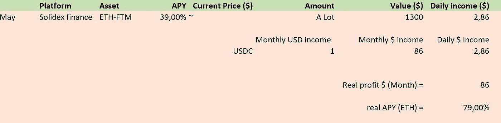
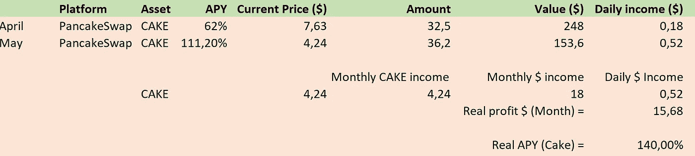
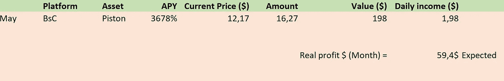
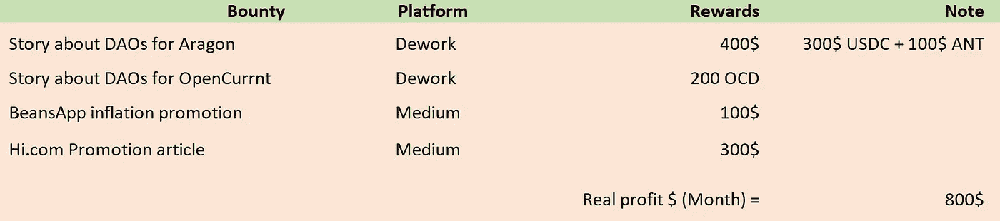
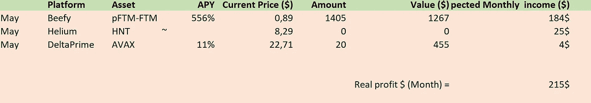
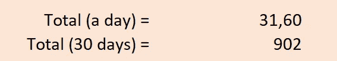

# 我每月 900 美元的半被动收入概述！

> 原文：<https://medium.com/coinmonks/my-900-a-month-semi-passive-income-overview-of-may-34efff1d4b82?source=collection_archive---------1----------------------->

## 我的冒险和他们得到的回报！

# 介绍

你好，区块链的冒险家们！现在是五月底，所以每个人都知道这意味着什么；我现在的半被动收入流的一个新的收入概览！这是一个繁忙的月份，价格大幅波动，许多新的发展，崩溃和有趣的事情发生在我们身边。这也影响了我的被动收入来源，很遗憾，并没有变得更好。

这篇文章将向你展示我的被动收入流的一个非常不科学的概述，并告诉你一些关于它们的情况。虽然我这个月赚了不少钱，但这主要来自于积极寻找必须完成的奖金/工作。除此之外，这个月在运行投资项目方面有点平淡无奇，但请坚持到下个月，因为我刚刚开始了 3 个新项目，我个人对此非常兴奋！

> 加入 Coinmonks [电报频道](https://t.me/coincodecap)和 [Youtube 频道](https://www.youtube.com/c/coinmonks/videos)了解加密交易和投资

# 结果

这个月我投资了 3 个值得一提的项目，基于 Fantom 和 finance 链。下个月我将添加基于以太坊链、氦网络和雪崩链的项目！目前正在运行的项目有 Solidex finance 上的 Staked FTM-ETH liquidity、Pancakeswap 上的 Staked CAKE 和 Piston token staking。我还完成了一些奖金支付不错！

## ETH-FTM 流动性头寸

在过去的一个月里，我在 fantom chain 上的 solidex finance 上提供了 FTM-ETH 流动性，这样做的原因是他们的 APY 相对于其他平台来说相对较高。可悲的是，由于 FTM 已经损失了近 90%的价值，我最初投资的 35k 在几天内就缩水到了现在的 13k。这也是计算的 APY 高于提供的 APY 的原因；我种田赚了更多的钱，也获得了更多的回报。虽然我仍然看好 FTM，所以我仍然推荐这个游泳池！

## 蛋糕桩

接下来是蛋糕！随着锁定您的蛋糕的引入，您现在可以在您的赌注蛋糕上获得 111%的 APY。我上个月已经锁定了我的 32.5 蛋糕，已经让我获利 4 蛋糕多一点了！如果你问我，我觉得还不错。唯一不方便的是，奖励基金也被锁定到年底，所以我还不能获利。此外，当我上个月开始下注时，APY 要高得多，可能是因为那时下注的蛋糕少了。这也解释了实际 APY 计算的更高。无论如何，我推荐这个农场，因为它表现相当稳定，并且没有非常高的风险！

## 活塞座圈

最后，我们有活塞比赛令牌。活塞赛是基于滴滴，建立在币安智能链。它利用博弈论建立了一个每天支付 1%的应用程序，你可以提取或复利。它一直稳定地以每天 1%的速度增长，直到今天我一直在以复利计算。然而，随着价格的下降，我现在将开始撤回资金，以收回我的一些初始投资。让我们看看下个月的表现吧！

## 赏金猎人

最后但同样重要的是，我们有我们的大赢家！我刚刚发现了赏金猎人，但是它已经以一种我无法想象的方式获得了回报！我一直在申请第三层和同事的奖金和演出，在过去的一个月里，只表演了 3 次奖金，就赚了惊人的 800 美元。这些大部分是以适合组织或道的方式撰写某些主题，但我也申请了一些其他的奖励。我肯定会推荐探索这个领域，因为只有几个小时的空闲时间，你可能会赚到一些不错的外快！

# 下个月投资

下个月，我为你准备了三项新的投资！FTM-ETH 流动性头寸将改为 pFTM-FTM 头寸，每天支付几乎 0.5%的利息。我也终于收到了我的 HNT 矿工，通过帮助保护网络，它有望让我们每月获得大约 30-40 美元，我还开始探索低抵押贷款平台 deltaprime，在那里我可以通过下注获得我的 Avax 的近 22%的利息。

未来我会分享更多关于这些投资和平台的细节，敬请关注下个月的回报！

# 结论

所以总的来说，五月让我赚了大约 900 美元，其中大部分收入来自 FTM-ETH 农场和完成奖金。正如我所说的，这不是最令人惊奇的一个月，但是一些令人兴奋的东西我将在我的下一篇文章中出现，所以如果你也想阅读我的新冒险，请继续关注！

欢迎在评论中或通过给我发电子邮件来建议项目、提问或与我展开讨论！

在这里阅读我上个月[的故事，了解四月份发生了什么！](/coinmonks/300-a-month-my-sustainable-passive-income-streams-for-april-9d9c38621dff)

**其他链接:**

*   为了让我的故事对每个人都免费，请给我买杯咖啡吧！[https://ko-fi.com/igormd](https://ko-fi.com/igormd)
*   如果你想开始交易，可以考虑用我推荐的库币！[https://www.kucoin.com/r/rf/1de5d](https://www.kucoin.com/r/rf/1de5d)
*   想从每天 1%的活塞赛跑开始吗？考虑使用我的好友链接！[https://piston-token.com/ref/igormd](https://piston-token.com/ref/igormd)
*   想成为页面上的特色吗？给我发邮件！