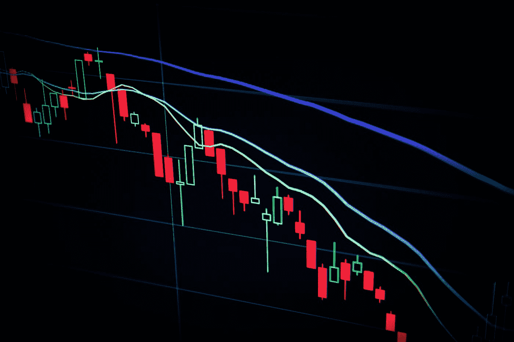

# 我最大的秘密痛点。让我们坦诚地谈谈区块链吧？

> 原文：<https://medium.com/coinmonks/my-biggest-crypto-pain-points-lets-be-honest-about-blockchain-704bcc939f88?source=collection_archive---------5----------------------->

Photo by [Maxim Hopman](https://unsplash.com/@nampoh?utm_source=medium&utm_medium=referral) on [Unsplash](https://unsplash.com?utm_source=medium&utm_medium=referral)

似乎我们现在生活在两个平行的世界里。有人仍然相信传统的银行业务，也有人像我一样认为储蓄账户、支票，甚至塑料借记卡/信用卡已经成为过去。

为什么？简单。多年来，银行一直在撒谎。有太多的规定，我们…