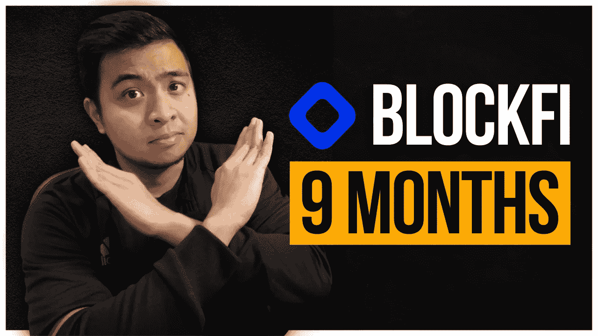
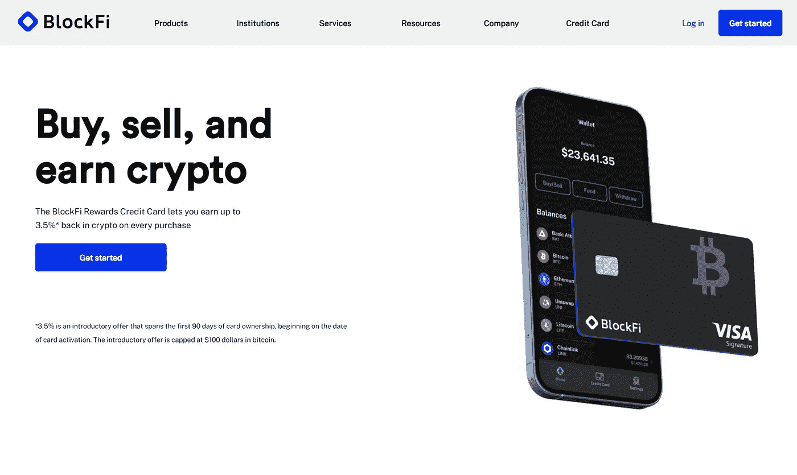
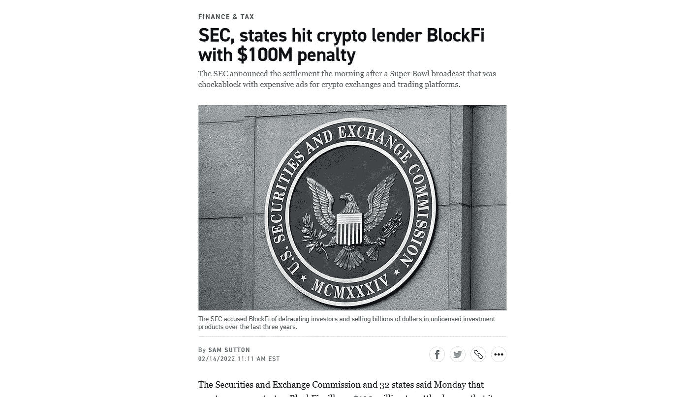
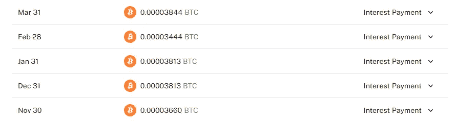

# 9 个月后我的 BlockFi 利息账户

> 原文：<https://medium.com/coinmonks/my-blockfi-interest-account-after-9-months-c8c946ca1cd4?source=collection_archive---------20----------------------->

[Check me out on YouTube too! :)](https://go.thehustlefiles.com/YouTube-sub)

几个月前，在发现我的比特币基地账户中仍有比特币后，我分享了我在有息加密账户 BlockFi 中赚了多少钱。从那以后，我学习了很多关于密码世界的东西。

现在，有 NFTs，Web3，分散金融和元宇宙。有这么多新的东西可以看，它使这个空间成为一个令人兴奋的游乐场，让普通投资者在短时间内变得富有。

但随之而来的是政府和其他不相信加密货币的人的严格审查。虽然去年看到了加密成为主流的巨大机会，但一些加密公司受到了制裁，特别是在美国。

但这并没有阻止许多密码爱好者投资这个领域，并继续支持他们最喜爱的数字资产，希望有一天能让它变得富有。

几个月前，我存了一些钱投资 BlockFi。我分享了一个 5 个月的更新，但是 9 个月过去了，现在怎么会公平呢？我们将讨论我的结果，以及我最近在这个平台上做了什么。

# 什么是 BlockFi？

BlockFi 是美国的一家加密金融公司，为持有区块链资产的个人和机构提供金融服务。他们提供各种产品和服务，如交易所、加密贷款、信用卡，以及最受欢迎的利息账户。

通过将您的密码存入 BlockFi 利息账户(BIA)，您可以获得高达 9%的利息，具体取决于您拥有的密码。

利息在你存入账户后的第二天开始累积，并按日累积。然后在每个月的最后一个工作日支付利息，按月计算复利。

# BlockFi 怎么了？

今年早些时候，BlockFi 被 SEC 指控在过去三年里欺诈投资者并销售数十亿美元未经许可的投资产品。*block fi 支付了 1 亿美元，以了结其经营非法贷款业务的指控。官员们称这是对数字资产交易的首次打击。*

**

*[Source: Politico](https://www.politico.com/news/2022/02/14/sec-blockfi-penalty-00008609)*

*我们都知道，在美国，密码公司一直很难建立自己的商店，因为监管机构一直在他们的脖子上，在几乎没有任何指导方针的情况下打击他们的活动。*

*但尽管如此，许多爱好者，甚至 BlockFi，都庆祝这一命令，以及监管机构已经开始讨论加密公司合法化的事实。*

*BlockFi 创始人兼首席执行官扎克·普林斯(Zac Prince)在一份声明中表示:“从我们创立 BlockFi 的那天起，我们就一直知道，与监管机构的密切合作对于采用加密货币提供的金融服务至关重要。”。“今天的里程碑是我们为更广泛的行业和我们的客户确保监管清晰性的开创性努力的又一个例子，就像我们为我们的第一个产品-加密支持贷款所做的那样。”*

# *我 9 个月的成果*

*我于 6 月 23 日开始使用 BlockFi，并将 0.01 BTC 迁移到该平台，当时该平台的价值为 330 美元。10 月底，我赚了 15，008 satoshis 作为我投资的利息。在我最后一次更新时，这个账户的价值是 597.82 美元，增长了 267.82 美元，或者说增长了 81.16%。*

*9 个月后，330 美元的投资已经增长到 484.78 美元。与我上一次更新相比，“成长”可能是错误的说法，但它仍然比我最初的投资大。我 3 月底赚了 18,574 satoshis，估值 8.46 美元，剩下的就是价格升值。*

**

*由于价格波动，我的 BTC 的美元价值下降了。但实际上我没意见，因为我增加了我的股份。BTC 是众所周知的价值储存地，所以对我来说，现在扩大我的份额比考虑价值更重要。如果我有更多的 BTC 股票，那么价值也会随之增长。*

*把我从 BlockFi 赚来的所有 satoshis 加起来，我有 33，582。对于一个我很少接触的资产来说还不错。*

# *我的前进计划*

*而我喜欢从 BlockFi 上赚取被动收益，4 月 2 日，我决定把投资搬出去，最终告别平台。*

*我这样做是因为我开始觉得 BlockFi 不再适合我了。我赚取的利息是其他平台无法比拟的，这些平台对同样的资产产生利息。我把我的资产从 BlockFi 转移到 KuCoin，并决定借出去，把我的 BTC 放在那里。*

*对我来说，这是一个更好的选择，因为那里的 BTC 储蓄账户收益率灵活，7 天期年收益率为 0.39%。另外，我还可以借出一些 BTC 给想要代币的交易者。*

*取款花了 2 天才到达库科恩。因此，如果你正考虑退出 BlockFi，这将会有所延迟。*

*总的来说，我对 BlockFi 的体验相当不错。我用的时候没有任何问题。当你把钱存进去的时候，这完全是被动的。设置可能需要一些时间。然后，你可以不时地检查你的投资。没什么刺激的，真的。*

> *加入 Coinmonks [电报频道](https://t.me/coincodecap)和 [Youtube 频道](https://www.youtube.com/c/coinmonks/videos)了解加密交易和投资*

# *另外，阅读*

*   *[在美国如何使用 BitMEX？](https://coincodecap.com/use-bitmex-in-usa) | [BitMEX 评论](https://coincodecap.com/bitmex-review)*
*   *[区块链 vs 摄氏](/coinmonks/blockfi-vs-celsius-vs-hodlnaut-8a1cc8c26630) | [区块链回顾](/coinmonks/blockfi-review-53096053c097) | [区块链 vs 比特币基地](https://coincodecap.com/blockfi-vs-coinbase)*
*   *[block fi vs coin loan vs Nexo](/coinmonks/blockfi-vs-coinloan-vs-nexo-cb624635230d)|[双子座 vs BlockFi](https://coincodecap.com/gemini-vs-blockfi)*
*   *[最佳期货交易信号](https://coincodecap.com/futures-trading-signals) | [流动性交易所评论](https://coincodecap.com/liquid-exchange-review)*
*   *[南非的加密交易所](https://coincodecap.com/crypto-exchanges-in-south-africa) | [BitMEX 加密信号](https://coincodecap.com/bitmex-crypto-signals)*
*   *[MoonXBT 副本交易](https://coincodecap.com/moonxbt-copy-trading) | [阿联酋的加密钱包](https://coincodecap.com/crypto-wallets-in-uae)*
*   *[雷米塔诺评论](https://coincodecap.com/remitano-review)|[1 英寸协议指南](https://coincodecap.com/1inch) | [购买 Floki](https://coincodecap.com/buy-floki-inu-token)*