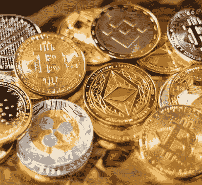
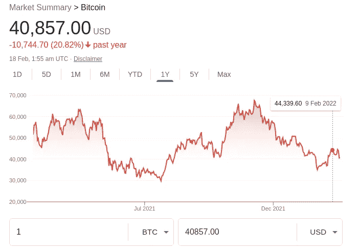
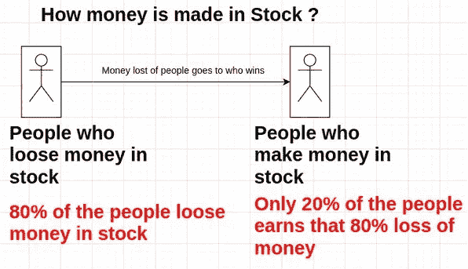
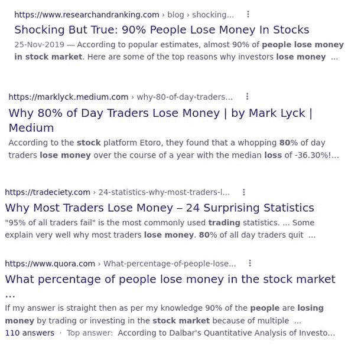
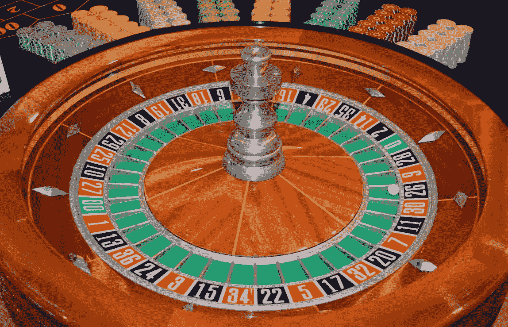
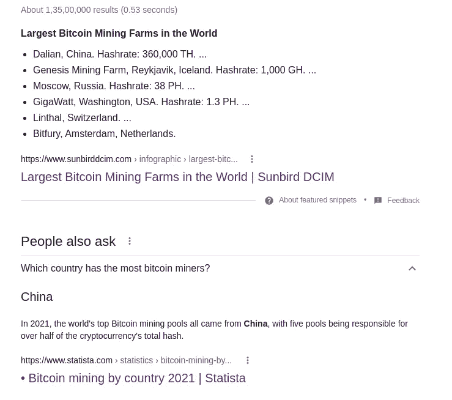
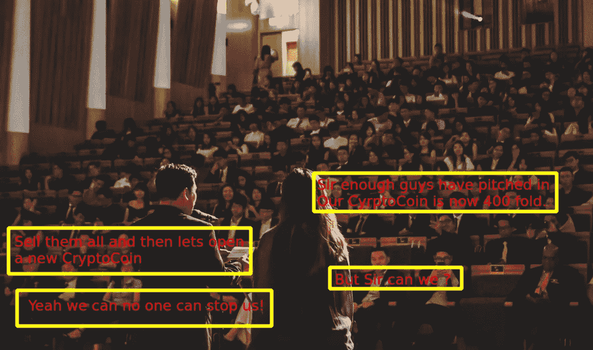

# 我对加密货币的担忧

> 原文：<https://medium.com/coinmonks/my-concerns-regarding-cryptocurrency-512f824514e1?source=collection_archive---------12----------------------->

我对整个加密货币有一些担忧，我不知道这些担忧有多深刻。所以在这里分享一下，万一有专家可以评论一下，帮我解决这些顾虑:

CryPto = Do it mean Cry + Upto grave?

# 加密货币注定会下跌

目前，矿工因管理加密货币网络而获得奖励。但是一旦所有的硬币都被开采出来，这个网络将如何自我维持？

我在一些博客上看过一些关于这个的预测，所有的比特币将在 2140 年被开采，那是从现在起大约 120 年后(除非有人创造了一台量子计算机，它在一个月内发出所有的散列！).但每当那种情况发生的时候，不就彻底崩溃了吗？今天的技术是不可预测的！消费者认为做不到的事情已经在某个实验室里变成了现实！

而且，没有什么是永恒的！被认为是永恒的银行和常规货币现在受到了流通硬币的挑战。加密硬币也注定有一天会消亡。

# 加密货币是以旧换新风险最高的货币！

由于高汇率及其交易价格的巨大变化，类似口径的比特币/加密货币是进行**实际交易**的风险最高的货币。实际贸易意味着真正出售商品/服务/两者以换取加密货币。

以下是比特币在一年内的变化情况:

BitCoin a variant of CryptoCurrency: Exchange price variations over a year

假设我用 1 公斤黄金换了一个比特币(只是一个例子)，明天价格会大幅下跌(比如一些关于政府禁止加密货币的传言)，卖家通过交易他的实物资产来换取无担保的加密货币，这不是在做一笔风险很大的生意吗？

# 没有中央权威意味着没有人能控制它的稳定性

我在上面解释过，价格变化风险适用于任何货币(即使是合法的钞票:真正的货币)，但政府投入了他们的时间和金钱来保持其稳定(即使他们失败了)，然而考虑到比特币/加密货币汇率的巨大变化及其去中心化的性质，没有权威机构致力于稳定其价格。这是交易风险最高的货币。

你辛辛苦苦做一个产品，换一个加密币。密码硬币会掉落(确实每天变化很大)，你所有的努力都会化为灰烬。

# 这是个骗局

事实上，任何东西都可能是骗局，如果它卖的价格不值得的话。这就是为什么我称之为骗局。

扯淡(真牛粪)是有真市场的。它被用作有机农业的肥料。但是如果 X 先生让你相信你应该用一公斤黄金买一公斤狗屎，那么 X 先生就是在骗你。

如果你在思考，为什么狗屁不值一公斤黄金:

1.  因为一头成年奶牛每天生产数公斤的狗屎，而 X 先生没有进行任何增值加工来给这些狗屎增加任何真正的价值。X 先生所做的就是从奶牛身上收集。
2.  两者都不稀罕！你可以从另一个农民那里买到同样的东西，价格非常便宜。
3.  两种屁话都没有限制。如果一头牛不幸死去，你可以从另一头圣牛那里得到它。

现在让我们将这个比喻与加密货币进行比较。

1.  一个矿工对一个 CrytoCoin 没有真正的价值。他们所做的就是找到哈希。找到散列后，任何人都可以轻松地创建相同的散列。在挖掘之后，没有对分类帐进行定性增强。它只是一天结束时的数字记录。
2.  没有一种加密硬币是真正稀有的！因为人们总是可以以极低的价格从另一个密码变体那里买到一枚密码硬币。或者干脆复制开源密码，开始自己的硬币。
3.  两种加密硬币都没有限制。如果一个硬币死了(当所有的散列都已知时)，你可以简单地挤出另一个加密变体。

你刚刚读了很多文章，各种各样的 X 先生试图说服你购买加密硬币。但你一定会问，我为什么要这么做？它值多少钱？我能简单的托管我自己的币吗！

# 这是一个骗局:一个附加的但技术性的怀疑

这是一个技术点，如果你不明白 CyrptoCoin 是如何工作的，跳过这个重要的点！因为你不会得到你所担心的！

在我的第一个观点中，我认为 CryptoCoin 将会下跌，因为所有的哈希都被耗尽了。这种说法还有更多值得怀疑的地方。

我假设你有足够的技术来理解这一点。
看这个技术点的你一定知道工作证明在加密货币中的作用。工作证明(POW)就是加密货币如何挖掘新币。一旦现有的哈希值耗尽或接近耗尽，CyrptoCoin 社区投票支持新的工作证明挑战，以保持采矿继续进行。

但是是什么阻止了他们释放所有新的能量模式，这样每个人都可以采矿！？！百万/十亿幂模式(也就是说，使用一些其他预先确定的数字模式，而不是前导零幂散列！说 123456789)，会允许大家去挖掘和参与！

我怀疑这是企图制造**人为稀缺**！从而增加其价值。

归根结底，比特币是一个共享账本，它的目的是确保不会出现双重消费。它的目的不是制造稀缺！

# **这是股市的另一只股票:80%的人赔钱**

加密货币不能凭空创造货币，因为它没有真正的附加值。说到底就是一只股票。

股票不是一个骗局，但是那些引诱你进入并说这是一个非常好的投资的人，的确大多是骗子！

说到底，股市不过是一场赌博！
里面没有工作策略。完全是随机的。如果它不是随机的，那么你可能在玩一个有偏见的游戏，在这个游戏中，你这个“新手”肯定会输。

有人在其中赚了大钱，因为许多人在其中赔了钱。钱不是凭空创造出来的，不是凭空变出来的。

如果我们遵循帕累托原则:只有 20%的人赚取 80%的利润。换句话说:80%的人损失了他们的钱，然后这些钱在 20%的人中分配

Stock market’s reality

作为一个初学者或小玩家，你并不是 80%利润的主要来源！

那些说“股票是一个很好很容易赚钱的方法”的人在这个游戏中引诱你，这样他们就可以找到 80%的傻瓜来持续获利！

A simple google will tell you how many people lose money in the stock market

这不值得一赌。我宁愿赌轮盘赌，赌红色我有 50%的赢/输几率！，而不是去玩一场我有 80%机会输，只有 20%机会赢的赌博！

Roulette board

不要赌博，宁可投资在你是天才的地方！
如果你是个好农民，那就投资农业。如果你是一名优秀的软件工程师，就创建自己的初创企业。

不要赌博，这是你无法控制的。
赌博没有策略，好像有一样，但这不是一个公平的游戏，你最终会被诱惑而输！

# **加密并没有真正意义上的去中心化:它仍然被少数人控制，并且注定被少数人控制**

这种“任何人”都可以挖掘加密硬币的销售宣传在今天远非现实。这个**任何人**都不是平均 80%的人口。

Pareto principle is an excellent thing: 80% of the coin is mined by 20% of the **FARM (not individual)**

你家中的普通个人电脑无法与外面的巨型加密采矿场竞争。

再按帕累托原则 20%的农场，开采 80%的比特币。而 80%的农场“今天”只生产 20%的比特币。

它将永远被这 20%的农场所控制！

目前的法定货币(真正的货币)是由民主选举(或以某种形式选举)的负责任的政府控制的。

加密硬币的命运将被唯利是图的资本家掌握！这种信任有多理智？

如果这些主要矿商中的 20%决定放弃他们目前的加密硬币并支持另一种硬币，他们可以。当他们离开网络，并因此失去巨大的计算能力时，加密硬币网络变得不那么不安全，因此将在一天内崩溃/妥协。他们是经济的新老板。

> 加入 Coinmonks [电报频道](https://t.me/coincodecap)和 [Youtube 频道](https://www.youtube.com/c/coinmonks/videos)了解加密交易和投资

# 另外，阅读

*   [用信用卡购买密码的 10 个最佳地点](https://coincodecap.com/buy-crypto-with-credit-card)
*   [最好的卡达诺钱包](https://coincodecap.com/best-cardano-wallets) | [Bingbon 副本交易](https://coincodecap.com/bingbon-copy-trading)
*   [印度最佳 P2P 加密交易所](https://coincodecap.com/p2p-crypto-exchanges-in-india) | [柴犬钱包](https://coincodecap.com/baby-shiba-inu-wallets)
*   [8 大加密联盟项目](https://coincodecap.com/crypto-affiliate-programs) | [eToro vs 比特币基地](https://coincodecap.com/etoro-vs-coinbase)
*   [最佳以太坊钱包](https://coincodecap.com/best-ethereum-wallets) | [电报上的加密货币机器人](https://coincodecap.com/telegram-crypto-bots)
*   [交易杠杆代币的最佳交易所](https://coincodecap.com/leveraged-token-exchanges) | [购买 Floki](https://coincodecap.com/buy-floki-inu-token)