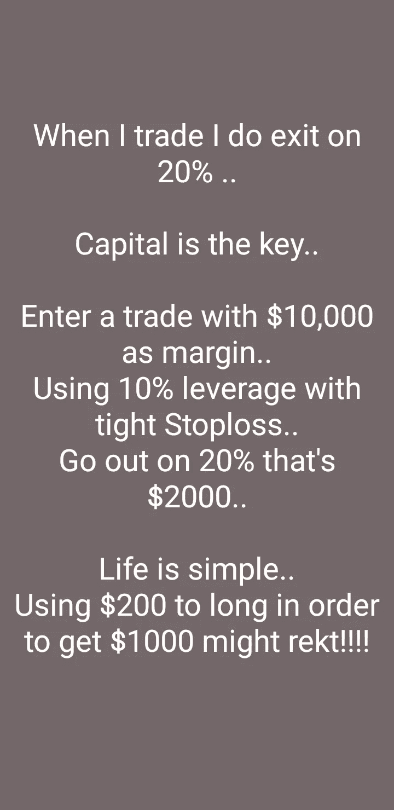

# 加密期货交易提示

> 原文：<https://medium.com/coinmonks/my-crypto-futures-trading-tips-e35e6a6c52b?source=collection_archive---------55----------------------->

当我用密码交易时，我在 20%时退出...

资金是关键🔑

用 10，000 美元作为保证金进行交易...

使用带轻度止损的 10 倍杠杆...

20%的折扣，也就是 2000 美元...

生活在密码中很简单...

在 crypto 中使用 200 美元太长时间来获得 1000 美元可能会 rekt！！

期货交易不是现货交易...

> 交易新手？试试[加密交易机器人](/coinmonks/crypto-trading-bot-c2ffce8acb2a)或者[复制交易](/coinmonks/top-10-crypto-copy-trading-platforms-for-beginners-d0c37c7d698c)

无杠杆的现货交易...你买的或交易的就是你得到的......

说实话，如果你不确定你在从事什么，你就不应该从事期货交易...

现货交易你可以持有 2 年...你知道得越早越好