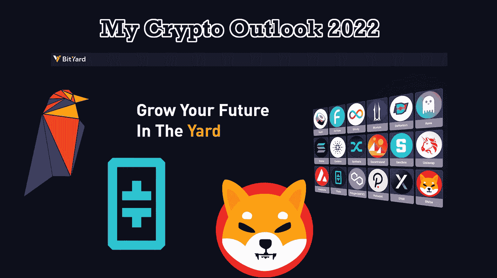

# 我对 2022 年的加密展望

> 原文：<https://medium.com/coinmonks/my-crypto-outlook-for-2022-2d8f7ae0e84?source=collection_archive---------13----------------------->

让我们来看看我的大脑，看看我最喜欢的密码在 2022 年的表现。我不是财务顾问，所以对我说的一切要有所保留。

# θ& t 燃料

如果我没有从 [Theta](https://www.bityard.com/en-US/trade/spot/THETAUSDT?ru=AebNkR&f=Medium) 和 [TFUEL](https://www.bityard.com/en-US/trade/spot/TFUELUSDT?ru=AebNkR&f=Medium) 开始，那我就失职了。如果你已经关注我很长时间了，你会知道我非常看好 T4 的西塔区块链。如果你不知道燃料是θ区块链上的气体标记，那里也有θ标记。

有几个原因让我如此坚信θ。为了试图说服你，为什么你应该有一些θ和 TFUEL，我把区块链最重要的方面列了一个清单。

1)他们在[theta . TV](https://www.theta.tv/)(silver . TV)中已经有了一段时间的“概念”工作证明。这是一个视频转播网站，非常类似于 Twitch 或 YouTube Gaming。区块链的工作方式是流运行，观看它的节点/人然后与其他观看的人分享它，因此它大大减少了来自 CDN 的数据量。

2)他们已经有了很多[节点](https://www.thetatoken.org/)并且已经通过了 staging t fuel/THETA。在撰写本文时，有 130，738 个边缘节点、3，461 个监护节点和 16 个企业验证器节点。让您感到惊讶的是，已经有公司在运行企业验证器节点了。

3)在他们完全部署了一个稳定的、构建好的生态系统之前，他们不会专注于市场营销和大幅提价。这是一个令人耳目一新的步伐变化，许多加密项目在 alpha 中早期发布，然后覆盖范围逐渐消失，项目也趋于消失。Theta 是一家真正的公司，试图解决现实世界的问题，为了做到这一点，他们需要向全世界发布一个成品。当然，我们现在可以在 Theta.tv 上观看直播，但这不是最终形式。

4)[2022 年 2 月 1 日 TDROP](https://www.thetadrop.com/) 正在下降。TDROP 是西塔区块链的一个全新标志，奖励 NFT 的流动性并提供治理。

5)他们在美国专利局注册了 7 项专利。你可以在这里阅读它们[。他们不断获得新的专利，这将改变我们在未来几年处理数字数据的方式。我的天啊，即使 Theta 发生了巨大的变化，他们也拥有专利，也就是金钱！](https://assignment.uspto.gov/patent/index.html#/patent/search/resultAssignee?assigneeName=THETA%20LABS,%20INC.&searchInput=Theta)

Theta 和 TFUEL 的价格都不算过高(在我看来)，有很大的上涨空间。以汽油为例，它只值 0.17 美元。西塔现在是 3.97 美元。这留下了很大的增长空间，一旦θ成为主流，价格将会爆炸。

7)支持区块链的人似乎会长期坚持下去，而且一般都是好人。花时间在 subreddit 上，你会看到人们通常关心网络和 10-20 年后的 Theta 区块链。

8)我有相当多的 TFUEL 和一些 THETA，所以显然我希望它做得好。# noShameHonesty

现在我的列表出来了，让我们回到我对θ和 TFUEL 的期望。我可以预见，到 2022 年，西塔平均价格将升至 5 美元或 6 美元。我还预计今年 TFUEL 将回升至 0.35 美元左右。我不认为这是疯狂的价格，老实说，我认为这是相当保守的预测。

我每天在 3 个 GPU 上挖掘[乌鸦币](https://ravencoin.org/)是有原因的。Ravencoin 是一个伟大的项目，它有一个伟大的路线图/未来愿景。

我认为 Ravencoin 还没有到成为公众焦点的时候，这没什么，因为要让它成为主流还有很多工作要做。

如果你想在 1 分 16 秒内了解 Ravencoin 的要点，只需观看他们的 YouTube 视频。它会告诉你关于它你需要知道的一切。

我从没想过我会走到这一步，但是 [SHIB](https://www.bityard.com/en-US/trade/spot/SHIBUSDT?ru=AebNkR&f=Medium) 在过去的几个月里不断给我带来惊喜。我看到了 [DOGE](https://www.bityard.com/en-US/trade/spot/DOGEUSDT?ru=AebNkR&f=Medium) 涨跌。我看到 DOGE 声名鹊起，价格大幅上涨，我也看到它大幅贬值，许多人/公司跳槽。我喜欢我所看到的 SHIB，我认为它比多格更有潜力。Doge 一开始是一个笑话 BS cryptocurrency 字面意思是取笑比特币和购买比特币的人。我不认为总督能够真正忘记他们的起源。另一方面，SHIB 被创造出来作为一个迷因符号，但这本身并不限制它。

我认为 SHIB 一开始就知道这是什么，知道他们想去哪里，这对他们帮助很大。SHIB 仍然价值连城，这很好。这意味着有很大的发展空间。他们被称为 SHIB 军，正致力于 SHIB 区块链游戏，并让 SHIB 在任何地方都能被接受作为支付加密货币。

SHIB 有着卑微的出身和有趣的起源故事，我认为这几乎对它有所帮助。这让它脱颖而出，获得了 Nano 或 LTC 这样的令牌所没有获得的关注。我是说，在现实世界中，SHIB 有很多广告牌。人们正和 SHIB 一起买房。SHIB 的名字有点奇怪，但因为 DOGE 和 dodge 太像了，所以我觉得这有点伤人。虽然我知道 SHIB 和另一个以 S 开头以 T 结尾的 4 个字母单词拼写非常相似，但听起来不太相似。但谁知道那只是我。我比很多人更看重 crypto 这个名字。

# 值得一提的是:

我想包括蜡，因为我认为它会继续稳步攀升，但我不认为会在 2022 年膨胀。我认为蜡生态系统设计得很好，也很容易使用。我认为它在钉住 NFT 市场和 defi 游戏生态系统方面做得非常好。有很多伟大的项目利用蜡，因此我认为它可能会在全年上升几个百分点。我不会为了赚钱而买下它去 HODL。

然而，如果你愿意的话，你可以在区块链上玩游戏，然后卖掉，赚一大笔钱。

[BAT](https://www.bityard.com/en-US/trade/spot/BATUSDT?ru=AebNkR&f=Medium) 只是一个潜伏者密码。Brave 一直致力于他们的生态系统，他们革新了互联网浏览器和互联网广告。它们不会消失，总体而言，今年可能还会增加几个百分点。再说一次，我不会为了从现在起一年后获利而购买 BAT。然而，我相信，从现在起 20 年后，BAT 和它的区块链将会在某个迭代中出现。

本文是为#MyCryptoOutlook2022 写作比赛[写的。](https://www.publish0x.com/publish0x-contests/mycryptooutlook2022-bityard-writing-contest-and-giveaway-1-d-xyyznde)

[BitYard](https://www.bityard.com/account/register?ru=AebNkR&f=Medium) 是一个购买和销售各种密码的一站式商店。我强烈推荐你去看看，如果你喜欢的话，可以试一试。

我在名单上挑选的所有硬币都可以在 [BitYard](https://www.bityard.com/account/register?ru=AebNkR&f=Medium) 上交易。如果没有别的原因的话，BitYard 将捐赠 5 万 SHIB 给为本次比赛写的任何一篇标有“T2”字样的文章。所以，感谢你 Bityard 帮助慈善机构，也帮助我们的作者赚了一些钱…希望如此！:)

*原为发表于*[*https://www.publish0x.com*](https://www.publish0x.com/earning-that-crypto/my-crypto-outlook-for-2022-xmmlkgr)*。*

 [## 您需要了解的关于美国加密货币税的所有信息。

### 存储用现金购买的密码货币并将其保存在保险箱中而不进行交易是不…

medium.com](/@BitYard/about-cryptocurrency-taxes-in-the-united-states-3d19c9847d49)  [## 还在寻找 NFT 密码购买吗？以下是我们的五大选择

### 您应该注意的 NFT 令牌的五大选择。

medium.com](/@BitYard/still-looking-for-nft-cryptos-to-buy-here-are-our-top-5-choices-aef36618f422) 

_____________________________________________________

**比特场交易:**[BitYard.com](https://www.bityard.com/account/register?ru=AebNkR&f=Medium)

**客户支持:** [支持@bityard.exchange](mailto:support@bityard.exchange)

**业务需求:** levi@bityard.exchange

**比特院电报社区**

BitYard 新闻与事件—[https://t.me/BITYARDNEWS](https://t.me/BITYARDNEWS)

英语—[https://t.me/BityardEnglish](https://t.me/BityardEnglish)

越南—[https://t.me/BitYardVietNamChat](https://t.me/BitYardVietNamChat)

印度尼西亚—[https://t.me/bityardindonesia](https://t.me/bityardindonesia)

菲律宾—[https://t.me/BityardPhilippines](https://t.me/BityardPhilippines)

**BitYard 官方社交媒体**

YouTube—[https://www.youtube.com/c/BityardOfficial/](https://www.youtube.com/c/BityardOfficial/)

脸书—[https://www.facebook.com/Bityardofficial](https://www.facebook.com/Bityardofficial)

推特—[https://twitter.com/Bityard_Global](https://twitter.com/Bityard_Global)

中—[https://medium.com/bityard](https://medium.com/bityard)

## 【BitYard 落户平台】

[Coincodex](https://coincodex.com/exchange/bityard)——【https://coincodex.com/exchange/bityard 

https://coinpaprika.com/exchanges/bityard/[辣椒粉](https://coinpaprika.com/exchanges/bityard/) — [辣椒粉](https://coinpaprika.com/exchanges/bityard/)

[神秘冒险](https://cryptoadventure.com/discover/exchanges)——[https://cryptoadventure.com/discover/exchanges](https://cryptoadventure.com/discover/exchanges)

> 加入 Coinmonks [电报频道](https://t.me/coincodecap)和 [Youtube 频道](https://www.youtube.com/c/coinmonks/videos)了解加密交易和投资

# 另外，阅读

*   [百无聊赖的猿游艇俱乐部(BAYC)评论](https://coincodecap.com/bored-ape-yacht-club-bayc-review)
*   [5 款最佳加密交易终端](https://coincodecap.com/crypto-trading-terminals) | [最佳 DeFi 应用](https://coincodecap.com/best-defi-apps)
*   [比特币基地 vs 瓦济克斯](https://coincodecap.com/coinbase-vs-wazirx) | [比特鲁点评](https://coincodecap.com/bitrue-review) | [波洛涅克斯 vs 比特鲁](https://coincodecap.com/poloniex-vs-bittrex)
*   [德国最佳加密交易所](https://coincodecap.com/crypto-exchanges-in-germany) | [Arbitrum:第二层解决方案](https://coincodecap.com/arbitrum)
*   [币安交易机器人](/coinmonks/binance-trading-bots-d0d57bb62c4c) | [OKEx 审查](/coinmonks/okex-review-6b369304110f) | [Atani 审查](https://coincodecap.com/atani-review)
*   [最佳加密交易信号电报](/coinmonks/best-crypto-signals-telegram-5785cdbc4b2b) | [MoonXBT 评论](/coinmonks/moonxbt-review-6e4ab26d037)
*   [如何在 Bitbns 上购买柴犬(SHIB)币？](https://coincodecap.com/buy-shiba-bitbns) | [买弗洛基](https://coincodecap.com/buy-floki-inu-token)
*   [CoinFLEX 评论](https://coincodecap.com/coinflex-review) | [AEX 交易所评论](https://coincodecap.com/aex-exchange-review) | [UPbit 评论](https://coincodecap.com/upbit-review)
*   [十大最佳加密货币博客](https://coincodecap.com/best-cryptocurrency-blogs) | [YouHodler 评论](https://coincodecap.com/youhodler-review)
*   [AscendEx 保证金交易](https://coincodecap.com/ascendex-margin-trading) | [Bitfinex 赌注](https://coincodecap.com/bitfinex-staking)