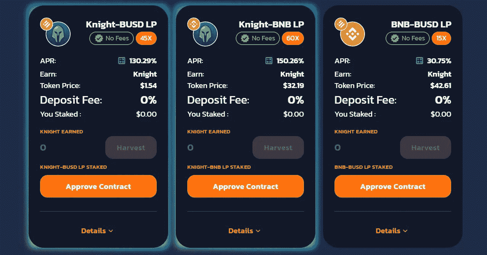

# 我的 200%复合回报加密/LP 策略

> 原文：<https://medium.com/coinmonks/my-crypto-staking-lp-strategy-for-200-compounding-returns-600b3c33abd6?source=collection_archive---------7----------------------->

Some liquidity pools on Knight Financial (Image: [https://app.knightswap.financial/farms](https://app.knightswap.financial/farms))

## 解释了密码货币盈利方法

密码货币为您提供了多种不同的赚钱方式。您可以购买密码，持有它直到它升值，出售它，并兑现您的**利润**。

您也可以在某些池中锁定密码，并为您的承诺获得被动收入。这叫做**押**。

另一种流行的赚钱方法是向密码货币交易对提供流动性。不要过于技术性，但是，为了买卖密码货币，市场上需要足够的流动性。用更简单的话来说，必须有人愿意在公开市场上交易相同的密码货币来处理某人的密码买卖。因此，您基本上可以将密码(成对交易)锁定在流动性池中，称自己为**流动性提供者(LP)** ，并从所有交易中获得流动性池产生的部分交易费用。

还有很多其他的方式，比如流动性挖掘、游戏赚钱、水龙头等等。以上方法正是我目前使用的。

一个明智的投资者会将他们的风险分散到不同的盈利方式、平台和各种隐型货币上。

# 我的加密收益策略

我坚信要创造被动的收入流——多重收入流，这样即使一个失败了，我也能维持下去。

所以，我有几个被动的收入项目正在进行不同的密码货币，我将在下面列出其中一些与他们的疯狂的 apy。

**(1)币安-BSW，143% APY**

BSW 是 Biswap 加密交换的本地令牌。Biswap 最近在币安上市，交易竞争正在进行。我参加了这次交易比赛，然后，把我所有的 BSW 币投入一个赌注池，疯狂地赌 APY 币 143%。赌注池持续 90 天，所以我不能加倍我的 BSW 币。但是，对于一个有很好的未来潜力的硬币来说，这是一个疯狂的回报。

在币安的下注期结束后，我很可能会把硬币撤到我的 MetaMask 钱包里，并在 Biswap 本身的一些高收益池中下注。

**(2)Babyswap LP-防尘/500% APY USDT LP**

Babyswap 有一些有趣的投资和流动性池，收益率非常高。当我加入时，这个特定的池的回报率最高，超过 500%。除了测试这种高回报的可持续性之外，我对这个资金池没有什么过高的期望。

关于流动性池 apy，需要注意的一点是，它会根据其他人对该池的贡献大小而不断变化。因此，这个特定泳池 500%+的起点在一周内已经侵蚀到 290% APY。这是必然会发生的，但 APY 仍然精神错乱。

在这个资金池中，我每天赚取婴儿代币作为被动收入。婴儿令牌是 Babyswap 上的本地令牌。因此，在这个尘埃/USDT 池结束后，我将在 Babyswap 上的其他高收益池中重新下注 Baby 令牌。

**(3)骑士金融-自由/BNB 有限公司，APY 230%**

我是自由金融的狂热投资者，拥有超过 150，000%的 APY 股权。是的，你读对了。因此，当自由金融与骑士金融合作，为自由/BNB 交易对提供超过 200%回报的流动性时，对我来说这是一件轻而易举的事。

[自由金融](/@emoneyrelated/how-to-earn-158-893-59-per-annum-on-your-money-bfc4961fed5c?source=your_stories_page----------------------------------------)是一个回赠令牌。这意味着，只需将这些硬币放在您的加密钱包中，您就会每 30 分钟复合一次，获得更多的 Libero。他们能够将同样的技术转移到这个自由/BNB 池。这意味着，尽管我将我的自由令牌“锁定”在这个特定的池中，我仍然可以从我的自由令牌中获得复合回报。这是巨大的！

我不仅继续从自由令牌中获得 150，000%的 APY 奖金，我还获得骑士令牌，这是骑士金融平台上的本地令牌。

在游泳池的尽头，我将得到我的自由令牌和复合回报，我将获得超过 200% APY 的骑士令牌。我将在骑士金融的其他农场和游泳池中使用这些骑士令牌。

## 结论

我上面提到的所有 stating/LP 战略都侧重于积累被动收入，并利用这些被动收入在未来赚取更多收入。将这些巨大的回报持续一两年，你将从一笔小投资中获得一个相当大的密码货币池。

## 风险警示

密码货币极易波动且不受监管。因此，购买、持有和出售任何密码货币都存在固有风险。所以，请只投资你完全输不起的钱。密码应该用于实现您的财务自由，而不是相反。做自己的研究，制定适合自己风险偏好的策略。

> 加入 Coinmonks [电报频道](https://t.me/coincodecap)和 [Youtube 频道](https://www.youtube.com/c/coinmonks/videos)了解密码交易和投资

# 此外，请阅读

*   [币安 vs FTX](https://coincodecap.com/binance-vs-ftx) | [Best (SOL) Solana 钱包](https://coincodecap.com/solana-wallets)
*   [比诺莫评论](https://coincodecap.com/binomo-review) | [斯多葛派 vs 3Commas vs TradeSanta](https://coincodecap.com/stoic-vs-3commas-vs-tradesanta)
*   【Capital.com】|[港加密借贷平台](https://coincodecap.com/crypto-lending-hong-kong)
*   [如何在 Uniswap 上交换加密？](https://coincodecap.com/swap-crypto-on-uniswap) | [A-Ads 评论](https://coincodecap.com/a-ads-review)
*   [WazirX vs CoinDCX vs bit bns](/coinmonks/wazirx-vs-coindcx-vs-bitbns-149f4f19a2f1)|[block fi vs coin loan vs Nexo](/coinmonks/blockfi-vs-coinloan-vs-nexo-cb624635230d)