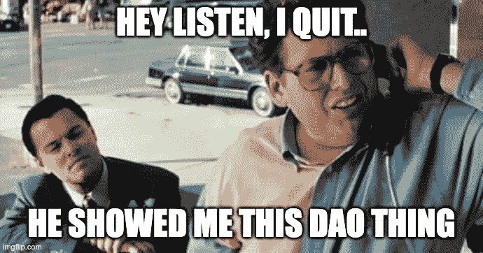

# 我的道之旅

> 原文：<https://medium.com/coinmonks/my-dao-journey-ea04b0ab60d5?source=collection_archive---------22----------------------->

除了我目前正在做的 Web2 项目，在过去的几个月里，我一直在探索一些新的东西。你可以说我进了 Web3 兔子洞。在我深入研究之前，我对什么是 Web3 以及它如何改变我们的工作方式有一个基本的想法，但当我开始阅读并为 DAOs 做贡献时，我觉得他们可以成为这种变化背后的核心驱动力。这篇文章将讲述刀到底是什么，以及我在这个激动人心的领域的旅程。

# 刀是什么？

那么，刀到底是什么？它代表分散的自治组织。那对你来说可能仍然没有任何意义。我知道，我也不知道。

最简短和最简单的定义是:[“一个共享加密钱包的在线社区。‘](https://blog.aragon.org/what-is-a-dao/)或者，用一个更 Web2 的表达:[‘‘一个有银行账户的子编辑。'](https://twitter.com/awrigh01/status/1383423710569197577)

阿道经营**没有层级管理，也没有中央领导**——决策由社区管理。它们是互联网本地的，运行在区块链(通常是以太坊)的智能合约上。

对 DAO 的任何更改都是由所有成员投票表决的机构群体提案做出的。这些提议必须得到大多数人的同意才能被接受。投票是使用软件在线完成的，例如[快照](https://snapshot.org/#/)。要获得完全的访问和投票，你通常需要持有他们的令牌。你需要拥有多少令牌取决于道本身。

在成员之间的权力分配方面，Dao 与合作社非常相似。但是，他们之间也有一些[不同点](https://www.fwb.help/wip/what-co-ops-and-daos-can-learn-from-each-other)。例如，合作社有“一人一票”的制度，而道组织通常选择“一人一票”的制度。根据我与 co-ops 和 Dao 合作的经验，后者提供了更大的灵活性，决策速度也更快。

今天的 Dao 大多在不和谐中运作。他们中的大多数都非常开放，你可以直接跳进去看看到底是怎么回事。这有点像进入谷歌的总部，在办公空间中穿行。虽然这对于普通公司来说几乎是不可能的，但对于 Dao 来说却是家常便饭。这是一个真正的即插即用系统。

[https://imgflip.com/i/5w7guf](https://imgflip.com/i/5w7guf)

DAOs 和社区激活潜力的一个很好的例子是 [ConstitutionDAO](https://twitter.com/ConstitutionDAO?s=20&t=6CW46ldBz65G4ptQsvXzTw) ，它着手购买一份美国宪法。尽管他们的努力失败了，但他们让我们看到了一个积极参与的社区所能取得的成就。背后的一些数字:

*   超过 17，000 名不同的人筹集了 4，800 万美元
*   宪法道的不和谐频道有 21000 名成员
*   推特上有 71，000 名粉丝

我就不赘述了，因为有很多关于 DAOs 的好文章。查看此[刀典](https://future.a16z.com/dao-canon/)获得更多见解。

# 树林中的小屋

我从 2021 年 12 月开始阅读关于 DAOs 的资料。然后，我决定我想了解它的第一手资料，并加入一个。我在找一把刀，它在某种程度上与旅行有关，因为这是我最活跃的行业。没过多久，我就偶然发现了 [CabinDAO](https://www.creatorcabins.com/) ，这是一个为 Web3 员工提供的小屋社区。他们的愿景是**为创作者建立一个分散的城市**。他们为 Web3 工作者和 DAO 操作者组织静修，给他们连接和解开 IRL 的可能性。

因为这是我的第一把刀，所以不和是有点震惊。虽然 Cabin 提供了一个非常好的入职体验，但它可能会让 Web3 新人感到不知所措。理解所有的 Web3 术语也需要一段时间，比如 WGMI(我们将会成功)等等。

要成为小屋的正式成员并拥有投票权，你有两个选择:购买小屋令牌或通过为道工作获得令牌。我选择了第二个选项，因为我知道这是详细了解 Cabin，尤其是与其他成员取得联系的最佳方式。好的，其中一个原因也是高昂的汽油费。

Cabin 有不同的公会(即部门),您可以在那里参与并获得您的第一个令牌:产品、Placemaker、媒体和社区建设者公会。我加入了媒体协会，开始写一些时事通讯。接下来，我写了 [Twitter 线程](https://twitter.com/RudiMedved1/status/1489688072908386311?s=20&t=6CW46ldBz65G4ptQsvXzTw)，这也是在 Twitter 上建立声誉的一个好方法，也是获得第一个令牌的一个简单方法。之后，我已经和一个朋友合作写了我的第一篇[文章](https://creators.mirror.xyz/2Ylzx6Qx6KLQ58E-L2k768YjjF6Da53MKkKxCMFEG0Q)。

除了完成奖金(任务)，小屋还提供许多社交活动，如[书友会](https://twitter.com/RudiMedved1/status/1497287628424679436?s=20&t=6CW46ldBz65G4ptQsvXzTw)，玩龙与地下城等。我们最近也有了我们的第一个公会游戏！不幸的是，我们没有看到媒体公会获胜…

到目前为止，我的经历都是积极的。我唯一纠结的是时区，因为大多数人来自美国。这通常意味着深夜开会。但这种情况也在改变，因为越来越多的人来自欧洲，这意味着我们已经为 Cabin IRL meetups 感到兴奋，希望这是第一个欧洲 Cabin Node！

# 展望未来

虽然小屋是我目前最活跃的地方，但我也潜伏在不同的地方，主要是旅游和数字游牧相关的地方。从长远来看，我认为 DAOs 是自由职业者和创作者的**工作未来，**为我们提供了一种更好的方式来组织人们朝着同一个目标前进，我正在积极地学习这个话题。

Dao 是一种组织世界各地的人和团队的新方式。当你为一把刀做出贡献时，**你不仅仅是一个贡献者，你也是一个拥有者**，这是一个很大的心态转变。任何人都可以加入到不和谐中，介绍他们自己，并向道提供他们的技能。这取决于 DAO 及其用途，但是您可以在许多方面提供帮助(编码、编写、设计、入职等。).选择你觉得有联系的社区也很重要。

在我看来，最好的 Dao 拥有**健康的核心社区**，而不是纯粹受经济利益驱动的文化。社区拥有相同的兴趣，并感觉与愿景紧密相连。正如他们所说，共鸣很重要。

如果你对探索这个领域感兴趣，我建议加入一些不和谐的话题，从打招呼开始。通常情况下，并没有看起来那么可怕。对我来说，小屋是一个很好的开始。你可以加入他们的[不和](https://discord.com/invite/ttgRU7QKVE)看看到底是怎么回事:)

> 加入 Coinmonks [电报频道](https://t.me/coincodecap)和 [Youtube 频道](https://www.youtube.com/c/coinmonks/videos)了解加密交易和投资

# 另外，阅读

*   [7 个最佳零费用加密交易平台](https://coincodecap.com/zero-fee-crypto-exchanges)
*   [最佳网上赌场](https://coincodecap.com/best-online-casinos) | [期货交易机器人](/coinmonks/futures-trading-bots-5a282ccee3f5)
*   [分散交易所](https://coincodecap.com/what-are-decentralized-exchanges) | [比特 FIP](https://coincodecap.com/bitbns-fip) | [宾邦评论](https://coincodecap.com/bingbon-review)
*   [用信用卡购买密码的 10 个最佳地点](https://coincodecap.com/buy-crypto-with-credit-card)
*   [加拿大最好的加密交易机器人](https://coincodecap.com/5-best-crypto-trading-bots-in-canada) | [比特 vs 币安](https://coincodecap.com/bybit-binance-moonxbt)