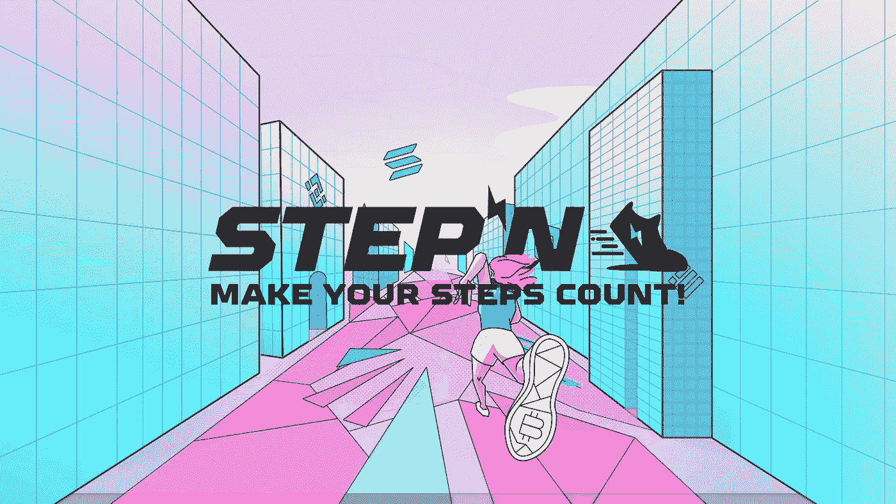
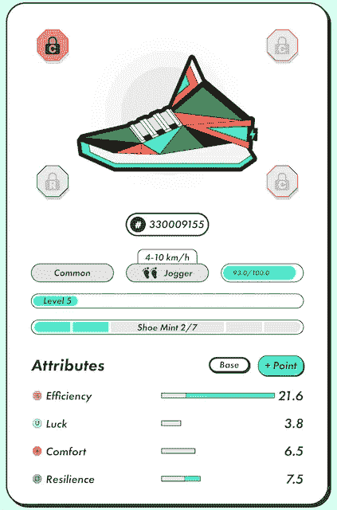

# 我从 STEPN 应用程序获得商品及服务税代币的第一天

> 原文：<https://medium.com/coinmonks/my-first-day-to-earn-gst-token-from-stepn-app-927300765510?source=collection_archive---------60----------------------->

我第一天体验流行的移动挣钱项目 STEPN

STEPN, a move-to-earn project to make your steps count

当我第一次听说 [STEPN](https://stepn.com/) ，一个移动挣钱的项目时，我说:“哇，多棒的主意啊”。你正在散步、慢跑或跑步，并从锻炼时间中赚取加密资产， [GST](https://coinmarketcap.com/currencies/green-satoshi-token/) (绿色 Satoshi Token)。这是一个双赢的局面:既健身又赚钱。我非常喜欢这个主意，然后跳上了火车。

为此，我用一些 USDT 换了一些索拉纳(SOL)，并把它们转移到我的幻影钱包里。我从 App Store 安装了 STEPN 应用程序，并从一个已经在使用该应用程序的朋友那里获得了激活码。然后，我将我的幻影索拉纳钱包导入到 STEPN 应用程序或 [DApp](https://coinmarketcap.com/alexandria/glossary/decentralized-applications-dapps) 。我准备去买一双 NFT 运动鞋。

我的朋友告诉我，购买一个普通的慢跑运动鞋与高效率和弹性点，5 级，鞋薄荷 2。更高的效率增加商品及服务税收入，更高的弹性降低运动鞋维修成本(由商品及服务税支付)。搜索了大约一个小时后，我花了 13.7 美元买了我的第一双 NFT 运动鞋。

My first NFT Sneaker on STEPN app

我准备绕着校园轻快地走一圈。但是，我没有任何精力。获得商品及服务税需要能量，每 1 点能量相当于 5 分钟的移动和获得时间。能量每 6 小时补充 25%，直到达到能量上限，对我来说是 2。

通过将配速保持在最佳速度，即 4 到 10 公里/小时，你在慢跑运动鞋上花费的 1 能量将获得大约 5 GST。确切的公式很复杂，可以在 STEPN 的[白皮书](https://whitepaper.stepn.com/game-fi-systems/earning-cap-mechanics)中查看。

> 加入 Coinmonks [Telegram group](https://t.me/joinchat/Trz8jaxd6xEsBI4p) 并了解加密交易和投资

我在当地时间下午 4 点得到了我的第一个 0.5 能量，赚了 2.49 GST。听到传入令牌的声音真好:)

第二天用 1.5 能量走，赚了 6.69 GST。使用一整天后，我总共获得了 9.18 GST，耐用性从 100 下降到 93。我花了 2.52 GST 修复，花了 6 GST 升级。我钱包里有 0.66 GST 买一杯咖啡:)

总的来说这是一次有趣的经历，但是安全第一。使用应用程序时始终保持安全。在第一天，你会很好奇看到应用程序屏幕上发生了什么。所以，我建议你在一个交通封闭的区域，比如公园或者森林，度过你的第一步并赢得时间。

第一次体验就这么多，后面几天继续贴。请不吝赐教，在 Medium 上关注我。

我将发送激活码给我的追随者加入“俱乐部”。

本文仅供参考。不应将其视为财务或法律建议。