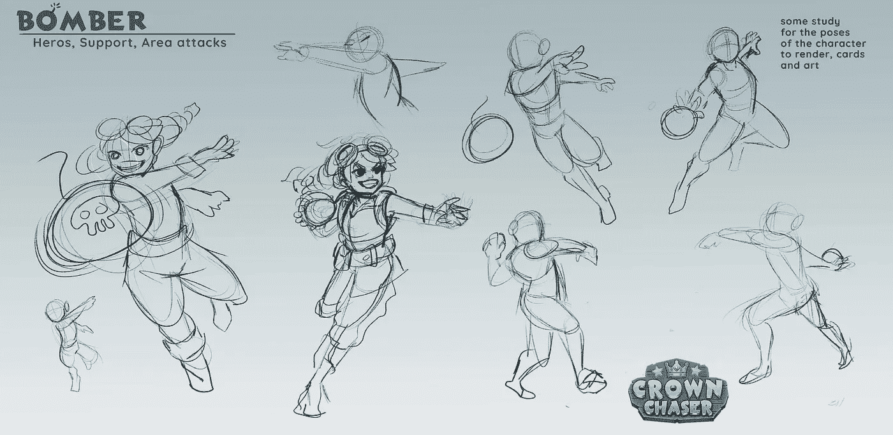
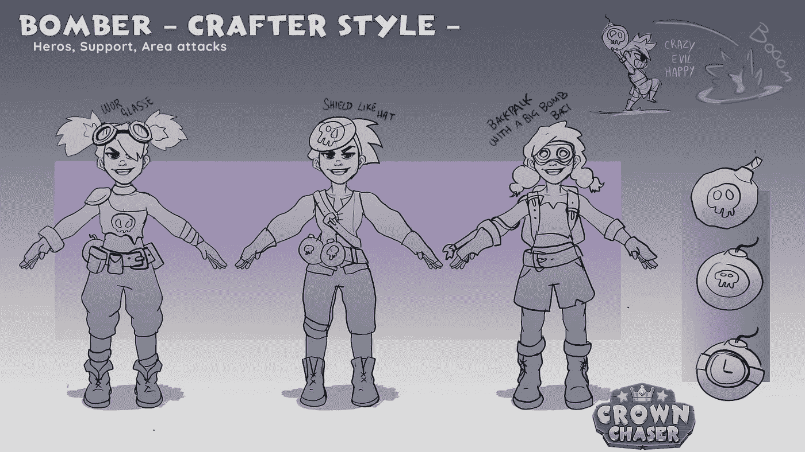
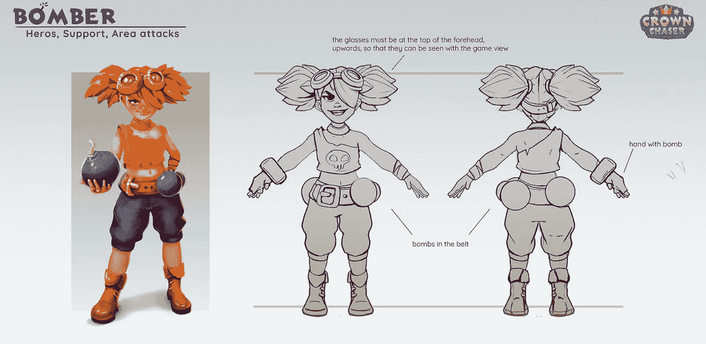
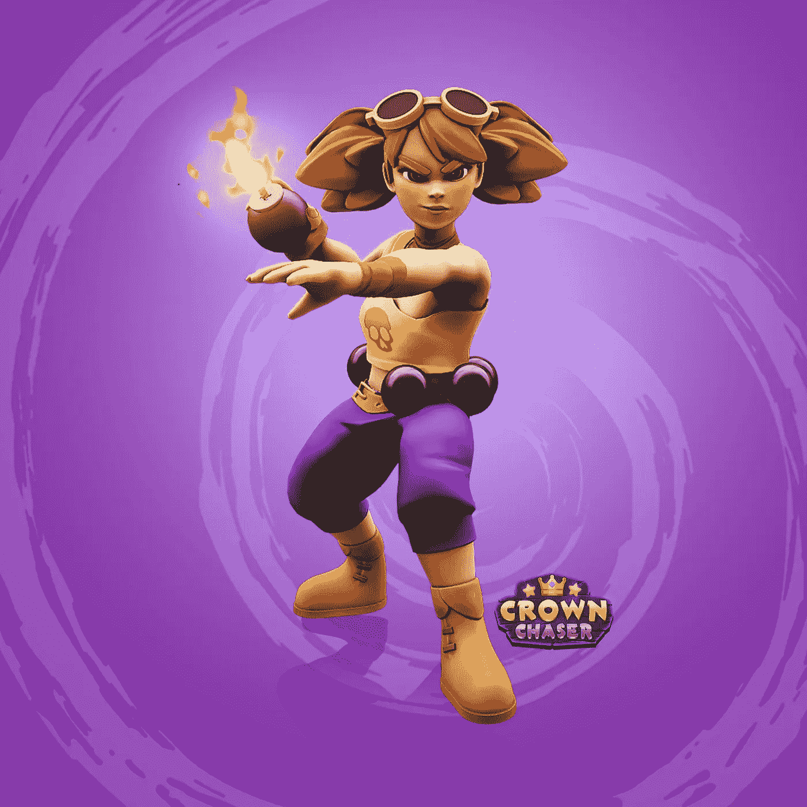

# 我作为 web3 初创公司创始人的头六个月。

> 原文：<https://medium.com/coinmonks/my-first-six-months-as-web3-startup-founder-cdfb950259ae?source=collection_archive---------12----------------------->

创业从来都不是一件容易的事情。在这篇文章里，我想和你分享我作为一个 web3 公司的创始人的亲身经历。

自从我创建了[追冠者](http://crownchaser.com)，一个以娱乐为先的玩赚游戏，已经快七个月了。在这篇文章中，我想和你们分享我和我的团队到目前为止所面临的最大的挑战和机遇。

在讨论细节之前，让我先简单介绍一下我自己。

我不是第一次创业，多年来我一直作为战略合作伙伴与谷歌合作，我的技能可以被定义为 X 型学习者——最著名的是“万金油”。我从 play station one 开始就是一名游戏玩家——如果你想知道的话，我最喜欢的游戏是 Halo 2！:)和 2017 年以来的区块链热心人。

# 第一步:想法

我已经有一段时间没有考虑直接在 web3 行业工作了。
我的意思是，谁不想成为第一批建设全新事物的人之一，并可能改变全世界数百万甚至数十亿人的生活呢？

区块链项目并不是什么新鲜事，早在 2018 年就有“ICO”热，我记得**事情是*疯狂*** :许多公司正在迈出试图“彻底改变”世界的第一步。问题？这些项目中的大多数都太复杂了，以至于大多数人都无法使用或理解，一些白皮书感觉你必须有多个硕士学位才能理解它们。

我真的相信，如果区块链想要达到主流采用，它必须由相对简单和容易理解的东西来驱动。
虽然我发现 DeFi 产品是一个非常有趣和令人兴奋的想法，但我怀疑它们能否推动区块链在普通观众中的采用。它们需要大量的知识才能被理解。

**取而代之的，是一些简单易懂的电子游戏。**

电子游戏是全世界最大的娱乐形式。是的，甚至比电影和电视剧还要大。很自然的，游戏可能是将区块链带给主流观众的驱动力。

区块链上的游戏并不新鲜，已经有不少了，而且就在我们说话的时候，它们还在不断发展(你可以查看我几个月前写的文章:玩游戏赚钱和玩游戏赚钱的区别)。

除了我认为非常主观的图像方面，缺少的是有趣和吸引人的游戏性。当我玩一些著名的“玩到赚”游戏时，我清楚地看到，游戏的重点是盈利预期，而不是乐趣。大多数游戏也有一个非常积极的支付赢机制。

那些真让我倒胃口。就我个人而言，我认为电子游戏是一种健康娱乐的形式，在这里你可以度过一段快乐的时光，在公平平等的环境中与其他玩家竞争，与他人合作，结交新朋友。

皇冠追逐者是基于这些品质的承诺而创建的，此外，当你真正拥有你在游戏中购买或获得的资产时，你可以获得一些加密奖励。

《追冠者》是基于一种乐趣至上的方法，就像所有的电子游戏一样。 ***追冠者是写给全世界所有玩家的情书。***

# 第二步:执行

既然“*什么……？”*和“*为什么…？”*已经解释过了让我们潜入*“如何？”*

让我们从陈述显而易见的事实开始:**开发视频游戏既不容易也不便宜。**

## 我遇到的第一个挑战是找到合适的人。

如果你有像我一样的背景，从 web 2 SaaS/营销你会遇到并不得不管理许多新的专业人士:2D 艺术家，3D 艺术家，动画师，装配工，游戏设计师，音响工程师，艺术总监，VFX 艺术家，SFX 工程师等等。

和他们一起工作是如此有趣，我最喜欢的事情是看着他们的想法如何一步步变成现实。

特别是对于游戏角色来说，这个过程真的很酷:游戏设计师从一个基本的概念开始，这个概念就是角色是谁，角色应该做什么。然后，2D 团队通过制作草图和木板开始着手这项工作。一旦他们准备好了画板，所有的东西都会交给 3D 团队，让角色看起来像真的一样。接下来轮到动画师的团队了，他们给角色一个骨架，让角色动起来，赋予角色“生命”。在那之后，开发者在游戏中插入所有东西。

Character’s Traits

Character's personality

Art Board

Meet our Bomber!

看起来很酷，对吧？每个角色需要 1 到 2 个月的工作，至少需要 5 个人来完成。

寻找团队成员从来都不是一件容易的事情，尤其是对于艺术家来说，因为有许多具有不同背景和经验的人在从事同一项任务，交付必须感觉和看起来好像只有一个人完成了整个过程。

我真的为这个团队感到骄傲。
不管他们的角色是什么，每个人都非常投入，对追逐冠军感到兴奋。Nicole、Francesco、Andrea、Silvano、Sara、Alessia、Emily、Khalil、Davide、Alex 和 Galya 非常感谢你们与我分享这段旅程！

## 我遇到的第二个挑战是关于筹款。

关于这个，现阶段没什么好说的。
目前，市场正面临衰退，因此来自风投和商业天使的可用资本非常有限。

**我们最近开始了种子期**。如果你有兴趣加入我们这次航行，请随时打电话到 antonio@crownchaser.com 找我。

我们将在接下来的文章中跟进这个挑战:)

## 现在，我们来谈谈机会！

非常感谢我们能够让**追冠者**成为[区块链游戏联盟](https://www.blockchaingamealliance.org/)的一员。那里有很多有意义的人，对 Flav 正在做的令人惊叹的工作大声欢呼。
如果你错过了，[你可以在这里找到我们在 BGA](https://youtu.be/zXp68QkSaWY?t=51) 的游戏介绍

但最重要的是，我感谢我们的社区。就个人而言，没有比看到人们喜欢并相信我们的项目更大的动力了。
如果你有多余的几分钟时间，过来和我们一起聊聊[不和谐](https://discord.com/invite/mTdbWP2FVw):)

# 第三步:下一步是什么？

我们将继续一步一步地开发我们的游戏，未来看起来很光明，我们将继续我们的追求:**开发多人游戏并赚取**游戏，通过向玩家提供利用区块链和 NFT 技术的优质游戏，为他们提供**引人入胜和有趣的**体验，同时关注生态系统的可持续性。

> *加入 Coinmonks* [*电报频道*](https://t.me/coincodecap) *和* [*Youtube 频道*](https://www.youtube.com/c/coinmonks/videos) *了解加密交易和投资*

# 另外，阅读

*   [有哪些交易信号？](https://coincodecap.com/trading-signal) | [Bitstamp vs 比特币基地](https://coincodecap.com/bitstamp-coinbase) | [买索拉纳](https://coincodecap.com/buy-solana)
*   [ProfitFarmers 回顾](https://coincodecap.com/profitfarmers-review) | [如何使用 Cornix 交易机器人](https://coincodecap.com/cornix-trading-bot)
*   [西班牙 5 大最佳文案交易平台](https://coincodecap.com/copy-trading-spain)
*   [Pionex 双投](https://coincodecap.com/pionex-dual-investment) | [AdvCash 审核](https://coincodecap.com/advcash-review) | [支持审核](https://coincodecap.com/uphold-review)
*   [面向开发者的 8 个最佳加密货币 API](https://coincodecap.com/best-cryptocurrency-apis)