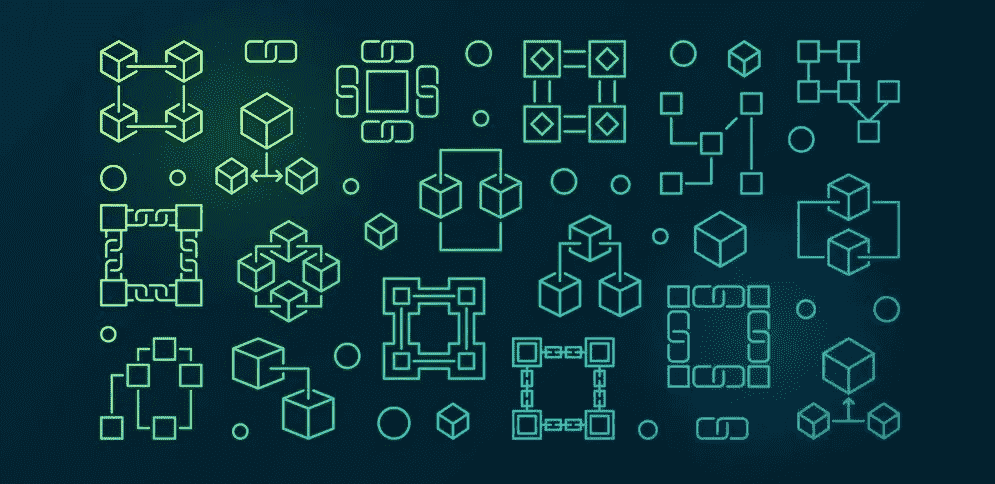

# 我的创世积木变成了数字资产

> 原文：<https://medium.com/coinmonks/my-genesis-block-into-digital-assets-914d46f61b02?source=collection_archive---------52----------------------->

“给一个人一条鱼，他会吃一天。教一个人钓鱼，他会吃一辈子。”—中国谚语—

你好。我是 Apex。由于我的工作面向公众，我被迫使用化名。有一天，我希望不会是这样。我从 2013 年第一次买比特币就开始投资数字资产。

当我买入时，我认为它是“神奇的互联网货币”。我的冲动是正确的，在 2017 年牛市的顶峰，我卖掉了几乎所有的比特币。我的初始投资翻了 35 倍，我被击垮了。我买了一堆东西，分散到其他新兴的区块链资产中，然后我突然想到:

“等等。我刚刚卖了什么？我拿着什么？我真的理解了吗？”事实是:我无法回答任何一个问题。

所以我决定改变这一切。

自 2018 年以来，我一直在进行研究，以了解这个新兴领域。我犯过错误，但我也从别人那里学到了很多，并注意到一些成功和失败的共同标准。

这个博客是关于分享的。分享我的错误。分享我的成功，希望其他人也能在数字资产领域的创业中获得成功。

在接近 2018 年底的时候，经过一年多的研究，我终于明白了我持有的东西——天哪——这是金融的未来。

我开始利用我在企业管理方面的职业经验来理解区块链的宏观环境、分布式账本技术、数字资产等等。

证据对我来说非常清楚。一个新的金融体系正在建立。这个新系统不是在大街头条之外的显眼地方建造的。

如果我没有一直在找它，我可能永远也不会看到它。

这个新的金融世界将改变一切——钱是如何流动的。支付是如何运作的。我们对银行和投资的看法。我们如何理解金钱。我们如何借贷。我们如何放贷。一切。

这个新世界正在快速发展和变化。

我可以看到这个“变化的海洋”正在发生。但是就像我们海洋中的水流一样，你不能仅仅通过观察表面来发现它。

然后我开始后悔。

如果我只知道 2017 年我拿着什么。

我没有。

我花了近 5 年时间来重新计算我在 2017 年出售的东西，尽管这是一个严重的错误。我因此变得更聪明、更坚强。现在我知道我 HODL。

我制定了一个稳健的策略，自 2013 年以来，我的原始投资平均获得了 100 倍的回报。

就我个人而言，我更愿意跟随别人的脚步，而不是自己去做，但如果你像我一样，当我看的时候，我会遇到茫然的目光、呆呆的目光、评判和对即将到来的金融灾难的严厉警告。

有人告诉我，这是一个炸弹，一个泡沫，一个骗局，一个庞氏骗局。我被告知我会失去所有的钱。我被告知这是一种时尚。那个密码被洗白了。

我不相信他们，因为我已经看够了。我自己已经做了足够的研究来了解真相。我们财务的未来在区块链，现在男男性接触者终于开始承认这种说法。

我们的世界将变得更加分散，因为我们的现在是数字化的，未来也是数字化的，不管我们是否接受这个现实。

火车已经离站了。
妖怪不能放回瓶子里。

这就是为什么现在是我的时间。这将是我的时刻。对我来说。为了我的家人。为了我的社区。这将是我要争取的未来。

如果你在这里看到了有价值的东西，请与他人分享。