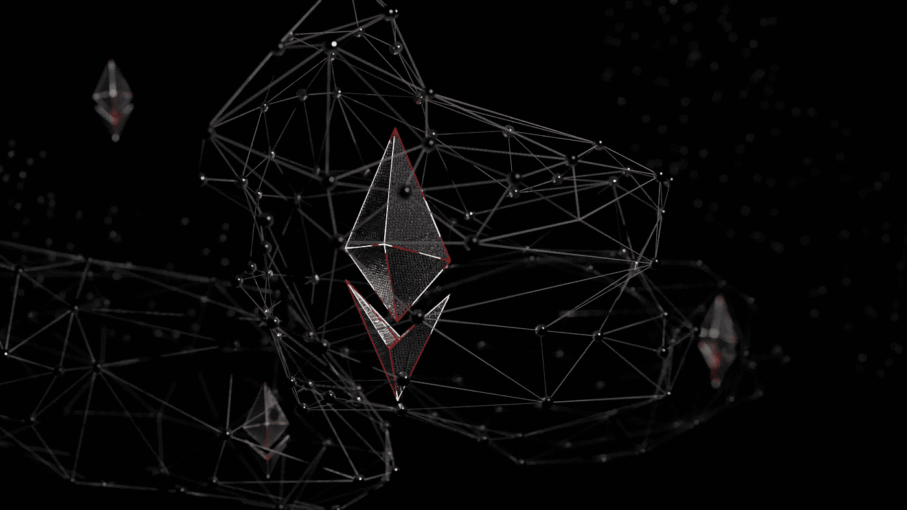

# 我的印象莫邪对 web3 的第一印象(上)

> 原文：<https://medium.com/coinmonks/my-impressions-of-moxies-first-impression-of-web3-part-1-648fbe1fd300?source=collection_archive---------3----------------------->

Photo by [Shubham Dhage](https://unsplash.com/@theshubhamdhage?utm_source=unsplash&utm_medium=referral&utm_content=creditCopyText) on [Unsplash](https://unsplash.com/s/photos/decentralized?utm_source=unsplash&utm_medium=referral&utm_content=creditCopyText)

Part 2 这里是[这里是](/coinmonks/my-impressions-of-moxies-first-impression-of-web3-part-2-35c9d8e1094f)。第三部分是这里的。

是的，距离莫邪的[对 web3](https://moxie.org/2022/01/07/web3-first-impressions.html) 的批评只有一个月。我发现随着《冷战 2:电力布加洛》的出现，芝加哥的冬天变得更慢了——但是，我跑题了。理所当然地，这篇文章引起了很大的反响，经过一段时间的酝酿，我也想记下一些想法。

从一千英尺的角度来看，我大体上同意他的批评的基础，但我不同意他的结论。我们从相同的事实出发，但在一些含义上有分歧。

莫邪从对 web3 的概述开始，提出了他关于集中式平台如何出现的论点，即:

> 1.人们不想运行自己的服务器，也永远不会。

我不能完全同意这种观点，但我认为这是有意回避警告。我的理论是，人们希望*选项*能够运行他们自己的服务器，但最终不想自己做。很明显，人们想要方便。与创建一个 gmail 帐户相比，设置一个电子邮件服务器是一件痛苦的事情。但他们也想感觉自己选择了所说的便利，而不是被明确地强迫(见:某些疫苗)。

这里的关键词是*永远不会*——因为这是我认为他错的地方。人们在 99%的时候会更喜欢集中的选项，但是这忽略了边缘情况，也就是说——人们会更喜欢集中的选项，除非:他们不信任集中的实体(这是一个关于它本身的话题，将在后面探讨)；他们有极其敏感的数据要保管？(蛋羹？)自己；还是方便到可以这么轻松的做。毕竟，很多人建立了自己的网站，而不是使用 Wordpress 或 Squarespace，因为这太简单了。

我认为这正是对 web3 的批评，尤其是对区块链的批评站不住脚的地方。它忽略了区块链是为边缘案件而建造的。批评家们把苹果比作橘子——中央集权实体的日复一日的“美好时光”(当生活的肉汤；MySQL 数据库已经启动并运行；Robinhood app 居然让 GME·斯通克斯的采购订单通过；*我支付*我的保险公司他们的保险费)给日复一日的加密工作——不可否认，这需要更多的努力来维护，不太容易扩展，并且需要为块空间付费。

(附注—在集中式数据库中，数据块空间也是要花钱的。只是你的友好的，像谷歌这样的社区中心实体为你补贴了那些费用…所以他们可以保留数据。天下没有免费的午餐。)

批评家将集中式堆栈的最佳元素与分散式堆栈的最差元素进行比较。

好吧，加密的效用在繁荣时期并没有表现出来。理论上，当网络出现大规模故障时，分散式系统会停机(在此插入索拉纳的笑话)；当数据库关闭时；当银行挤兑发生时；罗宾汉的城堡领主[来召唤](https://www.washingtonpost.com/business/2021/01/29/robinhood-citadel-gamestop-reddit/)；洪水摧毁了保险公司当*他们应该* [*付钱给我们*](https://www.npr.org/2016/05/24/478868270/business-of-disaster-insurance-firms-profited-400-million-after-sandy)；出现异常。当人类的腐败或无能取代了。在那些时刻，分散的代码就是法律，协议是不可改变的。至少在理论上是这样。

我们应该这样看待区块链。**这是集中式实体保险**，它归结为一个基本问题——在生命周期的成本效益分析中，允许第三方对数据库进行可审计验证的交易费用是否值得，在集中式堆栈被破坏的罕见情况下是否值得激活？

再说一遍，没有免费的午餐。你要么为每笔交易支付保险费，要么为低概率但极有可能发生的地震事件自掏腰包。

每个人对这个问题的答案都是内在的，但至少让我们明确这个决定是关于什么的。

> 2.**协议比平台移动得慢得多。**30+年后，邮件仍未加密；与此同时，WhatsApp 在一年内从未加密变成了完整的 e2ee。

再次表示同意。虽然速度在产品开发中至关重要，但这也不是区块链的初衷，也从未承诺过。这是苹果和橘子的另一个对比——比较独裁者效率的最佳版本和分权协议发展的最差版本。相反，你必须考虑集中速度带来的预期价值，包括快速实现但*不*符合用户最大利益的特性(咳咳， [Twitter 第三方 API](https://www.theverge.com/2012/8/23/3263481/twitter-api-third-party-developers) ，咳咳)。

正如 Chris Dixon [解释](https://future.a16z.com/why-web3-matters/)的那样，“当(集中式平台)到达 S 曲线的顶端时，它们与网络参与者的关系从正和变为零和。要继续增长，需要从用户那里获取数据，并与(以前的)合作伙伴竞争。”你仁慈的独裁者变成另一个独裁者只是时间问题。

但是，如果缺乏速度意味着区块链不适合每一个应用程序，这是绝对公平的。它可能是一项根本性的颠覆性新技术……*和*不会完全取代 web2 或所有以前的技术。这些不是相互排斥的概念。

毕竟，电子邮件协议确实发展缓慢，但对当今几乎所有的科技企业都至关重要。它是建立在其他技术之上的一层。但这只是一个更大整体的一个方面，而不是关键。同样，通过区块链的去中心化可以通过以一种无许可的方式嵌入信任来服务于业务元素中的一个利基，而这并不意味着成熟的 Dao 将从今天起统治世界，或者菲亚特毫无价值。

总的来说，虽然我同意这两点作为事实陈述，但我认为它们隐含地误诊了问题的根源。集中式平台最初出现的原因并不是因为人们*不喜欢*自我监管和天生渴望发展速度，他们只是喜欢它带来的便利——而在 web2 的情况下，便利恰好与集中化相吻合。人们真的不在乎它运行在哪个堆栈上——集中式还是分散式。只要简单就好。

在 web2 中，便利与多层次的集中化结合在一起，不仅包括运营交易，还包括心理模型——对于来自现实世界的正常人来说，集中化的公司更容易在心理上消化。

莫邪在 web3 上最初的阅读是:

> ……[总的论点](https://future.a16z.com/why-web3-matters/)似乎是 web1 是去中心化的，web2 将一切都集中到平台中，web3 将再次去中心化一切。web3 应该给我们 web2 的丰富性，但是去中心化了。

但我要稍微修改一下——web 1 是分散的，但最终外行人无法访问，因此矛盾地以自己的方式集中。没有准入的去中心化实质上是另一个名称的中心化；美国医疗保健私有化太棒了，对我这个平民来说太贵了，负担不起。毕竟，听听 web2 的先驱之一， [Zuck 自己在 2005 年说的话:](https://youtu.be/xFFs9UgOAlE?t=868)

> 我认为在谷歌之前的一代人，如果没有一些大的硬件，你甚至不能建立一个网站。例如，我想易贝用掉了两台价值 5 万美元的机器。如果你只是一个住在宿舍的孩子，你就不能开始那样做…

(你们都在抱怨 30 美元的汽油费？！)

因此，web3 应该旨在给我们 web1 的去中心化，但具有 web2 的*便利性*。在追求可及性的过程中，集权仅仅是一种必然的罪恶。web3 让我们回到了互联网的根源。

在[第二部](/coinmonks/my-impressions-of-moxies-first-impression-of-web3-part-2-35c9d8e1094f)中，也许我会得到一些莫邪的实际批评…

> 加入 Coinmonks [电报频道](https://t.me/coincodecap)和 [Youtube 频道](https://www.youtube.com/c/coinmonks/videos)了解加密交易和投资

# 另外，阅读

*   [AscendEx 保证金交易](https://coincodecap.com/ascendex-margin-trading) | [Bitfinex 赌注](https://coincodecap.com/bitfinex-staking) | [bitFlyer 审核](https://coincodecap.com/bitflyer-review)
*   [Bitget 回顾](https://coincodecap.com/bitget-review)|[Gemini vs block fi](https://coincodecap.com/gemini-vs-blockfi)cmd |[OKEx 期货交易](https://coincodecap.com/okex-futures-trading)
*   [AscendEx Staking](https://coincodecap.com/ascendex-staking)|[Bot Ocean Review](https://coincodecap.com/bot-ocean-review)|[最佳比特币钱包](https://coincodecap.com/bitcoin-wallets-india)
*   [霍比评论](https://coincodecap.com/huobi-review) | [OKEx 保证金交易](https://coincodecap.com/okex-margin-trading) | [期货交易](https://coincodecap.com/futures-trading)
*   [网格交易机器人](https://coincodecap.com/grid-trading) | [Cryptohopper 审查](/coinmonks/cryptohopper-review-a388ff5bae88) | [Bexplus 审查](https://coincodecap.com/bexplus-review)