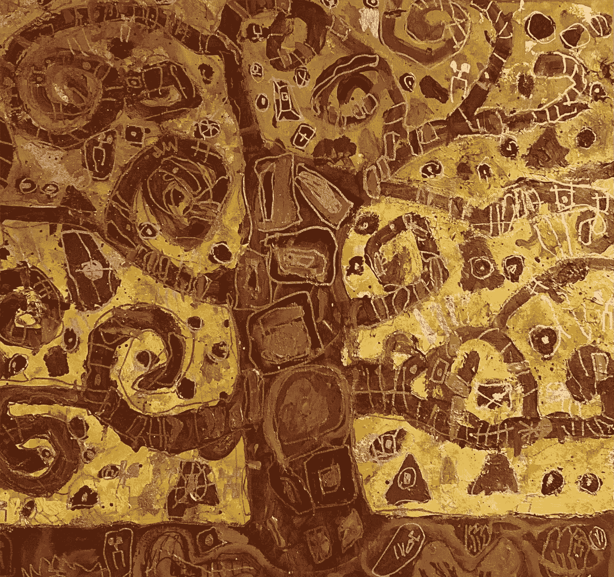
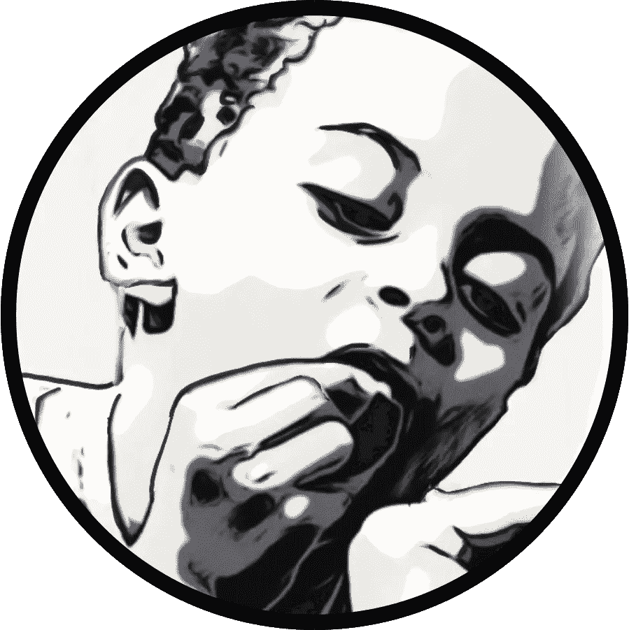
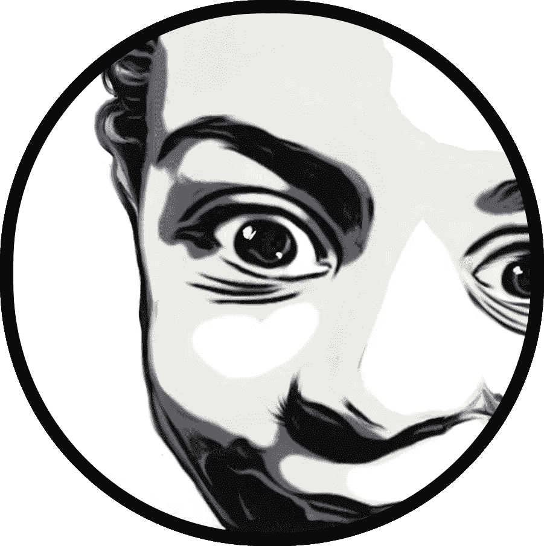
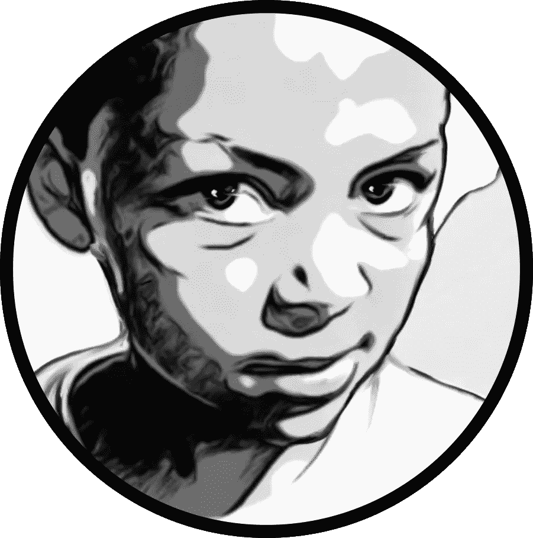

# 我的爪哇咖啡馆第一部分

> 原文：<https://medium.com/coinmonks/my-javanese-nftea-house-collection-516db3d9226d?source=collection_archive---------62----------------------->

Sawyer’s Painting

**作者注:**

《爪哇茶馆》是我几个月前写的一个儿童故事。虽然它已经在亚马逊上出现了——但它一直在那里无所事事，所以我开始寻找其他选择，然后发现了 NFT 的。

没有什么比一个没见天日的故事更糟糕的了，所以我把它改了一下，决定发表在这里。

没错。

这个故事是一个爱的劳动，灵感来自一次去尼亚加拉峡谷的徒步旅行，以及和我的双胞胎儿子去鸟类王国的生日旅行。在那里，我们发现了瀑布的令人敬畏之处，以及一座消失在时间长河中的神秘建筑。

我对爪哇文化一无所知。

我的第一个想法是他们把名字拼错了，但这是我的错误。原来这座建筑本身也有值得讲述的故事。

我完成的第一本书是关于我如何开始从事冰壶运动的背景故事。那个职业来了又去，现在我兜了一圈，尝试一种新的表达方式。

作家兼 NFT 艺术家。

一个朋友建议我以 NFT 的名义发行这本书，但我不知道这是什么意思。

在过去的几个月里，我们的友谊不断加深，他向我介绍了一个加密货币的新世界，NFT 和 Defi。每一次谈话都提醒我，我所知甚少。

我可以扔冰壶石，但在这个空间里，我又回到了起点。

尽管我一直很喜欢阅读关于加密货币的文章，但扣动扳机还是需要一点耐心。我一直着迷于经济学，以及透明硬币和隐私硬币之间的区别。

当我的 Metamask 钱包开始运行时，我让我的侄子给我转了足够的以太币来支付我的 Opensea.io 帐户上的汽油费。那对我来说是一个里程碑。

*我的第一笔正式交易。*

尘埃落定后，我上传了第一张 NFT。每本书都以封面开始，我尤其为这本书感到骄傲。

这幅作品是我七岁的儿子画的。当索耶专心致志时，他完全是个艺术家。我觉得很好，但我可能有点偏见。

索耶的画开启了 NFT 收藏的先河。

感谢阅读！

第一章——一颗名叫杰瑞的牙齿

律师发现他的牙齿松动了。这正常吗？他的双胞胎哥哥亨特还没有掉牙齿，所以他不知道会发生什么。

每天早上他都在镜子前晃动它，但是那颗可怜的牙齿还是挂着。最后，他决定把他的牙齿命名为“杰瑞”。

索耶喜欢和杰里聊天。

他和他的爸爸、妈妈或弟弟亨特分享了一些他从来没有谈过的事情。不久，杰里对索耶有了足够的了解，可以把一个重要的秘密托付给他。

所以在满月的前两天，杰瑞开口了。他的声音盖过了索亚的杂念，说道:“嘿！”

索耶停止了说话，紧盯着镜子里的杰里。“你刚才说话了吗？”

杰里没有点头，但索亚确实察觉到了他牙龈发痒的微弱摆动。“是的，索亚。我可以直接对着你的大脑说话。”

索耶的眼睛看起来疯狂。“我是不是疯了？”

杰里再次扭动。“没有。我只是想给你一些特别的东西，因为我在你嘴里的最后几天里你一直对我很好。”

“你的意思是杰瑞？你要走了吗？”

这一次，牙齿是静止的。“我很感激你，Sawyer，这就是为什么我要给你一份特别的礼物。我要和你分享一个秘密。这是一个只有你的乳牙知道的秘密。”

索耶洗耳恭听。“什么秘密？”

所以杰瑞告诉了索耶关于牙齿熊的传说。

他说:“大多数孩子只是把乳牙放在枕头下面，结果一般。问题是大部分父母实际上是在干涉仙女的领域。很糟糕。现实是你的父母看不到。他们认为魔法不存在，所以对他们来说魔法不存在。把你的牙齿留在某个地方进入魔法世界不是更好吗？”

现在索耶越来越糊涂了，“你说的魔法王国是什么意思？”

杰里尽力解释道，“只要记住我是一个牙锯木工就行了。我的感知能力被限制在你的牙床里。另一方面，你有几乎无限的能力来实现你内心的渴望。太厉害了！”

“你是没有意义的兄弟。”索亚对这部分对话有点厌烦了。他决定让杰瑞动一动。

杰瑞一直在说。“好吧。好的。我会坚守我的秘密。简而言之，父母一直在孩子的枕头下塞钱，偷他们的牙齿。他们用它们做什么是一个黑暗的秘密。这是违背自然规律的。如果你自愿放弃你的牙齿给牙熊，他们会为你表演好的魔术。那是他们对事物自然秩序的贡献。这是令人震惊的吧？”

索耶还是不明白杰里在说什么。“杰瑞我不知道你在说什么。我们来玩个游戏吧。”

杰里现在大力摆动。“好吧，索耶。我们会玩。你明天还和你爸爸还有猎人去鸟王国吗？”

“是的，这是真的。”

杰里扭动着。“去看看火球的水箱里面。水箱底部应该藏着一枚特殊的硬币。你必须取回这枚硬币，并在旅程的第一段带上它。懂了吗？”

索耶点点头。

杰里再次扭动。“在鸟类王国的内部有一座特殊的建筑，叫做爪哇茶馆。你不会错过这个标志的。不为人知的是，这座神奇的建筑与旧世界有一个开放的连接:一个传送门。走进这栋大楼，坐在长椅上等待进一步的指示。遵循这两个方向很重要。我警告你，在那个地方有很多分散注意力的东西，所以要小心！记得硬币和长凳。我只能告诉你这些。再见 Sawyer！”

Sawyer 感觉到牙齿停止摆动。杰里陷入沉默。索耶需要消化这个故事。他意识到他正在和一颗牙齿进行一场完整的对话，这有多奇怪？

他疯了吗？

也许是时候停止这场游戏了。在犹豫的时候，亨特走进了浴室。他一直专注地听着索耶的谈话，现在他要找点乐子了。

“嘿，索耶！杰瑞怎么样了？”

索耶不喜欢他的语气。“不关你的事。”

亨特笑了。“你为什么对着你的牙齿说话？你是怎么把杰瑞的声音弄得这么清晰的？太棒了。”他笑了。

索耶睁大了眼睛。“你也能听到杰瑞的声音？”

亨特看上去有些怀疑。“不，你是丁咚。我听到你做杰里。”

索耶笑了。“那不是我。我没说那种话。是杰瑞！亨特，你能帮我从火球的水箱里拿到硬币吗？我想我够不着。”

亨特笑了。“好吧，索亚，我不会上你的当。我有事情要做。再见！”

猎人离开后。

希望你喜欢读第一章。敬请期待**第二章** —火球的魔法币。请务必查看 Opensea.io 上的[爪哇 NFTea House](https://opensea.io/collection/javanese-tea-house) 收藏

-Bouwhui5