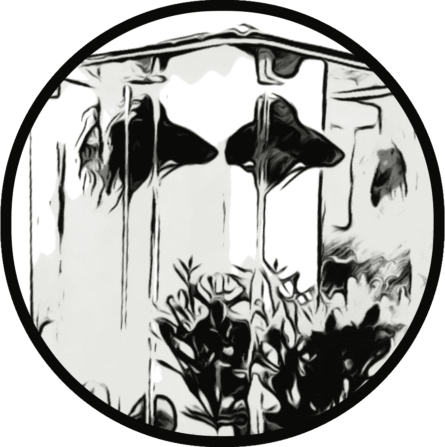
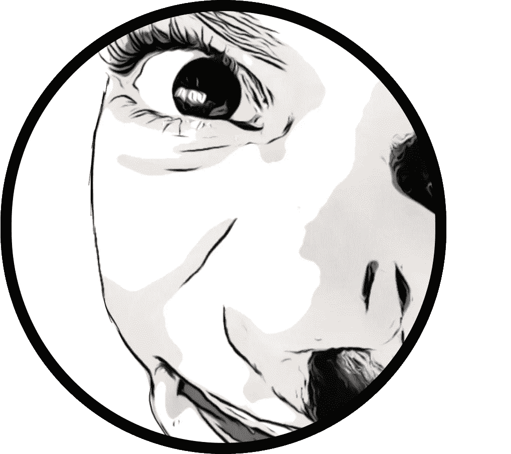
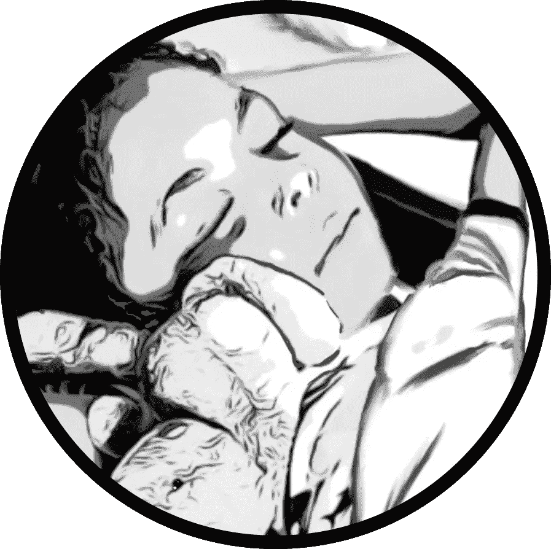

# 我的爪哇小吃屋第 2 部分

> 原文：<https://medium.com/coinmonks/my-javanese-nftea-house-collection-877772166c6b?source=collection_archive---------96----------------------->

> “你将一无所有，你会幸福的。”

**背景故事**

到现在你已经听到了这句流行语，它可能意味着完全不同的事情，这取决于你在矩阵中插入的程度。

当我失去婚姻时，我开始意识到我的生活中有一些不值得骄傲的事情。问题是我不知道从哪里开始改变。

在事业上，我追随父亲的脚步，把自己逼到了一个角落，所以尽管我挣的钱足够养家，但我并不快乐。

造成悲伤的不是我的配偶，而是我的功劳。

我的工作和我的婚姻给了我选择的机会。在疫情的第一波浪潮中，我的婚姻已经和平解决，然而，作为一个有一对双胞胎男孩的单身父亲，我仍然不得不考虑如何支付我的新生活方式。

随着时间和空间远离另一种生活——我以为会一帆风顺，然而，那时我意识到需要做更多的工作。此后不久，我失去了我的主要收入来源:俱乐部的冰上合同。

这种混乱需要一些时间来处理。

我的制冰机生涯是我过于追随父亲脚步的征兆，简单明了。制冰是他的道路。

不要误会我，我是沉浸在冰壶行业中长大的，我珍惜许多技能和记忆。

*我很害怕*。

我一直坚信有人或有东西会救我。直到很久以后的一次深夜散步，我才发现自己内心对贫困的恐惧。

赤贫和贫穷不是一回事。

我担心我没有足够的资源来照顾自己和家人。换句话说，我将无法独自生存和养活我的家人。

这种恐惧从何而来？

很久以前，我读过罗伯特·清崎写的一本书，名为《富爸爸穷爸爸》。我很容易理解我父亲在金钱上的挣扎。我的父亲并不富裕，他是二战后来到加拿大的荷兰移民家庭中的一员。

我父亲从他父亲那里购买了(而不是继承)家庭宅地。

几年后，我的父亲离开了他的家庭农场，在冰壶社区找到了自己的位置。自然，我跟着他的脚步。他继续为三届奥运会和世界各地的许多其他国家冰壶比赛制冰，所有这些都记录在我的第一部漫画小说《天生的冰壶手》中。

从小到大，我喜欢冰壶，就像其他加拿大人喜欢冰球一样。

作为一名制冰机，我可以无限制地练习我喜欢的游戏，但在实践方面，我被困住了。好的制冰机不会抛弃会员去追求职业冰壶生涯——这是我爸告诉我的。

选择权总是在我。

有一些制冰机在冰壶比赛中表现出色，但这种情况很少见。只是在过去的几年里，你才可以看到足够的钱让运动员全职工作。

我又一次发现自己被困在了栅栏上。

疫情的出现剥夺了我所有的借口。是时候站出来给我机会了。

恐惧还没有完全消失。

这种体验类似于打开飞机的出口门，并向我的乘客宣布我将在飞往地面的途中制作我的自由式降落伞。朋友和家人认为我疯了——因为他们还没有弄清楚我想要完成什么。

我总是幻想自己是一个讲故事的人，但我努力用我的日常工作来定义我，因此它阻碍了我的愿景。

在我冰壶生涯的后期，我偶然发现了拉塞尔·布伦森和点击漏斗社区。这不是我第一次迷恋网络营销。我很早就认识到，冰壶会员不会凭空出现在俱乐部，需要营销来吸引他们。

尽管我认为我理解了它——老实说，我还没能把我听罗素谈过的原则应用到我自己的艺术家生涯中。

点击漏斗似乎是一个理想的售书平台，也许对某些人来说确实如此。虽然这个模型很明显是为后端课程的“免费加运输图书报价”而设计的，但我无法为我的漫画小说找到一个漏斗。

称我为不幸的统计数据。

除了我，每个人似乎都赚了几百万。我确实相信你可以注册一个免费账户的宣传，到那段时间结束时，你会有一百万美元的资金投入运行。

很明显，他们没有做出这样的声明，但不知何故，我的想象力总是填补那些必要的空白，以至于那将如何发生。

几个月来，我每月支付 97 美元，同时我还在与拖延症和所有其他疯狂的心理游戏作斗争，这些都是第一次写作的作者在完成手稿时可能会经历的。

虽然我学会了一些技巧，但我从未宣布真正的胜利。

不合适的是，我对销售课程不再感兴趣，尽管我已经投入了这么多。问题是，我和前雇主的关系已经恶化，我基本上对被我服务多年的同一个行业抛弃感到不满。

在把我的知识倾注到一本书里之前，我流过血、汗和泪，这本书实际上是免费赠送的，然而，从表面上看，没有人想要它。

我不仅不能推销我的书，还被俱乐部开除了。那很痛。

要想弄清楚你个人英雄的旅程，可能需要很多时间和很多后见之明。

我正式或非正式地是一个讲故事的人——我终于摆脱了那只不合脚、挤压和削弱了我声音的鞋子。

我是这么想的。

几天前，在一个令人心痛的重大决定中，我让我的两个漏斗滑向遗忘的深处。我在平台上寄托了很多希望和梦想，但没有成功。我不怪他们，但我也拿起我的两本书，继续前进。

谢天谢地，我只睡了一夜。

**第二章—** 火球魔币

S awyer 没有气馁。他有个主意。爸爸想让他自己喂火球，所以他想做一点坦克清洗会有什么害处？

首先，他从厨房里找到了一些钳子，然后直接去了他爸爸的办公室，那里是火球的水箱。乍一看，没有硬币的迹象。他移动了一些岩石，直到他看到了银色的闪光。

就像杰瑞预测的那样！

他试图用钳子抓住它，但抓不到。火球并不欣赏这种入侵，并且像他们是他的敌人一样对着钳子猛咬。最后，他放弃了钳子，把他的手和胳膊伸进水箱去抓硬币。

这水溅到了他爸爸的桌子上，他完全忘记清理了。他必须给亨特看硬币。

亨特想看，但索耶不太想把它交给亨特保管。他哥哥对此不太满意，所以他回去看他正在看的节目。

索耶没有被吓倒。“我要给爸爸看。”

爸爸认出了这枚硬币，从索耶的手中夺过它，仔细看了看。“索耶，这枚硬币是我妈妈的。我不知道她是怎么得到它的，也不知道它是怎么进入火球的坦克的。”

索耶试图解释，但爸爸打断了他，说道:“魔法硬币，会说话的牙齿，牙齿浆果，我对这些东西一无所知。最好不要用牙齿说太多话，这听起来很奇怪。现在去玩吧，一直玩到睡觉——我得去听这个非常重要的阴谋节目。”

索耶看着爸爸漫不经心地掏出钱包，把硬币扔了进去。那是他应该带去爪哇茶馆的硬币！这是一场灾难！他很快对这个项目失去了希望，感到气馁。

睡觉前，他可以问爸爸一些关于爪哇茶馆的问题。索耶想知道这是不是一个神奇的入口。原来爸爸听到了一些谣言，但没有做太多的研究。

据称，房子是在一块裹着粗麻布的地里发现的。鸟鸟舍的几个家伙又把它组装起来了。这花了他们几年时间。茶馆是一个入口吗？

他不知道。

偷偷的，当爸爸洗碗的时候，索亚一直在听爸爸的节目。这教会了他很多。爸爸喜欢研究东西，为什么他对这个谜不感兴趣？

这是巨大的！

亨特一直专注地听着谈话，现在被打断了。

我能看看硬币吗，爸爸？

爸爸把手伸进牛仔裤里拿出钱包，然后拿出来递给亨特。亨特用手指把它翻过来，欣赏着它，“能给我吗？”

索耶火了，“不！它是我的。我先发现的！发现者的守护者！”

“啊……索耶说得有道理。然而，我没有意识到它甚至丢失了。我不知道这条法律在这一点上如何适用。我需要仔细考虑一下。无论如何你可以把它交出来。”

他伸出手，从亨特手里夺下了硬币。

“什么！这不公平！”亨特和索耶都爆发出抗议，但爸爸立场坚定，没有进一步讨论。时间不早了，该睡觉了。躺在亨特旁边的黑暗中，索耶问道:“你对《鸟类王国》感到兴奋吗？”

尽管他们为硬币打了起来，亨特平静地回答道:“是的，我想亲自看看爪哇茶馆的内部。”

这些话让索耶兴奋起来，“你认为我们会看到一只牙齿熊吗？”

亨特仍有点怀疑，“我不认识索耶。去睡吧。”

“晚安猎人…”

亨特陷入了自己的沉思，没有做出反应。

“晚安猎人！”

“晚安，索伊尔。”

亨特只是假装睡觉。一个计划正在他的脑海中形成。他听着哥哥的呼吸越来越柔和，越来越有节奏。当他确信索耶睡着了，他就开始行动。

他滚下床，蹑手蹑脚地走进他父亲存放外套的走廊。他在旁边的口袋里摸了摸一个肿块，然后把手伸进口袋，掏出了他爸爸的钱包。

他聚精会神地听爸爸的脚步声，爸爸正在隔壁房间看功夫电影。他迅速取出火球术的魔法硬币，把钱包放回原处。亨特认为，如果他的父亲曾经忘记过这枚硬币，他很可能会再次忘记。

这是他的理论。

希望你喜欢第二章。请继续关注第三章——爪哇公鸡。如果你对爪哇 NFTea House 的收藏感兴趣，请去看看 [Opensea.io](https://opensea.io/collection/javanese-tea-house) 上的儿童读物中的一系列插图。

— Bouwhui5